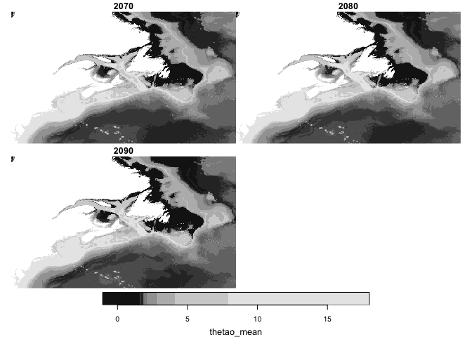
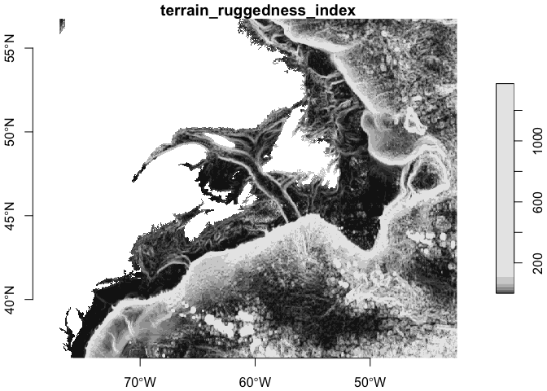

biooracle
================

Extra R-language tools to supplement [biooracler R
package](https://github.com/bio-oracle/biooracler). This package serves
up R scripts to create a local data repository.

# Requirements for package

From CRAN

- [R v4.1+](https://www.r-project.org/)
- [rlang](https://CRAN.R-project.org/package=rlang)
- [stars](https://CRAN.R-project.org/package=stars)
- [sf](https://CRAN.R-project.org/package=sf)
- [dplyr](https://CRAN.R-project.org/package=dplyr)
- [tidyr](https://CRAN.R-project.org/package=tidyr)

# Installation

    # install.packages(remotes)
    remotes::install_github("BigelowLab/biooracle")

# Set up a data directory

You can store the path to your chosen data directory. It will persist
between R sessions so you don’t have to do it each time.

``` r
suppressPackageStartupMessages({
  library(biooracle)
  library(dplyr)
})
set_biooracle_root("~/Library/CloudStorage/Dropbox/data/biooracle")
```

We’ll be creating a new local dataset for the Northwest Atlantic (nwa)
which has the bounding box
`{r} bb = c(xmin = -77, xmax = -42.5, ymin = 36.5, ymax = 56.7)`.

``` r
nwa_path = biooracle_path("nwa") |> make_path()
biooracle_path() |> dir(full.names = TRUE)
```

    ## [1] "/Users/ben/Library/CloudStorage/Dropbox/data/biooracle/nwa"    
    ## [2] "/Users/ben/Library/CloudStorage/Dropbox/data/biooracle/temp"   
    ## [3] "/Users/ben/Library/CloudStorage/Dropbox/data/biooracle/terrain"

# List available data layers

[biooracler R package](https://github.com/bio-oracle/biooracler)
provides a nice utility for obtaining a list of available data layers.
We have enhanced that by parsing the `dataset_id` so we can quickly
filter for the desried dataset(s). This will only work if
[biooracler](https://github.com/bio-oracle/biooracler) is installed.

``` r
list_layers()
```

    ## Loading required namespace: biooracler

    ## # A tibble: 356 × 9
    ##    longname       var   scenario start stop  z         dataset_id  title summary
    ##    <chr>          <chr> <chr>    <chr> <chr> <chr>     <chr>       <chr> <chr>  
    ##  1 AirTemperature tas   baseline 2000  2020  depthsurf tas_baseli… Bio-… "Uses …
    ##  2 AirTemperature tas   ssp119   2020  2100  depthsurf tas_ssp119… Bio-… "Uses …
    ##  3 AirTemperature tas   ssp126   2020  2100  depthsurf tas_ssp126… Bio-… "Uses …
    ##  4 AirTemperature tas   ssp245   2020  2100  depthsurf tas_ssp245… Bio-… "Uses …
    ##  5 AirTemperature tas   ssp370   2020  2100  depthsurf tas_ssp370… Bio-… "Uses …
    ##  6 AirTemperature tas   ssp460   2020  2100  depthsurf tas_ssp460… Bio-… "Uses …
    ##  7 AirTemperature tas   ssp585   2020  2100  depthsurf tas_ssp585… Bio-… "Uses …
    ##  8 Chlorophyll    chl   baseline 2000  2018  depthmax  chl_baseli… Bio-… "Uses …
    ##  9 Chlorophyll    chl   baseline 2000  2018  depthmean chl_baseli… Bio-… "Uses …
    ## 10 Chlorophyll    chl   baseline 2000  2018  depthmin  chl_baseli… Bio-… "Uses …
    ## # ℹ 346 more rows

# Fetch some data to a temporary directory

We’ll set that aside for right now and fetch some data for that region,
but note that this downloaded as a NetCDF file in a temporary directory.
Keep in mind that we are specifying the bounding box with a vector of
the corners, but we can also provide any object from which a bounding
box can be determined using the [sf
package](https://CRAN.R-project.org/package=sf), such as a polygon,
raster or collection of points.

``` r
dataset_id = "thetao_ssp119_2020_2100_depthmin"
newfile = fetch_biooracle(dataset_id, 
                          bb = c(xmin = -77, xmax = -42.5, ymin = 36.5, ymax = 56.7))
```

**NOTE** that you can make subselections of variable and times to
download. See `?fetch_biooracle` for the details.

Now we can read the file.

``` r
x = stars::read_stars(newfile, quiet = TRUE)
x
```

    ## stars object with 3 dimensions and 7 attributes
    ## attribute(s), summary of first 1e+05 cells:
    ##                          Min.    1st Qu.    Median      Mean   3rd Qu.
    ## thetao_ltmax [°C] -0.36475005 1.96057870 2.3428427 2.9704422 3.3483083
    ## thetao_ltmin [°C] -1.90398343 1.57293375 1.8961157 1.7156003 2.3728029
    ## thetao_max [°C]    0.21924963 2.17144280 2.7790994 3.7453738 4.5603769
    ## thetao_mean [°C]  -0.72299476 1.80542342 2.0918568 2.2443568 2.7558258
    ## thetao_min [°C]   -2.00000000 0.91433330 1.6623332 1.1105045 2.0303362
    ## thetao_range [°C]  0.22811718 0.47419300 0.7938143 2.6947997 4.0197336
    ## thetao_sd [°C]     0.03341453 0.09708313 0.1335515 0.2456717 0.4161988
    ##                         Max.  NA's
    ## thetao_ltmax [°C] 17.8440917 53161
    ## thetao_ltmin [°C]  6.0058540 53161
    ## thetao_max [°C]   21.4847577 53161
    ## thetao_mean [°C]   6.8363208 53161
    ## thetao_min [°C]    4.7977722 53161
    ## thetao_range [°C] 23.8074380 53161
    ## thetao_sd [°C]     0.7385261 53161
    ## dimension(s):
    ##      from  to offset delta  refsys                    values x/y
    ## x       1 691    -77  0.05      NA                      NULL [x]
    ## y       1 405  56.75 -0.05      NA                      NULL [y]
    ## time    1   8     NA    NA POSIXct 2020-01-01,...,2090-01-01

# Archiving in a local database

We often save the data in a directory structure aong with a simple table
that catalogs the contents of the directory. The `archive_biooracle()`
function will split up the fecthed data and save in a logical data
structure. We provide the data path, in this case for the Northwest
Atlantic (nwa).

``` r
archive_biooracle(newfile, path = nwa_path)
```

    ## # A tibble: 56 × 5
    ##    scenario year  z        param  trt  
    ##    <chr>    <chr> <chr>    <chr>  <chr>
    ##  1 ssp119   2020  depthmin thetao ltmax
    ##  2 ssp119   2020  depthmin thetao ltmin
    ##  3 ssp119   2020  depthmin thetao max  
    ##  4 ssp119   2020  depthmin thetao mean 
    ##  5 ssp119   2020  depthmin thetao min  
    ##  6 ssp119   2020  depthmin thetao range
    ##  7 ssp119   2020  depthmin thetao sd   
    ##  8 ssp119   2030  depthmin thetao ltmax
    ##  9 ssp119   2030  depthmin thetao ltmin
    ## 10 ssp119   2030  depthmin thetao max  
    ## # ℹ 46 more rows

Alternatively, it is possible to fetch and archive in one step, and this
is likely the most convenient usage.

``` r
newfile = fetch_biooracle(dataset_id, 
                          bb = c(xmin = -77, xmax = -42.5, ymin = 36.5, ymax = 56.7),
                          archive = TRUE,
                          data_dir = nwa_path)
```

# Read the database catalog

Once you have established a database of files, your can read the
database catalog.

``` r
db = read_database(nwa_path) |>
  print()
```

    ## # A tibble: 56 × 5
    ##    scenario year  z        param  trt  
    ##    <chr>    <chr> <chr>    <chr>  <chr>
    ##  1 ssp119   2020  depthmin thetao ltmax
    ##  2 ssp119   2020  depthmin thetao ltmin
    ##  3 ssp119   2020  depthmin thetao max  
    ##  4 ssp119   2020  depthmin thetao mean 
    ##  5 ssp119   2020  depthmin thetao min  
    ##  6 ssp119   2020  depthmin thetao range
    ##  7 ssp119   2020  depthmin thetao sd   
    ##  8 ssp119   2030  depthmin thetao ltmax
    ##  9 ssp119   2030  depthmin thetao ltmin
    ## 10 ssp119   2030  depthmin thetao max  
    ## # ℹ 46 more rows

# Read in data from the database

You can use a portion of the database to read in a `stars` object. Keep
in mind that if you are reading multiple over multiple decades, then
each variable must have the same number of time steps.

``` r
x = db |>
  dplyr::mutate(year = as.numeric(year)) |>
  dplyr::filter(year >= 2070) |>
  read_biooracle(, path = nwa_path) |>
  print()
```

    ## stars object with 3 dimensions and 7 attributes
    ## attribute(s):
    ##                      Min.    1st Qu.    Median      Mean   3rd Qu.      Max.
    ## thetao_ltmax  -0.64297539 1.89211679 2.1213403 4.1633015 4.1325927 31.248983
    ## thetao_ltmin  -2.00000000 1.80401134 1.8825923 2.4666165 2.7054288 12.447174
    ## thetao_max     0.46041700 1.94233787 2.4119213 5.0367358 5.3864827 33.908306
    ## thetao_mean   -1.06481194 1.86144698 1.9767619 3.2299667 3.4484773 18.037924
    ## thetao_min    -2.00000000 1.41676116 1.8234118 1.7105341 1.9514574  9.975613
    ## thetao_range   0.04843726 0.12690720 0.6352606 3.3517626 5.0061388 33.088707
    ## thetao_sd      0.02830037 0.06138093 0.2785121 0.4090969 0.6726204  3.425986
    ##                 NA's
    ## thetao_ltmax  287604
    ## thetao_ltmin  287604
    ## thetao_max    287604
    ## thetao_mean   287604
    ## thetao_min    287604
    ## thetao_range  287604
    ## thetao_sd     287604
    ## dimension(s):
    ##      from  to offset delta refsys x/y
    ## x       1 691    -77  0.05 WGS 84 [x]
    ## y       1 405  56.75 -0.05 WGS 84 [y]
    ## time    1   3   2070    10     NA

And of course you can plot.

``` r
plot(x['thetao_mean'])
```

    ## downsample set to 1

<!-- -->

# Terrain

Terrain characteristics are served as a semi-standalone product. We
provide tools for allowing you to download and archive terrain data (see
`fetch_terrain()`) and read terrain data (`read_terrain()`).

Here we downlaod terrian data for our study area.

``` r
x = fetch_terrain(archive = TRUE,
                  bb = c(xmin = -77, xmax = -42.5, ymin = 36.5, ymax = 56.7),
                  data_dir = nwa_path)
```

    ## area, aspect, bathymetry_max, bathymetry_mean, bathymetry_min, coastline, landmass, slope, terrain_ruggedness_index, topographic_position_index,

``` r
x
```

    ## stars object with 2 dimensions and 10 attributes
    ## attribute(s):
    ##                                         Min.       1st Qu.        Median
    ## area [m^2]                      1.692332e+01    19.9729965    22.1997646
    ## aspect [°]                      0.000000e+00    86.4516358   149.9867376
    ## bathymetry_max [m]             -5.992000e+03 -4725.0000000 -3331.0000000
    ## bathymetry_mean [m]            -5.947861e+03 -4691.1804199 -3283.1943359
    ## bathymetry_min [m]             -5.873000e+03 -4654.0000000 -3229.0000000
    ## coastline [1]                   1.000000e+00     1.0000000     1.0000000
    ## landmass [1]                    1.000000e+00     1.0000000     1.0000000
    ## slope [°]                       1.868605e-04     0.1213754     0.3171763
    ## terrain_ruggedness_index [1]    2.881918e-01    10.2154236    23.8368073
    ## topographic_position_index [1] -7.703681e+02    -7.8559723    -0.2778320
    ##                                         Mean      3rd Qu.       Max.   NA's
    ## area [m^2]                        21.6850430   23.6145159   24.75821  95868
    ## aspect [°]                       159.7517073  223.9874795  359.99994  95868
    ## bathymetry_max [m]             -2697.4030937 -239.0000000    0.00000  95868
    ## bathymetry_mean [m]            -2659.1993956 -215.4583359    0.00000  95868
    ## bathymetry_min [m]             -2620.5722198 -194.0000000    0.00000  95868
    ## coastline [1]                      1.0000000    1.0000000    1.00000 274801
    ## landmass [1]                       1.0000000    1.0000000    1.00000  95868
    ## slope [°]                          0.6484734    0.7387332   18.34382  95868
    ## terrain_ruggedness_index [1]      46.7541411   52.4096832 1375.70135  95868
    ## topographic_position_index [1]    -0.3759919    6.6007016 1250.09727  95868
    ## dimension(s):
    ##   from  to offset delta x/y
    ## x    1 691    -77  0.05 [x]
    ## y    1 405  56.75 -0.05 [y]

And read some back in.

``` r
y = read_terrain(what = c("bathymetry_mean", "slope", "terrain_ruggedness_index"))
plot(y["terrain_ruggedness_index"], axes = TRUE)
```

<!-- -->
