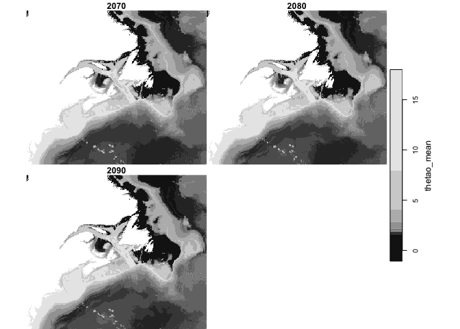

biooracle
================

Extra R-language tools to supplement [biooracler R
package](https://github.com/bio-oracle/biooracler). This package serves
up R scripts to create a local data repository.

# Requirements for package

From CRAN

- [R v4.1+](https://www.r-project.org/)
- [rlang](https://CRAN.R-project.org/package=rlang)
- [stars](https://CRAN.R-project.org/package=stars)
- [sf](https://CRAN.R-project.org/package=sf)
- [dplyr](https://CRAN.R-project.org/package=dplyr)
- [tidyr](https://CRAN.R-project.org/package=tidyr)

# Installation

    # install.packages(remotes)
    remotes::install_github("BigelowLab/biooracle")

# Set up a data directory

You can store the path to your chosen data directory. It will persist
between R sessions so you don’t have to do it each time.

``` r
suppressPackageStartupMessages({
  library(biooracle)
  library(dplyr)
})
set_biooracle_root("~/Library/CloudStorage/Dropbox/data/biooracle")
```

We’ll be creating a new local dataset for the Northwest Atlantic (nwa)
which has the bounding box
`{r} bb = c(xmin = -77, xmax = -42.5, ymin = 36.5, ymax = 56.7)`.

``` r
nwa_path = biooracle_path("nwa") |> make_path()
biooracle_path() |> dir(full.names = TRUE)
```

    ## [1] "/Users/ben/Library/CloudStorage/Dropbox/data/biooracle/nwa" 
    ## [2] "/Users/ben/Library/CloudStorage/Dropbox/data/biooracle/temp"

# List available data layers

[biooracler R package](https://github.com/bio-oracle/biooracler)
provides a nice utility for obtaining a list of available data layers.
We have enhanced that by parsing the `dataset_id` so we can quickly
filter for the desried dataset(s). This will only work if
[biooracler](https://github.com/bio-oracle/biooracler) is installed.

``` r
list_layers() |>
  knitr::kable()
```

    ## Loading required namespace: biooracler

| var | scenario | start | stop | z | dataset_id | title | summary |
|:---|:---|:---|:---|:---|:---|:---|:---|
| tas | baseline | 2000 | 2020 | depthsurf | tas_baseline_2000_2020_depthsurf | Bio-Oracle AirTemperature \[depthSurf\] Baseline 2000-2020. | Uses attributes recommended by <https://cfconventions.org> |

cdm_data_type = Grid VARIABLES (all of which use the dimensions
\[time\]\[latitude\]\[longitude\]): tas_max (Maximum AirTemperature, K)
tas_ltmax (Long-term maximum AirTemperature, K) tas_mean (Average
AirTemperature, K) tas_ltmin (Long-term minimum AirTemperature, K)
tas_min (Minimum AirTemperature, K) tas_range (Range AirTemperature, K)
\| \|tas \|ssp119 \|2020 \|2100 \|depthsurf
\|tas_ssp119_2020_2100_depthsurf \|Bio-Oracle AirTemperature
\[depthSurf\] SSP119 2020-2100. \|Uses attributes recommended by
<https://cfconventions.org>

cdm_data_type = Grid VARIABLES (all of which use the dimensions
\[time\]\[latitude\]\[longitude\]): tas_max (Maximum AirTemperature,
degree_C) tas_ltmax (Long-term maximum AirTemperature, degree_C)
tas_mean (Average AirTemperature, degree_C) tas_ltmin (Long-term minimum
AirTemperature, degree_C) tas_min (Minimum AirTemperature, degree_C)
tas_range (Range AirTemperature, degree_C) tas_sd (Standard deviation
AirTemperature, degree_C) \| \|tas \|ssp126 \|2020 \|2100 \|depthsurf
\|tas_ssp126_2020_2100_depthsurf \|Bio-Oracle AirTemperature
\[depthSurf\] SSP126 2020-2100. \|Uses attributes recommended by
<https://cfconventions.org>

cdm_data_type = Grid VARIABLES (all of which use the dimensions
\[time\]\[latitude\]\[longitude\]): tas_max (Maximum AirTemperature,
degree_C) tas_ltmax (Long-term maximum AirTemperature, degree_C)
tas_mean (Average AirTemperature, degree_C) tas_ltmin (Long-term minimum
AirTemperature, degree_C) tas_min (Minimum AirTemperature, degree_C)
tas_range (Range AirTemperature, degree_C) tas_sd (Standard deviation
AirTemperature, degree_C) \| \|tas \|ssp245 \|2020 \|2100 \|depthsurf
\|tas_ssp245_2020_2100_depthsurf \|Bio-Oracle AirTemperature
\[depthSurf\] SSP245 2020-2100. \|Uses attributes recommended by
<https://cfconventions.org>

cdm_data_type = Grid VARIABLES (all of which use the dimensions
\[time\]\[latitude\]\[longitude\]): tas_max (Maximum AirTemperature,
degree_C) tas_ltmax (Long-term maximum AirTemperature, degree_C)
tas_mean (Average AirTemperature, degree_C) tas_ltmin (Long-term minimum
AirTemperature, degree_C) tas_min (Minimum AirTemperature, degree_C)
tas_range (Range AirTemperature, degree_C) tas_sd (Standard deviation
AirTemperature, degree_C) \| \|tas \|ssp370 \|2020 \|2100 \|depthsurf
\|tas_ssp370_2020_2100_depthsurf \|Bio-Oracle AirTemperature
\[depthSurf\] SSP370 2020-2100. \|Uses attributes recommended by
<https://cfconventions.org>

cdm_data_type = Grid VARIABLES (all of which use the dimensions
\[time\]\[latitude\]\[longitude\]): tas_max (Maximum AirTemperature,
degree_C) tas_ltmax (Long-term maximum AirTemperature, degree_C)
tas_mean (Average AirTemperature, degree_C) tas_ltmin (Long-term minimum
AirTemperature, degree_C) tas_min (Minimum AirTemperature, degree_C)
tas_range (Range AirTemperature, degree_C) tas_sd (Standard deviation
AirTemperature, degree_C) \| \|tas \|ssp460 \|2020 \|2100 \|depthsurf
\|tas_ssp460_2020_2100_depthsurf \|Bio-Oracle AirTemperature
\[depthSurf\] SSP460 2020-2100. \|Uses attributes recommended by
<https://cfconventions.org>

cdm_data_type = Grid VARIABLES (all of which use the dimensions
\[time\]\[latitude\]\[longitude\]): tas_max (Maximum AirTemperature,
degree_C) tas_ltmax (Long-term maximum AirTemperature, degree_C)
tas_mean (Average AirTemperature, degree_C) tas_ltmin (Long-term minimum
AirTemperature, degree_C) tas_min (Minimum AirTemperature, degree_C)
tas_range (Range AirTemperature, degree_C) tas_sd (Standard deviation
AirTemperature, degree_C) \| \|tas \|ssp585 \|2020 \|2100 \|depthsurf
\|tas_ssp585_2020_2100_depthsurf \|Bio-Oracle AirTemperature
\[depthSurf\] SSP585 2020-2100. \|Uses attributes recommended by
<https://cfconventions.org>

cdm_data_type = Grid VARIABLES (all of which use the dimensions
\[time\]\[latitude\]\[longitude\]): tas_max (Maximum AirTemperature,
degree_C) tas_ltmax (Long-term maximum AirTemperature, degree_C)
tas_mean (Average AirTemperature, degree_C) tas_ltmin (Long-term minimum
AirTemperature, degree_C) tas_min (Minimum AirTemperature, degree_C)
tas_range (Range AirTemperature, degree_C) tas_sd (Standard deviation
AirTemperature, degree_C) \| \|chl \|baseline \|2000 \|2018 \|depthmax
\|chl_baseline_2000_2018_depthmax \|Bio-Oracle Chlorophyll \[depthMax\]
Baseline 2000-2018. \|Uses attributes recommended by
<https://cfconventions.org>

cdm_data_type = Grid VARIABLES (all of which use the dimensions
\[time\]\[latitude\]\[longitude\]): chl_max (Maximum Chlorophyll, mg
m-3) chl_ltmax (Long-term maximum Chlorophyll, mg m-3) chl_mean (Average
Chlorophyll, mg m-3) chl_ltmin (Long-term minimum Chlorophyll, mg m-3)
chl_min (Minimum Chlorophyll, mg m-3) chl_range (Range Chlorophyll, mg
m-3) \| \|chl \|baseline \|2000 \|2018 \|depthmean
\|chl_baseline_2000_2018_depthmean \|Bio-Oracle Chlorophyll
\[depthMean\] Baseline 2000-2018. \|Uses attributes recommended by
<https://cfconventions.org>

cdm_data_type = Grid VARIABLES (all of which use the dimensions
\[time\]\[latitude\]\[longitude\]): chl_max (Maximum Chlorophyll, mg
m-3) chl_ltmax (Long-term maximum Chlorophyll, mg m-3) chl_mean (Average
Chlorophyll, mg m-3) chl_ltmin (Long-term minimum Chlorophyll, mg m-3)
chl_min (Minimum Chlorophyll, mg m-3) chl_range (Range Chlorophyll, mg
m-3) \| \|chl \|baseline \|2000 \|2018 \|depthmin
\|chl_baseline_2000_2018_depthmin \|Bio-Oracle Chlorophyll \[depthMin\]
Baseline 2000-2018. \|Uses attributes recommended by
<https://cfconventions.org>

cdm_data_type = Grid VARIABLES (all of which use the dimensions
\[time\]\[latitude\]\[longitude\]): chl_max (Maximum Chlorophyll, mg
m-3) chl_ltmax (Long-term maximum Chlorophyll, mg m-3) chl_mean (Average
Chlorophyll, mg m-3) chl_ltmin (Long-term minimum Chlorophyll, mg m-3)
chl_min (Minimum Chlorophyll, mg m-3) chl_range (Range Chlorophyll, mg
m-3) \| \|chl \|baseline \|2000 \|2018 \|depthsurf
\|chl_baseline_2000_2018_depthsurf \|Bio-Oracle Chlorophyll
\[depthSurf\] Baseline 2000-2018. \|Uses attributes recommended by
<https://cfconventions.org>

cdm_data_type = Grid VARIABLES (all of which use the dimensions
\[time\]\[latitude\]\[longitude\]): chl_max (Maximum Chlorophyll, mg
m-3) chl_ltmax (Long-term maximum Chlorophyll, mg m-3) chl_mean (Average
Chlorophyll, mg m-3) chl_ltmin (Long-term minimum Chlorophyll, mg m-3)
chl_min (Minimum Chlorophyll, mg m-3) chl_range (Range Chlorophyll, mg
m-3) \| \|chl \|ssp119 \|2020 \|2100 \|depthsurf
\|chl_ssp119_2020_2100_depthsurf \|Bio-Oracle Chlorophyll \[depthSurf\]
SSP119 2020-2100. \|Uses attributes recommended by
<https://cfconventions.org>

cdm_data_type = Grid VARIABLES (all of which use the dimensions
\[time\]\[latitude\]\[longitude\]): chl_max (Maximum Chlorophyll, mg
m-3) chl_ltmax (Long-term maximum Chlorophyll, mg m-3) chl_mean (Average
Chlorophyll, mg m-3) chl_ltmin (Long-term minimum Chlorophyll, mg m-3)
chl_min (Minimum Chlorophyll, mg m-3) chl_range (Range Chlorophyll, mg
m-3) chl_sd (Standard deviation Chlorophyll, mg m-3) \| \|chl \|ssp126
\|2020 \|2100 \|depthsurf \|chl_ssp126_2020_2100_depthsurf \|Bio-Oracle
Chlorophyll \[depthSurf\] SSP126 2020-2100. \|Uses attributes
recommended by <https://cfconventions.org>

cdm_data_type = Grid VARIABLES (all of which use the dimensions
\[time\]\[latitude\]\[longitude\]): chl_max (Maximum Chlorophyll, mg
m-3) chl_ltmax (Long-term maximum Chlorophyll, mg m-3) chl_mean (Average
Chlorophyll, mg m-3) chl_ltmin (Long-term minimum Chlorophyll, mg m-3)
chl_min (Minimum Chlorophyll, mg m-3) chl_range (Range Chlorophyll, mg
m-3) chl_sd (Standard deviation Chlorophyll, mg m-3) \| \|chl \|ssp245
\|2020 \|2100 \|depthsurf \|chl_ssp245_2020_2100_depthsurf \|Bio-Oracle
Chlorophyll \[depthSurf\] SSP245 2020-2100. \|Uses attributes
recommended by <https://cfconventions.org>

cdm_data_type = Grid VARIABLES (all of which use the dimensions
\[time\]\[latitude\]\[longitude\]): chl_max (Maximum Chlorophyll, mg
m-3) chl_ltmax (Long-term maximum Chlorophyll, mg m-3) chl_mean (Average
Chlorophyll, mg m-3) chl_ltmin (Long-term minimum Chlorophyll, mg m-3)
chl_min (Minimum Chlorophyll, mg m-3) chl_range (Range Chlorophyll, mg
m-3) chl_sd (Standard deviation Chlorophyll, mg m-3) \| \|chl \|ssp370
\|2020 \|2100 \|depthsurf \|chl_ssp370_2020_2100_depthsurf \|Bio-Oracle
Chlorophyll \[depthSurf\] SSP370 2020-2100. \|Uses attributes
recommended by <https://cfconventions.org>

cdm_data_type = Grid VARIABLES (all of which use the dimensions
\[time\]\[latitude\]\[longitude\]): chl_max (Maximum Chlorophyll, mg
m-3) chl_ltmax (Long-term maximum Chlorophyll, mg m-3) chl_mean (Average
Chlorophyll, mg m-3) chl_ltmin (Long-term minimum Chlorophyll, mg m-3)
chl_min (Minimum Chlorophyll, mg m-3) chl_range (Range Chlorophyll, mg
m-3) chl_sd (Standard deviation Chlorophyll, mg m-3) \| \|chl \|ssp460
\|2020 \|2100 \|depthsurf \|chl_ssp460_2020_2100_depthsurf \|Bio-Oracle
Chlorophyll \[depthSurf\] SSP460 2020-2100. \|Uses attributes
recommended by <https://cfconventions.org>

cdm_data_type = Grid VARIABLES (all of which use the dimensions
\[time\]\[latitude\]\[longitude\]): chl_max (Maximum Chlorophyll, mg
m-3) chl_ltmax (Long-term maximum Chlorophyll, mg m-3) chl_mean (Average
Chlorophyll, mg m-3) chl_ltmin (Long-term minimum Chlorophyll, mg m-3)
chl_min (Minimum Chlorophyll, mg m-3) chl_range (Range Chlorophyll, mg
m-3) chl_sd (Standard deviation Chlorophyll, mg m-3) \| \|chl \|ssp585
\|2020 \|2100 \|depthsurf \|chl_ssp585_2020_2100_depthsurf \|Bio-Oracle
Chlorophyll \[depthSurf\] SSP585 2020-2100. \|Uses attributes
recommended by <https://cfconventions.org>

cdm_data_type = Grid VARIABLES (all of which use the dimensions
\[time\]\[latitude\]\[longitude\]): chl_max (Maximum Chlorophyll, mg
m-3) chl_ltmax (Long-term maximum Chlorophyll, mg m-3) chl_mean (Average
Chlorophyll, mg m-3) chl_ltmin (Long-term minimum Chlorophyll, mg m-3)
chl_min (Minimum Chlorophyll, mg m-3) chl_range (Range Chlorophyll, mg
m-3) chl_sd (Standard deviation Chlorophyll, mg m-3) \| \|dfe \|baseline
\|2000 \|2018 \|depthmax \|dfe_baseline_2000_2018_depthmax \|Bio-Oracle
DissolvedIron \[depthMax\] Baseline 2000-2018. \|Uses attributes
recommended by <https://cfconventions.org>

cdm_data_type = Grid VARIABLES (all of which use the dimensions
\[time\]\[latitude\]\[longitude\]): dfe_max (Maximum DissolvedIron,
MMol’ ‘M-3) dfe_ltmax (Long-term maximum DissolvedIron, MMol’ ‘M-3)
dfe_mean (Average DissolvedIron, MMol’ ‘M-3) dfe_ltmin (Long-term
minimum DissolvedIron, MMol’ ‘M-3) dfe_min (Minimum DissolvedIron, MMol’
‘M-3) dfe_range (Range DissolvedIron, MMol’ ’M-3) \| \|dfe \|ssp119
\|2020 \|2100 \|depthmax \|dfe_ssp119_2020_2100_depthmax \|Bio-Oracle
DissolvedIron \[depthMax\] SSP119 2020-2100. \|Uses attributes
recommended by <https://cfconventions.org>

cdm_data_type = Grid VARIABLES (all of which use the dimensions
\[time\]\[latitude\]\[longitude\]): dfe_max (Maximum DissolvedIron,
MMol’ ‘M-3) dfe_ltmax (Long-term maximum DissolvedIron, MMol’ ‘M-3)
dfe_mean (Average DissolvedIron, MMol’ ‘M-3) dfe_ltmin (Long-term
minimum DissolvedIron, MMol’ ‘M-3) dfe_min (Minimum DissolvedIron, MMol’
‘M-3) dfe_range (Range DissolvedIron, MMol’ ‘M-3) dfe_sd (Standard
deviation DissolvedIron, MMol’ ’M-3) \| \|dfe \|ssp126 \|2020 \|2100
\|depthmax \|dfe_ssp126_2020_2100_depthmax \|Bio-Oracle DissolvedIron
\[depthMax\] SSP126 2020-2100. \|Uses attributes recommended by
<https://cfconventions.org>

cdm_data_type = Grid VARIABLES (all of which use the dimensions
\[time\]\[latitude\]\[longitude\]): dfe_max (Maximum DissolvedIron,
MMol’ ‘M-3) dfe_ltmax (Long-term maximum DissolvedIron, MMol’ ‘M-3)
dfe_mean (Average DissolvedIron, MMol’ ‘M-3) dfe_ltmin (Long-term
minimum DissolvedIron, MMol’ ‘M-3) dfe_min (Minimum DissolvedIron, MMol’
‘M-3) dfe_range (Range DissolvedIron, MMol’ ‘M-3) dfe_sd (Standard
deviation DissolvedIron, MMol’ ’M-3) \| \|dfe \|ssp245 \|2020 \|2100
\|depthmax \|dfe_ssp245_2020_2100_depthmax \|Bio-Oracle DissolvedIron
\[depthMax\] SSP245 2020-2100. \|Uses attributes recommended by
<https://cfconventions.org>

cdm_data_type = Grid VARIABLES (all of which use the dimensions
\[time\]\[latitude\]\[longitude\]): dfe_max (Maximum DissolvedIron,
MMol’ ‘M-3) dfe_ltmax (Long-term maximum DissolvedIron, MMol’ ‘M-3)
dfe_mean (Average DissolvedIron, MMol’ ‘M-3) dfe_ltmin (Long-term
minimum DissolvedIron, MMol’ ‘M-3) dfe_min (Minimum DissolvedIron, MMol’
‘M-3) dfe_range (Range DissolvedIron, MMol’ ‘M-3) dfe_sd (Standard
deviation DissolvedIron, MMol’ ’M-3) \| \|dfe \|ssp370 \|2020 \|2100
\|depthmax \|dfe_ssp370_2020_2100_depthmax \|Bio-Oracle DissolvedIron
\[depthMax\] SSP370 2020-2100. \|Uses attributes recommended by
<https://cfconventions.org>

cdm_data_type = Grid VARIABLES (all of which use the dimensions
\[time\]\[latitude\]\[longitude\]): dfe_max (Maximum DissolvedIron,
MMol’ ‘M-3) dfe_ltmax (Long-term maximum DissolvedIron, MMol’ ‘M-3)
dfe_mean (Average DissolvedIron, MMol’ ‘M-3) dfe_ltmin (Long-term
minimum DissolvedIron, MMol’ ‘M-3) dfe_min (Minimum DissolvedIron, MMol’
‘M-3) dfe_range (Range DissolvedIron, MMol’ ‘M-3) dfe_sd (Standard
deviation DissolvedIron, MMol’ ’M-3) \| \|dfe \|ssp460 \|2020 \|2100
\|depthmax \|dfe_ssp460_2020_2100_depthmax \|Bio-Oracle DissolvedIron
\[depthMax\] SSP460 2020-2100. \|Uses attributes recommended by
<https://cfconventions.org>

cdm_data_type = Grid VARIABLES (all of which use the dimensions
\[time\]\[latitude\]\[longitude\]): dfe_max (Maximum DissolvedIron,
MMol’ ‘M-3) dfe_ltmax (Long-term maximum DissolvedIron, MMol’ ‘M-3)
dfe_mean (Average DissolvedIron, MMol’ ‘M-3) dfe_ltmin (Long-term
minimum DissolvedIron, MMol’ ‘M-3) dfe_min (Minimum DissolvedIron, MMol’
‘M-3) dfe_range (Range DissolvedIron, MMol’ ‘M-3) dfe_sd (Standard
deviation DissolvedIron, MMol’ ’M-3) \| \|dfe \|ssp585 \|2020 \|2100
\|depthmax \|dfe_ssp585_2020_2100_depthmax \|Bio-Oracle DissolvedIron
\[depthMax\] SSP585 2020-2100. \|Uses attributes recommended by
<https://cfconventions.org>

cdm_data_type = Grid VARIABLES (all of which use the dimensions
\[time\]\[latitude\]\[longitude\]): dfe_max (Maximum DissolvedIron,
MMol’ ‘M-3) dfe_ltmax (Long-term maximum DissolvedIron, MMol’ ‘M-3)
dfe_mean (Average DissolvedIron, MMol’ ‘M-3) dfe_ltmin (Long-term
minimum DissolvedIron, MMol’ ‘M-3) dfe_min (Minimum DissolvedIron, MMol’
‘M-3) dfe_range (Range DissolvedIron, MMol’ ‘M-3) dfe_sd (Standard
deviation DissolvedIron, MMol’ ’M-3) \| \|dfe \|baseline \|2000 \|2018
\|depthmean \|dfe_baseline_2000_2018_depthmean \|Bio-Oracle
DissolvedIron \[depthMean\] Baseline 2000-2018. \|Uses attributes
recommended by <https://cfconventions.org>

cdm_data_type = Grid VARIABLES (all of which use the dimensions
\[time\]\[latitude\]\[longitude\]): dfe_max (Maximum DissolvedIron,
MMol’ ‘M-3) dfe_ltmax (Long-term maximum DissolvedIron, MMol’ ‘M-3)
dfe_mean (Average DissolvedIron, MMol’ ‘M-3) dfe_ltmin (Long-term
minimum DissolvedIron, MMol’ ‘M-3) dfe_min (Minimum DissolvedIron, MMol’
‘M-3) dfe_range (Range DissolvedIron, MMol’ ’M-3) \| \|dfe \|ssp119
\|2020 \|2100 \|depthmean \|dfe_ssp119_2020_2100_depthmean \|Bio-Oracle
DissolvedIron \[depthMean\] SSP119 2020-2100. \|Uses attributes
recommended by <https://cfconventions.org>

cdm_data_type = Grid VARIABLES (all of which use the dimensions
\[time\]\[latitude\]\[longitude\]): dfe_max (Maximum DissolvedIron,
MMol’ ‘M-3) dfe_ltmax (Long-term maximum DissolvedIron, MMol’ ‘M-3)
dfe_mean (Average DissolvedIron, MMol’ ‘M-3) dfe_ltmin (Long-term
minimum DissolvedIron, MMol’ ‘M-3) dfe_min (Minimum DissolvedIron, MMol’
‘M-3) dfe_range (Range DissolvedIron, MMol’ ‘M-3) dfe_sd (Standard
deviation DissolvedIron, MMol’ ’M-3) \| \|dfe \|ssp126 \|2020 \|2100
\|depthmean \|dfe_ssp126_2020_2100_depthmean \|Bio-Oracle DissolvedIron
\[depthMean\] SSP126 2020-2100. \|Uses attributes recommended by
<https://cfconventions.org>

cdm_data_type = Grid VARIABLES (all of which use the dimensions
\[time\]\[latitude\]\[longitude\]): dfe_max (Maximum DissolvedIron,
MMol’ ‘M-3) dfe_ltmax (Long-term maximum DissolvedIron, MMol’ ‘M-3)
dfe_mean (Average DissolvedIron, MMol’ ‘M-3) dfe_ltmin (Long-term
minimum DissolvedIron, MMol’ ‘M-3) dfe_min (Minimum DissolvedIron, MMol’
‘M-3) dfe_range (Range DissolvedIron, MMol’ ‘M-3) dfe_sd (Standard
deviation DissolvedIron, MMol’ ’M-3) \| \|dfe \|ssp245 \|2020 \|2100
\|depthmean \|dfe_ssp245_2020_2100_depthmean \|Bio-Oracle DissolvedIron
\[depthMean\] SSP245 2020-2100. \|Uses attributes recommended by
<https://cfconventions.org>

cdm_data_type = Grid VARIABLES (all of which use the dimensions
\[time\]\[latitude\]\[longitude\]): dfe_max (Maximum DissolvedIron,
MMol’ ‘M-3) dfe_ltmax (Long-term maximum DissolvedIron, MMol’ ‘M-3)
dfe_mean (Average DissolvedIron, MMol’ ‘M-3) dfe_ltmin (Long-term
minimum DissolvedIron, MMol’ ‘M-3) dfe_min (Minimum DissolvedIron, MMol’
‘M-3) dfe_range (Range DissolvedIron, MMol’ ‘M-3) dfe_sd (Standard
deviation DissolvedIron, MMol’ ’M-3) \| \|dfe \|ssp370 \|2020 \|2100
\|depthmean \|dfe_ssp370_2020_2100_depthmean \|Bio-Oracle DissolvedIron
\[depthMean\] SSP370 2020-2100. \|Uses attributes recommended by
<https://cfconventions.org>

cdm_data_type = Grid VARIABLES (all of which use the dimensions
\[time\]\[latitude\]\[longitude\]): dfe_max (Maximum DissolvedIron,
MMol’ ‘M-3) dfe_ltmax (Long-term maximum DissolvedIron, MMol’ ‘M-3)
dfe_mean (Average DissolvedIron, MMol’ ‘M-3) dfe_ltmin (Long-term
minimum DissolvedIron, MMol’ ‘M-3) dfe_min (Minimum DissolvedIron, MMol’
‘M-3) dfe_range (Range DissolvedIron, MMol’ ‘M-3) dfe_sd (Standard
deviation DissolvedIron, MMol’ ’M-3) \| \|dfe \|ssp460 \|2020 \|2100
\|depthmean \|dfe_ssp460_2020_2100_depthmean \|Bio-Oracle DissolvedIron
\[depthMean\] SSP460 2020-2100. \|Uses attributes recommended by
<https://cfconventions.org>

cdm_data_type = Grid VARIABLES (all of which use the dimensions
\[time\]\[latitude\]\[longitude\]): dfe_max (Maximum DissolvedIron,
MMol’ ‘M-3) dfe_ltmax (Long-term maximum DissolvedIron, MMol’ ‘M-3)
dfe_mean (Average DissolvedIron, MMol’ ‘M-3) dfe_ltmin (Long-term
minimum DissolvedIron, MMol’ ‘M-3) dfe_min (Minimum DissolvedIron, MMol’
‘M-3) dfe_range (Range DissolvedIron, MMol’ ‘M-3) dfe_sd (Standard
deviation DissolvedIron, MMol’ ’M-3) \| \|dfe \|ssp585 \|2020 \|2100
\|depthmean \|dfe_ssp585_2020_2100_depthmean \|Bio-Oracle DissolvedIron
\[depthMean\] SSP585 2020-2100. \|Uses attributes recommended by
<https://cfconventions.org>

cdm_data_type = Grid VARIABLES (all of which use the dimensions
\[time\]\[latitude\]\[longitude\]): dfe_max (Maximum DissolvedIron,
MMol’ ‘M-3) dfe_ltmax (Long-term maximum DissolvedIron, MMol’ ‘M-3)
dfe_mean (Average DissolvedIron, MMol’ ‘M-3) dfe_ltmin (Long-term
minimum DissolvedIron, MMol’ ‘M-3) dfe_min (Minimum DissolvedIron, MMol’
‘M-3) dfe_range (Range DissolvedIron, MMol’ ‘M-3) dfe_sd (Standard
deviation DissolvedIron, MMol’ ’M-3) \| \|dfe \|baseline \|2000 \|2018
\|depthmin \|dfe_baseline_2000_2018_depthmin \|Bio-Oracle DissolvedIron
\[depthMin\] Baseline 2000-2018. \|Uses attributes recommended by
<https://cfconventions.org>

cdm_data_type = Grid VARIABLES (all of which use the dimensions
\[time\]\[latitude\]\[longitude\]): dfe_max (Maximum DissolvedIron,
MMol’ ‘M-3) dfe_ltmax (Long-term maximum DissolvedIron, MMol’ ‘M-3)
dfe_mean (Average DissolvedIron, MMol’ ‘M-3) dfe_ltmin (Long-term
minimum DissolvedIron, MMol’ ‘M-3) dfe_min (Minimum DissolvedIron, MMol’
‘M-3) dfe_range (Range DissolvedIron, MMol’ ’M-3) \| \|dfe \|ssp119
\|2020 \|2100 \|depthmin \|dfe_ssp119_2020_2100_depthmin \|Bio-Oracle
DissolvedIron \[depthMin\] SSP119 2020-2100. \|Uses attributes
recommended by <https://cfconventions.org>

cdm_data_type = Grid VARIABLES (all of which use the dimensions
\[time\]\[latitude\]\[longitude\]): dfe_max (Maximum DissolvedIron,
MMol’ ‘M-3) dfe_ltmax (Long-term maximum DissolvedIron, MMol’ ‘M-3)
dfe_mean (Average DissolvedIron, MMol’ ‘M-3) dfe_ltmin (Long-term
minimum DissolvedIron, MMol’ ‘M-3) dfe_min (Minimum DissolvedIron, MMol’
‘M-3) dfe_range (Range DissolvedIron, MMol’ ‘M-3) dfe_sd (Standard
deviation DissolvedIron, MMol’ ’M-3) \| \|dfe \|ssp126 \|2020 \|2100
\|depthmin \|dfe_ssp126_2020_2100_depthmin \|Bio-Oracle DissolvedIron
\[depthMin\] SSP126 2020-2100. \|Uses attributes recommended by
<https://cfconventions.org>

cdm_data_type = Grid VARIABLES (all of which use the dimensions
\[time\]\[latitude\]\[longitude\]): dfe_max (Maximum DissolvedIron,
MMol’ ‘M-3) dfe_ltmax (Long-term maximum DissolvedIron, MMol’ ‘M-3)
dfe_mean (Average DissolvedIron, MMol’ ‘M-3) dfe_ltmin (Long-term
minimum DissolvedIron, MMol’ ‘M-3) dfe_min (Minimum DissolvedIron, MMol’
‘M-3) dfe_range (Range DissolvedIron, MMol’ ‘M-3) dfe_sd (Standard
deviation DissolvedIron, MMol’ ’M-3) \| \|dfe \|ssp245 \|2020 \|2100
\|depthmin \|dfe_ssp245_2020_2100_depthmin \|Bio-Oracle DissolvedIron
\[depthMin\] SSP245 2020-2100. \|Uses attributes recommended by
<https://cfconventions.org>

cdm_data_type = Grid VARIABLES (all of which use the dimensions
\[time\]\[latitude\]\[longitude\]): dfe_max (Maximum DissolvedIron,
MMol’ ‘M-3) dfe_ltmax (Long-term maximum DissolvedIron, MMol’ ‘M-3)
dfe_mean (Average DissolvedIron, MMol’ ‘M-3) dfe_ltmin (Long-term
minimum DissolvedIron, MMol’ ‘M-3) dfe_min (Minimum DissolvedIron, MMol’
‘M-3) dfe_range (Range DissolvedIron, MMol’ ‘M-3) dfe_sd (Standard
deviation DissolvedIron, MMol’ ’M-3) \| \|dfe \|ssp370 \|2020 \|2100
\|depthmin \|dfe_ssp370_2020_2100_depthmin \|Bio-Oracle DissolvedIron
\[depthMin\] SSP370 2020-2100. \|Uses attributes recommended by
<https://cfconventions.org>

cdm_data_type = Grid VARIABLES (all of which use the dimensions
\[time\]\[latitude\]\[longitude\]): dfe_max (Maximum DissolvedIron,
MMol’ ‘M-3) dfe_ltmax (Long-term maximum DissolvedIron, MMol’ ‘M-3)
dfe_mean (Average DissolvedIron, MMol’ ‘M-3) dfe_ltmin (Long-term
minimum DissolvedIron, MMol’ ‘M-3) dfe_min (Minimum DissolvedIron, MMol’
‘M-3) dfe_range (Range DissolvedIron, MMol’ ‘M-3) dfe_sd (Standard
deviation DissolvedIron, MMol’ ’M-3) \| \|dfe \|ssp460 \|2020 \|2100
\|depthmin \|dfe_ssp460_2020_2100_depthmin \|Bio-Oracle DissolvedIron
\[depthMin\] SSP460 2020-2100. \|Uses attributes recommended by
<https://cfconventions.org>

cdm_data_type = Grid VARIABLES (all of which use the dimensions
\[time\]\[latitude\]\[longitude\]): dfe_max (Maximum DissolvedIron,
MMol’ ‘M-3) dfe_ltmax (Long-term maximum DissolvedIron, MMol’ ‘M-3)
dfe_mean (Average DissolvedIron, MMol’ ‘M-3) dfe_ltmin (Long-term
minimum DissolvedIron, MMol’ ‘M-3) dfe_min (Minimum DissolvedIron, MMol’
‘M-3) dfe_range (Range DissolvedIron, MMol’ ‘M-3) dfe_sd (Standard
deviation DissolvedIron, MMol’ ’M-3) \| \|dfe \|ssp585 \|2020 \|2100
\|depthmin \|dfe_ssp585_2020_2100_depthmin \|Bio-Oracle DissolvedIron
\[depthMin\] SSP585 2020-2100. \|Uses attributes recommended by
<https://cfconventions.org>

cdm_data_type = Grid VARIABLES (all of which use the dimensions
\[time\]\[latitude\]\[longitude\]): dfe_max (Maximum DissolvedIron,
MMol’ ‘M-3) dfe_ltmax (Long-term maximum DissolvedIron, MMol’ ‘M-3)
dfe_mean (Average DissolvedIron, MMol’ ‘M-3) dfe_ltmin (Long-term
minimum DissolvedIron, MMol’ ‘M-3) dfe_min (Minimum DissolvedIron, MMol’
‘M-3) dfe_range (Range DissolvedIron, MMol’ ‘M-3) dfe_sd (Standard
deviation DissolvedIron, MMol’ ’M-3) \| \|dfe \|baseline \|2000 \|2018
\|depthsurf \|dfe_baseline_2000_2018_depthsurf \|Bio-Oracle
DissolvedIron \[depthSurf\] Baseline 2000-2018. \|Uses attributes
recommended by <https://cfconventions.org>

cdm_data_type = Grid VARIABLES (all of which use the dimensions
\[time\]\[latitude\]\[longitude\]): dfe_max (Maximum DissolvedIron,
MMol’ ‘M-3) dfe_ltmax (Long-term maximum DissolvedIron, MMol’ ‘M-3)
dfe_mean (Average DissolvedIron, MMol’ ‘M-3) dfe_ltmin (Long-term
minimum DissolvedIron, MMol’ ‘M-3) dfe_min (Minimum DissolvedIron, MMol’
‘M-3) dfe_range (Range DissolvedIron, MMol’ ’M-3) \| \|dfe \|ssp119
\|2020 \|2100 \|depthsurf \|dfe_ssp119_2020_2100_depthsurf \|Bio-Oracle
DissolvedIron \[depthSurf\] SSP119 2020-2100. \|Uses attributes
recommended by <https://cfconventions.org>

cdm_data_type = Grid VARIABLES (all of which use the dimensions
\[time\]\[latitude\]\[longitude\]): dfe_max (Maximum DissolvedIron,
MMol’ ‘M-3) dfe_ltmax (Long-term maximum DissolvedIron, MMol’ ‘M-3)
dfe_mean (Average DissolvedIron, MMol’ ‘M-3) dfe_ltmin (Long-term
minimum DissolvedIron, MMol’ ‘M-3) dfe_min (Minimum DissolvedIron, MMol’
‘M-3) dfe_range (Range DissolvedIron, MMol’ ‘M-3) dfe_sd (Standard
deviation DissolvedIron, MMol’ ’M-3) \| \|dfe \|ssp126 \|2020 \|2100
\|depthsurf \|dfe_ssp126_2020_2100_depthsurf \|Bio-Oracle DissolvedIron
\[depthSurf\] SSP126 2020-2100. \|Uses attributes recommended by
<https://cfconventions.org>

cdm_data_type = Grid VARIABLES (all of which use the dimensions
\[time\]\[latitude\]\[longitude\]): dfe_max (Maximum DissolvedIron,
MMol’ ‘M-3) dfe_ltmax (Long-term maximum DissolvedIron, MMol’ ‘M-3)
dfe_mean (Average DissolvedIron, MMol’ ‘M-3) dfe_ltmin (Long-term
minimum DissolvedIron, MMol’ ‘M-3) dfe_min (Minimum DissolvedIron, MMol’
‘M-3) dfe_range (Range DissolvedIron, MMol’ ‘M-3) dfe_sd (Standard
deviation DissolvedIron, MMol’ ’M-3) \| \|dfe \|ssp245 \|2020 \|2100
\|depthsurf \|dfe_ssp245_2020_2100_depthsurf \|Bio-Oracle DissolvedIron
\[depthSurf\] SSP245 2020-2100. \|Uses attributes recommended by
<https://cfconventions.org>

cdm_data_type = Grid VARIABLES (all of which use the dimensions
\[time\]\[latitude\]\[longitude\]): dfe_max (Maximum DissolvedIron,
MMol’ ‘M-3) dfe_ltmax (Long-term maximum DissolvedIron, MMol’ ‘M-3)
dfe_mean (Average DissolvedIron, MMol’ ‘M-3) dfe_ltmin (Long-term
minimum DissolvedIron, MMol’ ‘M-3) dfe_min (Minimum DissolvedIron, MMol’
‘M-3) dfe_range (Range DissolvedIron, MMol’ ‘M-3) dfe_sd (Standard
deviation DissolvedIron, MMol’ ’M-3) \| \|dfe \|ssp370 \|2020 \|2100
\|depthsurf \|dfe_ssp370_2020_2100_depthsurf \|Bio-Oracle DissolvedIron
\[depthSurf\] SSP370 2020-2100. \|Uses attributes recommended by
<https://cfconventions.org>

cdm_data_type = Grid VARIABLES (all of which use the dimensions
\[time\]\[latitude\]\[longitude\]): dfe_max (Maximum DissolvedIron,
MMol’ ‘M-3) dfe_ltmax (Long-term maximum DissolvedIron, MMol’ ‘M-3)
dfe_mean (Average DissolvedIron, MMol’ ‘M-3) dfe_ltmin (Long-term
minimum DissolvedIron, MMol’ ‘M-3) dfe_min (Minimum DissolvedIron, MMol’
‘M-3) dfe_range (Range DissolvedIron, MMol’ ‘M-3) dfe_sd (Standard
deviation DissolvedIron, MMol’ ’M-3) \| \|dfe \|ssp460 \|2020 \|2100
\|depthsurf \|dfe_ssp460_2020_2100_depthsurf \|Bio-Oracle DissolvedIron
\[depthSurf\] SSP460 2020-2100. \|Uses attributes recommended by
<https://cfconventions.org>

cdm_data_type = Grid VARIABLES (all of which use the dimensions
\[time\]\[latitude\]\[longitude\]): dfe_max (Maximum DissolvedIron,
MMol’ ‘M-3) dfe_ltmax (Long-term maximum DissolvedIron, MMol’ ‘M-3)
dfe_mean (Average DissolvedIron, MMol’ ‘M-3) dfe_ltmin (Long-term
minimum DissolvedIron, MMol’ ‘M-3) dfe_min (Minimum DissolvedIron, MMol’
‘M-3) dfe_range (Range DissolvedIron, MMol’ ‘M-3) dfe_sd (Standard
deviation DissolvedIron, MMol’ ’M-3) \| \|dfe \|ssp585 \|2020 \|2100
\|depthsurf \|dfe_ssp585_2020_2100_depthsurf \|Bio-Oracle DissolvedIron
\[depthSurf\] SSP585 2020-2100. \|Uses attributes recommended by
<https://cfconventions.org>

cdm_data_type = Grid VARIABLES (all of which use the dimensions
\[time\]\[latitude\]\[longitude\]): dfe_max (Maximum DissolvedIron,
MMol’ ‘M-3) dfe_ltmax (Long-term maximum DissolvedIron, MMol’ ‘M-3)
dfe_mean (Average DissolvedIron, MMol’ ‘M-3) dfe_ltmin (Long-term
minimum DissolvedIron, MMol’ ‘M-3) dfe_min (Minimum DissolvedIron, MMol’
‘M-3) dfe_range (Range DissolvedIron, MMol’ ‘M-3) dfe_sd (Standard
deviation DissolvedIron, MMol’ ’M-3) \| \|o2 \|baseline \|2000 \|2018
\|depthmax \|o2_baseline_2000_2018_depthmax \|Bio-Oracle
DissolvedMolecularOxygen \[depthMax\] Baseline 2000-2018. \|Uses
attributes recommended by <https://cfconventions.org>

cdm_data_type = Grid VARIABLES (all of which use the dimensions
\[time\]\[latitude\]\[longitude\]): o2_max (Maximum
DissolvedMolecularOxygen, MMol’ ‘M-3) o2_ltmax (Long-term maximum
DissolvedMolecularOxygen, MMol’ ‘M-3) o2_mean (Average
DissolvedMolecularOxygen, MMol’ ‘M-3) o2_ltmin (Long-term minimum
DissolvedMolecularOxygen, MMol’ ‘M-3) o2_min (Minimum
DissolvedMolecularOxygen, MMol’ ‘M-3) o2_range (Range
DissolvedMolecularOxygen, MMol’ ’M-3) \| \|o2 \|ssp119 \|2020 \|2100
\|depthmax \|o2_ssp119_2020_2100_depthmax \|Bio-Oracle
DissolvedMolecularOxygen \[depthMax\] SSP119 2020-2100. \|Uses
attributes recommended by <https://cfconventions.org>

cdm_data_type = Grid VARIABLES (all of which use the dimensions
\[time\]\[latitude\]\[longitude\]): o2_max (Maximum
DissolvedMolecularOxygen, MMol’ ‘M-3) o2_ltmax (Long-term maximum
DissolvedMolecularOxygen, MMol’ ‘M-3) o2_mean (Average
DissolvedMolecularOxygen, MMol’ ‘M-3) o2_ltmin (Long-term minimum
DissolvedMolecularOxygen, MMol’ ‘M-3) o2_min (Minimum
DissolvedMolecularOxygen, MMol’ ‘M-3) o2_range (Range
DissolvedMolecularOxygen, MMol’ ‘M-3) o2_sd (Standard deviation
DissolvedMolecularOxygen, MMol’ ’M-3) \| \|o2 \|ssp126 \|2020 \|2100
\|depthmax \|o2_ssp126_2020_2100_depthmax \|Bio-Oracle
DissolvedMolecularOxygen \[depthMax\] SSP126 2020-2100. \|Uses
attributes recommended by <https://cfconventions.org>

cdm_data_type = Grid VARIABLES (all of which use the dimensions
\[time\]\[latitude\]\[longitude\]): o2_max (Maximum
DissolvedMolecularOxygen, MMol’ ‘M-3) o2_ltmax (Long-term maximum
DissolvedMolecularOxygen, MMol’ ‘M-3) o2_mean (Average
DissolvedMolecularOxygen, MMol’ ‘M-3) o2_ltmin (Long-term minimum
DissolvedMolecularOxygen, MMol’ ‘M-3) o2_min (Minimum
DissolvedMolecularOxygen, MMol’ ‘M-3) o2_range (Range
DissolvedMolecularOxygen, MMol’ ‘M-3) o2_sd (Standard deviation
DissolvedMolecularOxygen, MMol’ ’M-3) \| \|o2 \|ssp245 \|2020 \|2100
\|depthmax \|o2_ssp245_2020_2100_depthmax \|Bio-Oracle
DissolvedMolecularOxygen \[depthMax\] SSP245 2020-2100. \|Uses
attributes recommended by <https://cfconventions.org>

cdm_data_type = Grid VARIABLES (all of which use the dimensions
\[time\]\[latitude\]\[longitude\]): o2_max (Maximum
DissolvedMolecularOxygen, MMol’ ‘M-3) o2_ltmax (Long-term maximum
DissolvedMolecularOxygen, MMol’ ‘M-3) o2_mean (Average
DissolvedMolecularOxygen, MMol’ ‘M-3) o2_ltmin (Long-term minimum
DissolvedMolecularOxygen, MMol’ ‘M-3) o2_min (Minimum
DissolvedMolecularOxygen, MMol’ ‘M-3) o2_range (Range
DissolvedMolecularOxygen, MMol’ ‘M-3) o2_sd (Standard deviation
DissolvedMolecularOxygen, MMol’ ’M-3) \| \|o2 \|ssp370 \|2020 \|2100
\|depthmax \|o2_ssp370_2020_2100_depthmax \|Bio-Oracle
DissolvedMolecularOxygen \[depthMax\] SSP370 2020-2100. \|Uses
attributes recommended by <https://cfconventions.org>

cdm_data_type = Grid VARIABLES (all of which use the dimensions
\[time\]\[latitude\]\[longitude\]): o2_max (Maximum
DissolvedMolecularOxygen, MMol’ ‘M-3) o2_ltmax (Long-term maximum
DissolvedMolecularOxygen, MMol’ ‘M-3) o2_mean (Average
DissolvedMolecularOxygen, MMol’ ‘M-3) o2_ltmin (Long-term minimum
DissolvedMolecularOxygen, MMol’ ‘M-3) o2_min (Minimum
DissolvedMolecularOxygen, MMol’ ‘M-3) o2_range (Range
DissolvedMolecularOxygen, MMol’ ‘M-3) o2_sd (Standard deviation
DissolvedMolecularOxygen, MMol’ ’M-3) \| \|o2 \|ssp460 \|2020 \|2100
\|depthmax \|o2_ssp460_2020_2100_depthmax \|Bio-Oracle
DissolvedMolecularOxygen \[depthMax\] SSP460 2020-2100. \|Uses
attributes recommended by <https://cfconventions.org>

cdm_data_type = Grid VARIABLES (all of which use the dimensions
\[time\]\[latitude\]\[longitude\]): o2_max (Maximum
DissolvedMolecularOxygen, MMol’ ‘M-3) o2_ltmax (Long-term maximum
DissolvedMolecularOxygen, MMol’ ‘M-3) o2_mean (Average
DissolvedMolecularOxygen, MMol’ ‘M-3) o2_ltmin (Long-term minimum
DissolvedMolecularOxygen, MMol’ ‘M-3) o2_min (Minimum
DissolvedMolecularOxygen, MMol’ ‘M-3) o2_range (Range
DissolvedMolecularOxygen, MMol’ ‘M-3) o2_sd (Standard deviation
DissolvedMolecularOxygen, MMol’ ’M-3) \| \|o2 \|ssp585 \|2020 \|2100
\|depthmax \|o2_ssp585_2020_2100_depthmax \|Bio-Oracle
DissolvedMolecularOxygen \[depthMax\] SSP585 2020-2100. \|Uses
attributes recommended by <https://cfconventions.org>

cdm_data_type = Grid VARIABLES (all of which use the dimensions
\[time\]\[latitude\]\[longitude\]): o2_max (Maximum
DissolvedMolecularOxygen, MMol’ ‘M-3) o2_ltmax (Long-term maximum
DissolvedMolecularOxygen, MMol’ ‘M-3) o2_mean (Average
DissolvedMolecularOxygen, MMol’ ‘M-3) o2_ltmin (Long-term minimum
DissolvedMolecularOxygen, MMol’ ‘M-3) o2_min (Minimum
DissolvedMolecularOxygen, MMol’ ‘M-3) o2_range (Range
DissolvedMolecularOxygen, MMol’ ‘M-3) o2_sd (Standard deviation
DissolvedMolecularOxygen, MMol’ ’M-3) \| \|o2 \|baseline \|2000 \|2018
\|depthmean \|o2_baseline_2000_2018_depthmean \|Bio-Oracle
DissolvedMolecularOxygen \[depthMean\] Baseline 2000-2018. \|Uses
attributes recommended by <https://cfconventions.org>

cdm_data_type = Grid VARIABLES (all of which use the dimensions
\[time\]\[latitude\]\[longitude\]): o2_max (Maximum
DissolvedMolecularOxygen, MMol’ ‘M-3) o2_ltmax (Long-term maximum
DissolvedMolecularOxygen, MMol’ ‘M-3) o2_mean (Average
DissolvedMolecularOxygen, MMol’ ‘M-3) o2_ltmin (Long-term minimum
DissolvedMolecularOxygen, MMol’ ‘M-3) o2_min (Minimum
DissolvedMolecularOxygen, MMol’ ‘M-3) o2_range (Range
DissolvedMolecularOxygen, MMol’ ’M-3) \| \|o2 \|ssp119 \|2020 \|2100
\|depthmean \|o2_ssp119_2020_2100_depthmean \|Bio-Oracle
DissolvedMolecularOxygen \[depthMean\] SSP119 2020-2100. \|Uses
attributes recommended by <https://cfconventions.org>

cdm_data_type = Grid VARIABLES (all of which use the dimensions
\[time\]\[latitude\]\[longitude\]): o2_max (Maximum
DissolvedMolecularOxygen, MMol’ ‘M-3) o2_ltmax (Long-term maximum
DissolvedMolecularOxygen, MMol’ ‘M-3) o2_mean (Average
DissolvedMolecularOxygen, MMol’ ‘M-3) o2_ltmin (Long-term minimum
DissolvedMolecularOxygen, MMol’ ‘M-3) o2_min (Minimum
DissolvedMolecularOxygen, MMol’ ‘M-3) o2_range (Range
DissolvedMolecularOxygen, MMol’ ‘M-3) o2_sd (Standard deviation
DissolvedMolecularOxygen, MMol’ ’M-3) \| \|o2 \|ssp126 \|2020 \|2100
\|depthmean \|o2_ssp126_2020_2100_depthmean \|Bio-Oracle
DissolvedMolecularOxygen \[depthMean\] SSP126 2020-2100. \|Uses
attributes recommended by <https://cfconventions.org>

cdm_data_type = Grid VARIABLES (all of which use the dimensions
\[time\]\[latitude\]\[longitude\]): o2_max (Maximum
DissolvedMolecularOxygen, MMol’ ‘M-3) o2_ltmax (Long-term maximum
DissolvedMolecularOxygen, MMol’ ‘M-3) o2_mean (Average
DissolvedMolecularOxygen, MMol’ ‘M-3) o2_ltmin (Long-term minimum
DissolvedMolecularOxygen, MMol’ ‘M-3) o2_min (Minimum
DissolvedMolecularOxygen, MMol’ ‘M-3) o2_range (Range
DissolvedMolecularOxygen, MMol’ ‘M-3) o2_sd (Standard deviation
DissolvedMolecularOxygen, MMol’ ’M-3) \| \|o2 \|ssp245 \|2020 \|2100
\|depthmean \|o2_ssp245_2020_2100_depthmean \|Bio-Oracle
DissolvedMolecularOxygen \[depthMean\] SSP245 2020-2100. \|Uses
attributes recommended by <https://cfconventions.org>

cdm_data_type = Grid VARIABLES (all of which use the dimensions
\[time\]\[latitude\]\[longitude\]): o2_max (Maximum
DissolvedMolecularOxygen, MMol’ ‘M-3) o2_ltmax (Long-term maximum
DissolvedMolecularOxygen, MMol’ ‘M-3) o2_mean (Average
DissolvedMolecularOxygen, MMol’ ‘M-3) o2_ltmin (Long-term minimum
DissolvedMolecularOxygen, MMol’ ‘M-3) o2_min (Minimum
DissolvedMolecularOxygen, MMol’ ‘M-3) o2_range (Range
DissolvedMolecularOxygen, MMol’ ‘M-3) o2_sd (Standard deviation
DissolvedMolecularOxygen, MMol’ ’M-3) \| \|o2 \|ssp370 \|2020 \|2100
\|depthmean \|o2_ssp370_2020_2100_depthmean \|Bio-Oracle
DissolvedMolecularOxygen \[depthMean\] SSP370 2020-2100. \|Uses
attributes recommended by <https://cfconventions.org>

cdm_data_type = Grid VARIABLES (all of which use the dimensions
\[time\]\[latitude\]\[longitude\]): o2_max (Maximum
DissolvedMolecularOxygen, MMol’ ‘M-3) o2_ltmax (Long-term maximum
DissolvedMolecularOxygen, MMol’ ‘M-3) o2_mean (Average
DissolvedMolecularOxygen, MMol’ ‘M-3) o2_ltmin (Long-term minimum
DissolvedMolecularOxygen, MMol’ ‘M-3) o2_min (Minimum
DissolvedMolecularOxygen, MMol’ ‘M-3) o2_range (Range
DissolvedMolecularOxygen, MMol’ ‘M-3) o2_sd (Standard deviation
DissolvedMolecularOxygen, MMol’ ’M-3) \| \|o2 \|ssp460 \|2020 \|2100
\|depthmean \|o2_ssp460_2020_2100_depthmean \|Bio-Oracle
DissolvedMolecularOxygen \[depthMean\] SSP460 2020-2100. \|Uses
attributes recommended by <https://cfconventions.org>

cdm_data_type = Grid VARIABLES (all of which use the dimensions
\[time\]\[latitude\]\[longitude\]): o2_max (Maximum
DissolvedMolecularOxygen, MMol’ ‘M-3) o2_ltmax (Long-term maximum
DissolvedMolecularOxygen, MMol’ ‘M-3) o2_mean (Average
DissolvedMolecularOxygen, MMol’ ‘M-3) o2_ltmin (Long-term minimum
DissolvedMolecularOxygen, MMol’ ‘M-3) o2_min (Minimum
DissolvedMolecularOxygen, MMol’ ‘M-3) o2_range (Range
DissolvedMolecularOxygen, MMol’ ‘M-3) o2_sd (Standard deviation
DissolvedMolecularOxygen, MMol’ ’M-3) \| \|o2 \|ssp585 \|2020 \|2100
\|depthmean \|o2_ssp585_2020_2100_depthmean \|Bio-Oracle
DissolvedMolecularOxygen \[depthMean\] SSP585 2020-2100. \|Uses
attributes recommended by <https://cfconventions.org>

cdm_data_type = Grid VARIABLES (all of which use the dimensions
\[time\]\[latitude\]\[longitude\]): o2_max (Maximum
DissolvedMolecularOxygen, MMol’ ‘M-3) o2_ltmax (Long-term maximum
DissolvedMolecularOxygen, MMol’ ‘M-3) o2_mean (Average
DissolvedMolecularOxygen, MMol’ ‘M-3) o2_ltmin (Long-term minimum
DissolvedMolecularOxygen, MMol’ ‘M-3) o2_min (Minimum
DissolvedMolecularOxygen, MMol’ ‘M-3) o2_range (Range
DissolvedMolecularOxygen, MMol’ ‘M-3) o2_sd (Standard deviation
DissolvedMolecularOxygen, MMol’ ’M-3) \| \|o2 \|baseline \|2000 \|2018
\|depthmin \|o2_baseline_2000_2018_depthmin \|Bio-Oracle
DissolvedMolecularOxygen \[depthMin\] Baseline 2000-2018. \|Uses
attributes recommended by <https://cfconventions.org>

cdm_data_type = Grid VARIABLES (all of which use the dimensions
\[time\]\[latitude\]\[longitude\]): o2_max (Maximum
DissolvedMolecularOxygen, MMol’ ‘M-3) o2_ltmax (Long-term maximum
DissolvedMolecularOxygen, MMol’ ‘M-3) o2_mean (Average
DissolvedMolecularOxygen, MMol’ ‘M-3) o2_ltmin (Long-term minimum
DissolvedMolecularOxygen, MMol’ ‘M-3) o2_min (Minimum
DissolvedMolecularOxygen, MMol’ ‘M-3) o2_range (Range
DissolvedMolecularOxygen, MMol’ ’M-3) \| \|o2 \|ssp119 \|2020 \|2100
\|depthmin \|o2_ssp119_2020_2100_depthmin \|Bio-Oracle
DissolvedMolecularOxygen \[depthMin\] SSP119 2020-2100. \|Uses
attributes recommended by <https://cfconventions.org>

cdm_data_type = Grid VARIABLES (all of which use the dimensions
\[time\]\[latitude\]\[longitude\]): o2_max (Maximum
DissolvedMolecularOxygen, MMol’ ‘M-3) o2_ltmax (Long-term maximum
DissolvedMolecularOxygen, MMol’ ‘M-3) o2_mean (Average
DissolvedMolecularOxygen, MMol’ ‘M-3) o2_ltmin (Long-term minimum
DissolvedMolecularOxygen, MMol’ ‘M-3) o2_min (Minimum
DissolvedMolecularOxygen, MMol’ ‘M-3) o2_range (Range
DissolvedMolecularOxygen, MMol’ ‘M-3) o2_sd (Standard deviation
DissolvedMolecularOxygen, MMol’ ’M-3) \| \|o2 \|ssp126 \|2020 \|2100
\|depthmin \|o2_ssp126_2020_2100_depthmin \|Bio-Oracle
DissolvedMolecularOxygen \[depthMin\] SSP126 2020-2100. \|Uses
attributes recommended by <https://cfconventions.org>

cdm_data_type = Grid VARIABLES (all of which use the dimensions
\[time\]\[latitude\]\[longitude\]): o2_max (Maximum
DissolvedMolecularOxygen, MMol’ ‘M-3) o2_ltmax (Long-term maximum
DissolvedMolecularOxygen, MMol’ ‘M-3) o2_mean (Average
DissolvedMolecularOxygen, MMol’ ‘M-3) o2_ltmin (Long-term minimum
DissolvedMolecularOxygen, MMol’ ‘M-3) o2_min (Minimum
DissolvedMolecularOxygen, MMol’ ‘M-3) o2_range (Range
DissolvedMolecularOxygen, MMol’ ‘M-3) o2_sd (Standard deviation
DissolvedMolecularOxygen, MMol’ ’M-3) \| \|o2 \|ssp245 \|2020 \|2100
\|depthmin \|o2_ssp245_2020_2100_depthmin \|Bio-Oracle
DissolvedMolecularOxygen \[depthMin\] SSP245 2020-2100. \|Uses
attributes recommended by <https://cfconventions.org>

cdm_data_type = Grid VARIABLES (all of which use the dimensions
\[time\]\[latitude\]\[longitude\]): o2_max (Maximum
DissolvedMolecularOxygen, MMol’ ‘M-3) o2_ltmax (Long-term maximum
DissolvedMolecularOxygen, MMol’ ‘M-3) o2_mean (Average
DissolvedMolecularOxygen, MMol’ ‘M-3) o2_ltmin (Long-term minimum
DissolvedMolecularOxygen, MMol’ ‘M-3) o2_min (Minimum
DissolvedMolecularOxygen, MMol’ ‘M-3) o2_range (Range
DissolvedMolecularOxygen, MMol’ ‘M-3) o2_sd (Standard deviation
DissolvedMolecularOxygen, MMol’ ’M-3) \| \|o2 \|ssp370 \|2020 \|2100
\|depthmin \|o2_ssp370_2020_2100_depthmin \|Bio-Oracle
DissolvedMolecularOxygen \[depthMin\] SSP370 2020-2100. \|Uses
attributes recommended by <https://cfconventions.org>

cdm_data_type = Grid VARIABLES (all of which use the dimensions
\[time\]\[latitude\]\[longitude\]): o2_max (Maximum
DissolvedMolecularOxygen, MMol’ ‘M-3) o2_ltmax (Long-term maximum
DissolvedMolecularOxygen, MMol’ ‘M-3) o2_mean (Average
DissolvedMolecularOxygen, MMol’ ‘M-3) o2_ltmin (Long-term minimum
DissolvedMolecularOxygen, MMol’ ‘M-3) o2_min (Minimum
DissolvedMolecularOxygen, MMol’ ‘M-3) o2_range (Range
DissolvedMolecularOxygen, MMol’ ‘M-3) o2_sd (Standard deviation
DissolvedMolecularOxygen, MMol’ ’M-3) \| \|o2 \|ssp460 \|2020 \|2100
\|depthmin \|o2_ssp460_2020_2100_depthmin \|Bio-Oracle
DissolvedMolecularOxygen \[depthMin\] SSP460 2020-2100. \|Uses
attributes recommended by <https://cfconventions.org>

cdm_data_type = Grid VARIABLES (all of which use the dimensions
\[time\]\[latitude\]\[longitude\]): o2_max (Maximum
DissolvedMolecularOxygen, MMol’ ‘M-3) o2_ltmax (Long-term maximum
DissolvedMolecularOxygen, MMol’ ‘M-3) o2_mean (Average
DissolvedMolecularOxygen, MMol’ ‘M-3) o2_ltmin (Long-term minimum
DissolvedMolecularOxygen, MMol’ ‘M-3) o2_min (Minimum
DissolvedMolecularOxygen, MMol’ ‘M-3) o2_range (Range
DissolvedMolecularOxygen, MMol’ ‘M-3) o2_sd (Standard deviation
DissolvedMolecularOxygen, MMol’ ’M-3) \| \|o2 \|ssp585 \|2020 \|2100
\|depthmin \|o2_ssp585_2020_2100_depthmin \|Bio-Oracle
DissolvedMolecularOxygen \[depthMin\] SSP585 2020-2100. \|Uses
attributes recommended by <https://cfconventions.org>

cdm_data_type = Grid VARIABLES (all of which use the dimensions
\[time\]\[latitude\]\[longitude\]): o2_max (Maximum
DissolvedMolecularOxygen, MMol’ ‘M-3) o2_ltmax (Long-term maximum
DissolvedMolecularOxygen, MMol’ ‘M-3) o2_mean (Average
DissolvedMolecularOxygen, MMol’ ‘M-3) o2_ltmin (Long-term minimum
DissolvedMolecularOxygen, MMol’ ‘M-3) o2_min (Minimum
DissolvedMolecularOxygen, MMol’ ‘M-3) o2_range (Range
DissolvedMolecularOxygen, MMol’ ‘M-3) o2_sd (Standard deviation
DissolvedMolecularOxygen, MMol’ ’M-3) \| \|o2 \|baseline \|2000 \|2018
\|depthsurf \|o2_baseline_2000_2018_depthsurf \|Bio-Oracle
DissolvedMolecularOxygen \[depthSurf\] Baseline 2000-2018. \|Uses
attributes recommended by <https://cfconventions.org>

cdm_data_type = Grid VARIABLES (all of which use the dimensions
\[time\]\[latitude\]\[longitude\]): o2_max (Maximum
DissolvedMolecularOxygen, MMol’ ‘M-3) o2_ltmax (Long-term maximum
DissolvedMolecularOxygen, MMol’ ‘M-3) o2_mean (Average
DissolvedMolecularOxygen, MMol’ ‘M-3) o2_ltmin (Long-term minimum
DissolvedMolecularOxygen, MMol’ ‘M-3) o2_min (Minimum
DissolvedMolecularOxygen, MMol’ ‘M-3) o2_range (Range
DissolvedMolecularOxygen, MMol’ ’M-3) \| \|o2 \|ssp119 \|2020 \|2100
\|depthsurf \|o2_ssp119_2020_2100_depthsurf \|Bio-Oracle
DissolvedMolecularOxygen \[depthSurf\] SSP119 2020-2100. \|Uses
attributes recommended by <https://cfconventions.org>

cdm_data_type = Grid VARIABLES (all of which use the dimensions
\[time\]\[latitude\]\[longitude\]): o2_max (Maximum
DissolvedMolecularOxygen, MMol’ ‘M-3) o2_ltmax (Long-term maximum
DissolvedMolecularOxygen, MMol’ ‘M-3) o2_mean (Average
DissolvedMolecularOxygen, MMol’ ‘M-3) o2_ltmin (Long-term minimum
DissolvedMolecularOxygen, MMol’ ‘M-3) o2_min (Minimum
DissolvedMolecularOxygen, MMol’ ‘M-3) o2_range (Range
DissolvedMolecularOxygen, MMol’ ‘M-3) o2_sd (Standard deviation
DissolvedMolecularOxygen, MMol’ ’M-3) \| \|o2 \|ssp126 \|2020 \|2100
\|depthsurf \|o2_ssp126_2020_2100_depthsurf \|Bio-Oracle
DissolvedMolecularOxygen \[depthSurf\] SSP126 2020-2100. \|Uses
attributes recommended by <https://cfconventions.org>

cdm_data_type = Grid VARIABLES (all of which use the dimensions
\[time\]\[latitude\]\[longitude\]): o2_max (Maximum
DissolvedMolecularOxygen, MMol’ ‘M-3) o2_ltmax (Long-term maximum
DissolvedMolecularOxygen, MMol’ ‘M-3) o2_mean (Average
DissolvedMolecularOxygen, MMol’ ‘M-3) o2_ltmin (Long-term minimum
DissolvedMolecularOxygen, MMol’ ‘M-3) o2_min (Minimum
DissolvedMolecularOxygen, MMol’ ‘M-3) o2_range (Range
DissolvedMolecularOxygen, MMol’ ‘M-3) o2_sd (Standard deviation
DissolvedMolecularOxygen, MMol’ ’M-3) \| \|o2 \|ssp245 \|2020 \|2100
\|depthsurf \|o2_ssp245_2020_2100_depthsurf \|Bio-Oracle
DissolvedMolecularOxygen \[depthSurf\] SSP245 2020-2100. \|Uses
attributes recommended by <https://cfconventions.org>

cdm_data_type = Grid VARIABLES (all of which use the dimensions
\[time\]\[latitude\]\[longitude\]): o2_max (Maximum
DissolvedMolecularOxygen, MMol’ ‘M-3) o2_ltmax (Long-term maximum
DissolvedMolecularOxygen, MMol’ ‘M-3) o2_mean (Average
DissolvedMolecularOxygen, MMol’ ‘M-3) o2_ltmin (Long-term minimum
DissolvedMolecularOxygen, MMol’ ‘M-3) o2_min (Minimum
DissolvedMolecularOxygen, MMol’ ‘M-3) o2_range (Range
DissolvedMolecularOxygen, MMol’ ‘M-3) o2_sd (Standard deviation
DissolvedMolecularOxygen, MMol’ ’M-3) \| \|o2 \|ssp370 \|2020 \|2100
\|depthsurf \|o2_ssp370_2020_2100_depthsurf \|Bio-Oracle
DissolvedMolecularOxygen \[depthSurf\] SSP370 2020-2100. \|Uses
attributes recommended by <https://cfconventions.org>

cdm_data_type = Grid VARIABLES (all of which use the dimensions
\[time\]\[latitude\]\[longitude\]): o2_max (Maximum
DissolvedMolecularOxygen, MMol’ ‘M-3) o2_ltmax (Long-term maximum
DissolvedMolecularOxygen, MMol’ ‘M-3) o2_mean (Average
DissolvedMolecularOxygen, MMol’ ‘M-3) o2_ltmin (Long-term minimum
DissolvedMolecularOxygen, MMol’ ‘M-3) o2_min (Minimum
DissolvedMolecularOxygen, MMol’ ‘M-3) o2_range (Range
DissolvedMolecularOxygen, MMol’ ‘M-3) o2_sd (Standard deviation
DissolvedMolecularOxygen, MMol’ ’M-3) \| \|o2 \|ssp460 \|2020 \|2100
\|depthsurf \|o2_ssp460_2020_2100_depthsurf \|Bio-Oracle
DissolvedMolecularOxygen \[depthSurf\] SSP460 2020-2100. \|Uses
attributes recommended by <https://cfconventions.org>

cdm_data_type = Grid VARIABLES (all of which use the dimensions
\[time\]\[latitude\]\[longitude\]): o2_max (Maximum
DissolvedMolecularOxygen, MMol’ ‘M-3) o2_ltmax (Long-term maximum
DissolvedMolecularOxygen, MMol’ ‘M-3) o2_mean (Average
DissolvedMolecularOxygen, MMol’ ‘M-3) o2_ltmin (Long-term minimum
DissolvedMolecularOxygen, MMol’ ‘M-3) o2_min (Minimum
DissolvedMolecularOxygen, MMol’ ‘M-3) o2_range (Range
DissolvedMolecularOxygen, MMol’ ‘M-3) o2_sd (Standard deviation
DissolvedMolecularOxygen, MMol’ ’M-3) \| \|o2 \|ssp585 \|2020 \|2100
\|depthsurf \|o2_ssp585_2020_2100_depthsurf \|Bio-Oracle
DissolvedMolecularOxygen \[depthSurf\] SSP585 2020-2100. \|Uses
attributes recommended by <https://cfconventions.org>

cdm_data_type = Grid VARIABLES (all of which use the dimensions
\[time\]\[latitude\]\[longitude\]): o2_max (Maximum
DissolvedMolecularOxygen, MMol’ ‘M-3) o2_ltmax (Long-term maximum
DissolvedMolecularOxygen, MMol’ ‘M-3) o2_mean (Average
DissolvedMolecularOxygen, MMol’ ‘M-3) o2_ltmin (Long-term minimum
DissolvedMolecularOxygen, MMol’ ‘M-3) o2_min (Minimum
DissolvedMolecularOxygen, MMol’ ‘M-3) o2_range (Range
DissolvedMolecularOxygen, MMol’ ‘M-3) o2_sd (Standard deviation
DissolvedMolecularOxygen, MMol’ ’M-3) \| \|mlotst \|baseline \|2000
\|2019 \|depthsurf \|mlotst_baseline_2000_2019_depthsurf \|Bio-Oracle
MixedLayerDepth \[depthSurf\] Baseline 2000-2019. \|Uses attributes
recommended by <https://cfconventions.org>

cdm_data_type = Grid VARIABLES (all of which use the dimensions
\[time\]\[latitude\]\[longitude\]): mlotst_max (Maximum MixedLayerDepth,
m) mlotst_ltmax (Long-term maximum MixedLayerDepth, m) mlotst_mean
(Average MixedLayerDepth, m) mlotst_ltmin (Long-term minimum
MixedLayerDepth, m) mlotst_min (Minimum MixedLayerDepth, m) mlotst_range
(Range MixedLayerDepth, m) \| \|mlotst \|ssp119 \|2020 \|2100
\|depthsurf \|mlotst_ssp119_2020_2100_depthsurf \|Bio-Oracle
MixedLayerDepth \[depthSurf\] SSP119 2020-2100. \|Uses attributes
recommended by <https://cfconventions.org>

cdm_data_type = Grid VARIABLES (all of which use the dimensions
\[time\]\[latitude\]\[longitude\]): mlotst_max (Maximum MixedLayerDepth,
m) mlotst_ltmax (Long-term maximum MixedLayerDepth, m) mlotst_mean
(Average MixedLayerDepth, m) mlotst_ltmin (Long-term minimum
MixedLayerDepth, m) mlotst_min (Minimum MixedLayerDepth, m) mlotst_range
(Range MixedLayerDepth, m) mlotst_sd (Standard deviation
MixedLayerDepth, m) \| \|mlotst \|ssp126 \|2020 \|2100 \|depthsurf
\|mlotst_ssp126_2020_2100_depthsurf \|Bio-Oracle MixedLayerDepth
\[depthSurf\] SSP126 2020-2100. \|Uses attributes recommended by
<https://cfconventions.org>

cdm_data_type = Grid VARIABLES (all of which use the dimensions
\[time\]\[latitude\]\[longitude\]): mlotst_max (Maximum MixedLayerDepth,
m) mlotst_ltmax (Long-term maximum MixedLayerDepth, m) mlotst_mean
(Average MixedLayerDepth, m) mlotst_ltmin (Long-term minimum
MixedLayerDepth, m) mlotst_min (Minimum MixedLayerDepth, m) mlotst_range
(Range MixedLayerDepth, m) mlotst_sd (Standard deviation
MixedLayerDepth, m) \| \|mlotst \|ssp245 \|2020 \|2100 \|depthsurf
\|mlotst_ssp245_2020_2100_depthsurf \|Bio-Oracle MixedLayerDepth
\[depthSurf\] SSP245 2020-2100. \|Uses attributes recommended by
<https://cfconventions.org>

cdm_data_type = Grid VARIABLES (all of which use the dimensions
\[time\]\[latitude\]\[longitude\]): mlotst_max (Maximum MixedLayerDepth,
m) mlotst_ltmax (Long-term maximum MixedLayerDepth, m) mlotst_mean
(Average MixedLayerDepth, m) mlotst_ltmin (Long-term minimum
MixedLayerDepth, m) mlotst_min (Minimum MixedLayerDepth, m) mlotst_range
(Range MixedLayerDepth, m) mlotst_sd (Standard deviation
MixedLayerDepth, m) \| \|mlotst \|ssp370 \|2020 \|2100 \|depthsurf
\|mlotst_ssp370_2020_2100_depthsurf \|Bio-Oracle MixedLayerDepth
\[depthSurf\] SSP370 2020-2100. \|Uses attributes recommended by
<https://cfconventions.org>

cdm_data_type = Grid VARIABLES (all of which use the dimensions
\[time\]\[latitude\]\[longitude\]): mlotst_max (Maximum MixedLayerDepth,
m) mlotst_ltmax (Long-term maximum MixedLayerDepth, m) mlotst_mean
(Average MixedLayerDepth, m) mlotst_ltmin (Long-term minimum
MixedLayerDepth, m) mlotst_min (Minimum MixedLayerDepth, m) mlotst_range
(Range MixedLayerDepth, m) mlotst_sd (Standard deviation
MixedLayerDepth, m) \| \|mlotst \|ssp460 \|2020 \|2100 \|depthsurf
\|mlotst_ssp460_2020_2100_depthsurf \|Bio-Oracle MixedLayerDepth
\[depthSurf\] SSP460 2020-2100. \|Uses attributes recommended by
<https://cfconventions.org>

cdm_data_type = Grid VARIABLES (all of which use the dimensions
\[time\]\[latitude\]\[longitude\]): mlotst_max (Maximum MixedLayerDepth,
m) mlotst_ltmax (Long-term maximum MixedLayerDepth, m) mlotst_mean
(Average MixedLayerDepth, m) mlotst_ltmin (Long-term minimum
MixedLayerDepth, m) mlotst_min (Minimum MixedLayerDepth, m) mlotst_range
(Range MixedLayerDepth, m) mlotst_sd (Standard deviation
MixedLayerDepth, m) \| \|mlotst \|ssp585 \|2020 \|2100 \|depthsurf
\|mlotst_ssp585_2020_2100_depthsurf \|Bio-Oracle MixedLayerDepth
\[depthSurf\] SSP585 2020-2100. \|Uses attributes recommended by
<https://cfconventions.org>

cdm_data_type = Grid VARIABLES (all of which use the dimensions
\[time\]\[latitude\]\[longitude\]): mlotst_max (Maximum MixedLayerDepth,
m) mlotst_ltmax (Long-term maximum MixedLayerDepth, m) mlotst_mean
(Average MixedLayerDepth, m) mlotst_ltmin (Long-term minimum
MixedLayerDepth, m) mlotst_min (Minimum MixedLayerDepth, m) mlotst_range
(Range MixedLayerDepth, m) mlotst_sd (Standard deviation
MixedLayerDepth, m) \| \|no3 \|baseline \|2000 \|2018 \|depthmax
\|no3_baseline_2000_2018_depthmax \|Bio-Oracle Nitrate \[depthMax\]
Baseline 2000-2018. \|Uses attributes recommended by
<https://cfconventions.org>

cdm_data_type = Grid VARIABLES (all of which use the dimensions
\[time\]\[latitude\]\[longitude\]): no3_max (Maximum Nitrate, MMol’
‘M-3) no3_ltmax (Long-term maximum Nitrate, MMol’ ‘M-3) no3_mean
(Average Nitrate, MMol’ ‘M-3) no3_ltmin (Long-term minimum Nitrate,
MMol’ ‘M-3) no3_min (Minimum Nitrate, MMol’ ‘M-3) no3_range (Range
Nitrate, MMol’ ’M-3) \| \|no3 \|ssp119 \|2020 \|2100 \|depthmax
\|no3_ssp119_2020_2100_depthmax \|Bio-Oracle Nitrate \[depthMax\] SSP119
2020-2100. \|Uses attributes recommended by <https://cfconventions.org>

cdm_data_type = Grid VARIABLES (all of which use the dimensions
\[time\]\[latitude\]\[longitude\]): no3_max (Maximum Nitrate, MMol’
‘M-3) no3_ltmax (Long-term maximum Nitrate, MMol’ ‘M-3) no3_mean
(Average Nitrate, MMol’ ‘M-3) no3_ltmin (Long-term minimum Nitrate,
MMol’ ‘M-3) no3_min (Minimum Nitrate, MMol’ ‘M-3) no3_range (Range
Nitrate, MMol’ ‘M-3) no3_sd (Standard deviation Nitrate, MMol’ ’M-3) \|
\|no3 \|ssp126 \|2020 \|2100 \|depthmax \|no3_ssp126_2020_2100_depthmax
\|Bio-Oracle Nitrate \[depthMax\] SSP126 2020-2100. \|Uses attributes
recommended by <https://cfconventions.org>

cdm_data_type = Grid VARIABLES (all of which use the dimensions
\[time\]\[latitude\]\[longitude\]): no3_max (Maximum Nitrate, MMol’
‘M-3) no3_ltmax (Long-term maximum Nitrate, MMol’ ‘M-3) no3_mean
(Average Nitrate, MMol’ ‘M-3) no3_ltmin (Long-term minimum Nitrate,
MMol’ ‘M-3) no3_min (Minimum Nitrate, MMol’ ‘M-3) no3_range (Range
Nitrate, MMol’ ‘M-3) no3_sd (Standard deviation Nitrate, MMol’ ’M-3) \|
\|no3 \|ssp245 \|2020 \|2100 \|depthmax \|no3_ssp245_2020_2100_depthmax
\|Bio-Oracle Nitrate \[depthMax\] SSP245 2020-2100. \|Uses attributes
recommended by <https://cfconventions.org>

cdm_data_type = Grid VARIABLES (all of which use the dimensions
\[time\]\[latitude\]\[longitude\]): no3_max (Maximum Nitrate, MMol’
‘M-3) no3_ltmax (Long-term maximum Nitrate, MMol’ ‘M-3) no3_mean
(Average Nitrate, MMol’ ‘M-3) no3_ltmin (Long-term minimum Nitrate,
MMol’ ‘M-3) no3_min (Minimum Nitrate, MMol’ ‘M-3) no3_range (Range
Nitrate, MMol’ ‘M-3) no3_sd (Standard deviation Nitrate, MMol’ ’M-3) \|
\|no3 \|ssp370 \|2020 \|2100 \|depthmax \|no3_ssp370_2020_2100_depthmax
\|Bio-Oracle Nitrate \[depthMax\] SSP370 2020-2100. \|Uses attributes
recommended by <https://cfconventions.org>

cdm_data_type = Grid VARIABLES (all of which use the dimensions
\[time\]\[latitude\]\[longitude\]): no3_max (Maximum Nitrate, MMol’
‘M-3) no3_ltmax (Long-term maximum Nitrate, MMol’ ‘M-3) no3_mean
(Average Nitrate, MMol’ ‘M-3) no3_ltmin (Long-term minimum Nitrate,
MMol’ ‘M-3) no3_min (Minimum Nitrate, MMol’ ‘M-3) no3_range (Range
Nitrate, MMol’ ‘M-3) no3_sd (Standard deviation Nitrate, MMol’ ’M-3) \|
\|no3 \|ssp460 \|2020 \|2100 \|depthmax \|no3_ssp460_2020_2100_depthmax
\|Bio-Oracle Nitrate \[depthMax\] SSP460 2020-2100. \|Uses attributes
recommended by <https://cfconventions.org>

cdm_data_type = Grid VARIABLES (all of which use the dimensions
\[time\]\[latitude\]\[longitude\]): no3_max (Maximum Nitrate, MMol’
‘M-3) no3_ltmax (Long-term maximum Nitrate, MMol’ ‘M-3) no3_mean
(Average Nitrate, MMol’ ‘M-3) no3_ltmin (Long-term minimum Nitrate,
MMol’ ‘M-3) no3_min (Minimum Nitrate, MMol’ ‘M-3) no3_range (Range
Nitrate, MMol’ ‘M-3) no3_sd (Standard deviation Nitrate, MMol’ ’M-3) \|
\|no3 \|ssp585 \|2020 \|2100 \|depthmax \|no3_ssp585_2020_2100_depthmax
\|Bio-Oracle Nitrate \[depthMax\] SSP585 2020-2100. \|Uses attributes
recommended by <https://cfconventions.org>

cdm_data_type = Grid VARIABLES (all of which use the dimensions
\[time\]\[latitude\]\[longitude\]): no3_max (Maximum Nitrate, MMol’
‘M-3) no3_ltmax (Long-term maximum Nitrate, MMol’ ‘M-3) no3_mean
(Average Nitrate, MMol’ ‘M-3) no3_ltmin (Long-term minimum Nitrate,
MMol’ ‘M-3) no3_min (Minimum Nitrate, MMol’ ‘M-3) no3_range (Range
Nitrate, MMol’ ‘M-3) no3_sd (Standard deviation Nitrate, MMol’ ’M-3) \|
\|no3 \|baseline \|2000 \|2018 \|depthmean
\|no3_baseline_2000_2018_depthmean \|Bio-Oracle Nitrate \[depthMean\]
Baseline 2000-2018. \|Uses attributes recommended by
<https://cfconventions.org>

cdm_data_type = Grid VARIABLES (all of which use the dimensions
\[time\]\[latitude\]\[longitude\]): no3_max (Maximum Nitrate, MMol’
‘M-3) no3_ltmax (Long-term maximum Nitrate, MMol’ ‘M-3) no3_mean
(Average Nitrate, MMol’ ‘M-3) no3_ltmin (Long-term minimum Nitrate,
MMol’ ‘M-3) no3_min (Minimum Nitrate, MMol’ ‘M-3) no3_range (Range
Nitrate, MMol’ ’M-3) \| \|no3 \|ssp119 \|2020 \|2100 \|depthmean
\|no3_ssp119_2020_2100_depthmean \|Bio-Oracle Nitrate \[depthMean\]
SSP119 2020-2100. \|Uses attributes recommended by
<https://cfconventions.org>

cdm_data_type = Grid VARIABLES (all of which use the dimensions
\[time\]\[latitude\]\[longitude\]): no3_max (Maximum Nitrate, MMol’
‘M-3) no3_ltmax (Long-term maximum Nitrate, MMol’ ‘M-3) no3_mean
(Average Nitrate, MMol’ ‘M-3) no3_ltmin (Long-term minimum Nitrate,
MMol’ ‘M-3) no3_min (Minimum Nitrate, MMol’ ‘M-3) no3_range (Range
Nitrate, MMol’ ‘M-3) no3_sd (Standard deviation Nitrate, MMol’ ’M-3) \|
\|no3 \|ssp126 \|2020 \|2100 \|depthmean
\|no3_ssp126_2020_2100_depthmean \|Bio-Oracle Nitrate \[depthMean\]
SSP126 2020-2100. \|Uses attributes recommended by
<https://cfconventions.org>

cdm_data_type = Grid VARIABLES (all of which use the dimensions
\[time\]\[latitude\]\[longitude\]): no3_max (Maximum Nitrate, MMol’
‘M-3) no3_ltmax (Long-term maximum Nitrate, MMol’ ‘M-3) no3_mean
(Average Nitrate, MMol’ ‘M-3) no3_ltmin (Long-term minimum Nitrate,
MMol’ ‘M-3) no3_min (Minimum Nitrate, MMol’ ‘M-3) no3_range (Range
Nitrate, MMol’ ‘M-3) no3_sd (Standard deviation Nitrate, MMol’ ’M-3) \|
\|no3 \|ssp245 \|2020 \|2100 \|depthmean
\|no3_ssp245_2020_2100_depthmean \|Bio-Oracle Nitrate \[depthMean\]
SSP245 2020-2100. \|Uses attributes recommended by
<https://cfconventions.org>

cdm_data_type = Grid VARIABLES (all of which use the dimensions
\[time\]\[latitude\]\[longitude\]): no3_max (Maximum Nitrate, MMol’
‘M-3) no3_ltmax (Long-term maximum Nitrate, MMol’ ‘M-3) no3_mean
(Average Nitrate, MMol’ ‘M-3) no3_ltmin (Long-term minimum Nitrate,
MMol’ ‘M-3) no3_min (Minimum Nitrate, MMol’ ‘M-3) no3_range (Range
Nitrate, MMol’ ‘M-3) no3_sd (Standard deviation Nitrate, MMol’ ’M-3) \|
\|no3 \|ssp370 \|2020 \|2100 \|depthmean
\|no3_ssp370_2020_2100_depthmean \|Bio-Oracle Nitrate \[depthMean\]
SSP370 2020-2100. \|Uses attributes recommended by
<https://cfconventions.org>

cdm_data_type = Grid VARIABLES (all of which use the dimensions
\[time\]\[latitude\]\[longitude\]): no3_max (Maximum Nitrate, MMol’
‘M-3) no3_ltmax (Long-term maximum Nitrate, MMol’ ‘M-3) no3_mean
(Average Nitrate, MMol’ ‘M-3) no3_ltmin (Long-term minimum Nitrate,
MMol’ ‘M-3) no3_min (Minimum Nitrate, MMol’ ‘M-3) no3_range (Range
Nitrate, MMol’ ‘M-3) no3_sd (Standard deviation Nitrate, MMol’ ’M-3) \|
\|no3 \|ssp460 \|2020 \|2100 \|depthmean
\|no3_ssp460_2020_2100_depthmean \|Bio-Oracle Nitrate \[depthMean\]
SSP460 2020-2100. \|Uses attributes recommended by
<https://cfconventions.org>

cdm_data_type = Grid VARIABLES (all of which use the dimensions
\[time\]\[latitude\]\[longitude\]): no3_max (Maximum Nitrate, MMol’
‘M-3) no3_ltmax (Long-term maximum Nitrate, MMol’ ‘M-3) no3_mean
(Average Nitrate, MMol’ ‘M-3) no3_ltmin (Long-term minimum Nitrate,
MMol’ ‘M-3) no3_min (Minimum Nitrate, MMol’ ‘M-3) no3_range (Range
Nitrate, MMol’ ‘M-3) no3_sd (Standard deviation Nitrate, MMol’ ’M-3) \|
\|no3 \|ssp585 \|2020 \|2100 \|depthmean
\|no3_ssp585_2020_2100_depthmean \|Bio-Oracle Nitrate \[depthMean\]
SSP585 2020-2100. \|Uses attributes recommended by
<https://cfconventions.org>

cdm_data_type = Grid VARIABLES (all of which use the dimensions
\[time\]\[latitude\]\[longitude\]): no3_max (Maximum Nitrate, MMol’
‘M-3) no3_ltmax (Long-term maximum Nitrate, MMol’ ‘M-3) no3_mean
(Average Nitrate, MMol’ ‘M-3) no3_ltmin (Long-term minimum Nitrate,
MMol’ ‘M-3) no3_min (Minimum Nitrate, MMol’ ‘M-3) no3_range (Range
Nitrate, MMol’ ‘M-3) no3_sd (Standard deviation Nitrate, MMol’ ’M-3) \|
\|no3 \|baseline \|2000 \|2018 \|depthmin
\|no3_baseline_2000_2018_depthmin \|Bio-Oracle Nitrate \[depthMin\]
Baseline 2000-2018. \|Uses attributes recommended by
<https://cfconventions.org>

cdm_data_type = Grid VARIABLES (all of which use the dimensions
\[time\]\[latitude\]\[longitude\]): no3_max (Maximum Nitrate, MMol’
‘M-3) no3_ltmax (Long-term maximum Nitrate, MMol’ ‘M-3) no3_mean
(Average Nitrate, MMol’ ‘M-3) no3_ltmin (Long-term minimum Nitrate,
MMol’ ‘M-3) no3_min (Minimum Nitrate, MMol’ ‘M-3) no3_range (Range
Nitrate, MMol’ ’M-3) \| \|no3 \|ssp119 \|2020 \|2100 \|depthmin
\|no3_ssp119_2020_2100_depthmin \|Bio-Oracle Nitrate \[depthMin\] SSP119
2020-2100. \|Uses attributes recommended by <https://cfconventions.org>

cdm_data_type = Grid VARIABLES (all of which use the dimensions
\[time\]\[latitude\]\[longitude\]): no3_max (Maximum Nitrate, MMol’
‘M-3) no3_ltmax (Long-term maximum Nitrate, MMol’ ‘M-3) no3_mean
(Average Nitrate, MMol’ ‘M-3) no3_ltmin (Long-term minimum Nitrate,
MMol’ ‘M-3) no3_min (Minimum Nitrate, MMol’ ‘M-3) no3_range (Range
Nitrate, MMol’ ‘M-3) no3_sd (Standard deviation Nitrate, MMol’ ’M-3) \|
\|no3 \|ssp126 \|2020 \|2100 \|depthmin \|no3_ssp126_2020_2100_depthmin
\|Bio-Oracle Nitrate \[depthMin\] SSP126 2020-2100. \|Uses attributes
recommended by <https://cfconventions.org>

cdm_data_type = Grid VARIABLES (all of which use the dimensions
\[time\]\[latitude\]\[longitude\]): no3_max (Maximum Nitrate, MMol’
‘M-3) no3_ltmax (Long-term maximum Nitrate, MMol’ ‘M-3) no3_mean
(Average Nitrate, MMol’ ‘M-3) no3_ltmin (Long-term minimum Nitrate,
MMol’ ‘M-3) no3_min (Minimum Nitrate, MMol’ ‘M-3) no3_range (Range
Nitrate, MMol’ ‘M-3) no3_sd (Standard deviation Nitrate, MMol’ ’M-3) \|
\|no3 \|ssp245 \|2020 \|2100 \|depthmin \|no3_ssp245_2020_2100_depthmin
\|Bio-Oracle Nitrate \[depthMin\] SSP245 2020-2100. \|Uses attributes
recommended by <https://cfconventions.org>

cdm_data_type = Grid VARIABLES (all of which use the dimensions
\[time\]\[latitude\]\[longitude\]): no3_max (Maximum Nitrate, MMol’
‘M-3) no3_ltmax (Long-term maximum Nitrate, MMol’ ‘M-3) no3_mean
(Average Nitrate, MMol’ ‘M-3) no3_ltmin (Long-term minimum Nitrate,
MMol’ ‘M-3) no3_min (Minimum Nitrate, MMol’ ‘M-3) no3_range (Range
Nitrate, MMol’ ‘M-3) no3_sd (Standard deviation Nitrate, MMol’ ’M-3) \|
\|no3 \|ssp370 \|2020 \|2100 \|depthmin \|no3_ssp370_2020_2100_depthmin
\|Bio-Oracle Nitrate \[depthMin\] SSP370 2020-2100. \|Uses attributes
recommended by <https://cfconventions.org>

cdm_data_type = Grid VARIABLES (all of which use the dimensions
\[time\]\[latitude\]\[longitude\]): no3_max (Maximum Nitrate, MMol’
‘M-3) no3_ltmax (Long-term maximum Nitrate, MMol’ ‘M-3) no3_mean
(Average Nitrate, MMol’ ‘M-3) no3_ltmin (Long-term minimum Nitrate,
MMol’ ‘M-3) no3_min (Minimum Nitrate, MMol’ ‘M-3) no3_range (Range
Nitrate, MMol’ ‘M-3) no3_sd (Standard deviation Nitrate, MMol’ ’M-3) \|
\|no3 \|ssp460 \|2020 \|2100 \|depthmin \|no3_ssp460_2020_2100_depthmin
\|Bio-Oracle Nitrate \[depthMin\] SSP460 2020-2100. \|Uses attributes
recommended by <https://cfconventions.org>

cdm_data_type = Grid VARIABLES (all of which use the dimensions
\[time\]\[latitude\]\[longitude\]): no3_max (Maximum Nitrate, MMol’
‘M-3) no3_ltmax (Long-term maximum Nitrate, MMol’ ‘M-3) no3_mean
(Average Nitrate, MMol’ ‘M-3) no3_ltmin (Long-term minimum Nitrate,
MMol’ ‘M-3) no3_min (Minimum Nitrate, MMol’ ‘M-3) no3_range (Range
Nitrate, MMol’ ‘M-3) no3_sd (Standard deviation Nitrate, MMol’ ’M-3) \|
\|no3 \|ssp585 \|2020 \|2100 \|depthmin \|no3_ssp585_2020_2100_depthmin
\|Bio-Oracle Nitrate \[depthMin\] SSP585 2020-2100. \|Uses attributes
recommended by <https://cfconventions.org>

cdm_data_type = Grid VARIABLES (all of which use the dimensions
\[time\]\[latitude\]\[longitude\]): no3_max (Maximum Nitrate, MMol’
‘M-3) no3_ltmax (Long-term maximum Nitrate, MMol’ ‘M-3) no3_mean
(Average Nitrate, MMol’ ‘M-3) no3_ltmin (Long-term minimum Nitrate,
MMol’ ‘M-3) no3_min (Minimum Nitrate, MMol’ ‘M-3) no3_range (Range
Nitrate, MMol’ ‘M-3) no3_sd (Standard deviation Nitrate, MMol’ ’M-3) \|
\|no3 \|baseline \|2000 \|2018 \|depthsurf
\|no3_baseline_2000_2018_depthsurf \|Bio-Oracle Nitrate \[depthSurf\]
Baseline 2000-2018. \|Uses attributes recommended by
<https://cfconventions.org>

cdm_data_type = Grid VARIABLES (all of which use the dimensions
\[time\]\[latitude\]\[longitude\]): no3_max (Maximum Nitrate, MMol’
‘M-3) no3_ltmax (Long-term maximum Nitrate, MMol’ ‘M-3) no3_mean
(Average Nitrate, MMol’ ‘M-3) no3_ltmin (Long-term minimum Nitrate,
MMol’ ‘M-3) no3_min (Minimum Nitrate, MMol’ ‘M-3) no3_range (Range
Nitrate, MMol’ ’M-3) \| \|no3 \|ssp119 \|2020 \|2100 \|depthsurf
\|no3_ssp119_2020_2100_depthsurf \|Bio-Oracle Nitrate \[depthSurf\]
SSP119 2020-2100. \|Uses attributes recommended by
<https://cfconventions.org>

cdm_data_type = Grid VARIABLES (all of which use the dimensions
\[time\]\[latitude\]\[longitude\]): no3_max (Maximum Nitrate, MMol’
‘M-3) no3_ltmax (Long-term maximum Nitrate, MMol’ ‘M-3) no3_mean
(Average Nitrate, MMol’ ‘M-3) no3_ltmin (Long-term minimum Nitrate,
MMol’ ‘M-3) no3_min (Minimum Nitrate, MMol’ ‘M-3) no3_range (Range
Nitrate, MMol’ ‘M-3) no3_sd (Standard deviation Nitrate, MMol’ ’M-3) \|
\|no3 \|ssp126 \|2020 \|2100 \|depthsurf
\|no3_ssp126_2020_2100_depthsurf \|Bio-Oracle Nitrate \[depthSurf\]
SSP126 2020-2100. \|Uses attributes recommended by
<https://cfconventions.org>

cdm_data_type = Grid VARIABLES (all of which use the dimensions
\[time\]\[latitude\]\[longitude\]): no3_max (Maximum Nitrate, MMol’
‘M-3) no3_ltmax (Long-term maximum Nitrate, MMol’ ‘M-3) no3_mean
(Average Nitrate, MMol’ ‘M-3) no3_ltmin (Long-term minimum Nitrate,
MMol’ ‘M-3) no3_min (Minimum Nitrate, MMol’ ‘M-3) no3_range (Range
Nitrate, MMol’ ‘M-3) no3_sd (Standard deviation Nitrate, MMol’ ’M-3) \|
\|no3 \|ssp245 \|2020 \|2100 \|depthsurf
\|no3_ssp245_2020_2100_depthsurf \|Bio-Oracle Nitrate \[depthSurf\]
SSP245 2020-2100. \|Uses attributes recommended by
<https://cfconventions.org>

cdm_data_type = Grid VARIABLES (all of which use the dimensions
\[time\]\[latitude\]\[longitude\]): no3_max (Maximum Nitrate, MMol’
‘M-3) no3_ltmax (Long-term maximum Nitrate, MMol’ ‘M-3) no3_mean
(Average Nitrate, MMol’ ‘M-3) no3_ltmin (Long-term minimum Nitrate,
MMol’ ‘M-3) no3_min (Minimum Nitrate, MMol’ ‘M-3) no3_range (Range
Nitrate, MMol’ ‘M-3) no3_sd (Standard deviation Nitrate, MMol’ ’M-3) \|
\|no3 \|ssp370 \|2020 \|2100 \|depthsurf
\|no3_ssp370_2020_2100_depthsurf \|Bio-Oracle Nitrate \[depthSurf\]
SSP370 2020-2100. \|Uses attributes recommended by
<https://cfconventions.org>

cdm_data_type = Grid VARIABLES (all of which use the dimensions
\[time\]\[latitude\]\[longitude\]): no3_max (Maximum Nitrate, MMol’
‘M-3) no3_ltmax (Long-term maximum Nitrate, MMol’ ‘M-3) no3_mean
(Average Nitrate, MMol’ ‘M-3) no3_ltmin (Long-term minimum Nitrate,
MMol’ ‘M-3) no3_min (Minimum Nitrate, MMol’ ‘M-3) no3_range (Range
Nitrate, MMol’ ‘M-3) no3_sd (Standard deviation Nitrate, MMol’ ’M-3) \|
\|no3 \|ssp460 \|2020 \|2100 \|depthsurf
\|no3_ssp460_2020_2100_depthsurf \|Bio-Oracle Nitrate \[depthSurf\]
SSP460 2020-2100. \|Uses attributes recommended by
<https://cfconventions.org>

cdm_data_type = Grid VARIABLES (all of which use the dimensions
\[time\]\[latitude\]\[longitude\]): no3_max (Maximum Nitrate, MMol’
‘M-3) no3_ltmax (Long-term maximum Nitrate, MMol’ ‘M-3) no3_mean
(Average Nitrate, MMol’ ‘M-3) no3_ltmin (Long-term minimum Nitrate,
MMol’ ‘M-3) no3_min (Minimum Nitrate, MMol’ ‘M-3) no3_range (Range
Nitrate, MMol’ ‘M-3) no3_sd (Standard deviation Nitrate, MMol’ ’M-3) \|
\|no3 \|ssp585 \|2020 \|2100 \|depthsurf
\|no3_ssp585_2020_2100_depthsurf \|Bio-Oracle Nitrate \[depthSurf\]
SSP585 2020-2100. \|Uses attributes recommended by
<https://cfconventions.org>

cdm_data_type = Grid VARIABLES (all of which use the dimensions
\[time\]\[latitude\]\[longitude\]): no3_max (Maximum Nitrate, MMol’
‘M-3) no3_ltmax (Long-term maximum Nitrate, MMol’ ‘M-3) no3_mean
(Average Nitrate, MMol’ ‘M-3) no3_ltmin (Long-term minimum Nitrate,
MMol’ ‘M-3) no3_min (Minimum Nitrate, MMol’ ‘M-3) no3_range (Range
Nitrate, MMol’ ‘M-3) no3_sd (Standard deviation Nitrate, MMol’ ’M-3) \|
\|thetao \|baseline \|2000 \|2019 \|depthmax
\|thetao_baseline_2000_2019_depthmax \|Bio-Oracle OceanTemperature
\[depthMax\] Baseline 2000-2019. \|Uses attributes recommended by
<https://cfconventions.org>

cdm_data_type = Grid VARIABLES (all of which use the dimensions
\[time\]\[latitude\]\[longitude\]): thetao_max (Maximum
OceanTemperature, degree_C) thetao_ltmax (Long-term maximum
OceanTemperature, degree_C) thetao_mean (Average OceanTemperature,
degree_C) thetao_ltmin (Long-term minimum OceanTemperature, degree_C)
thetao_min (Minimum OceanTemperature, degree_C) thetao_range (Range
OceanTemperature, degree_C) \| \|thetao \|ssp119 \|2020 \|2100
\|depthmax \|thetao_ssp119_2020_2100_depthmax \|Bio-Oracle
OceanTemperature \[depthMax\] SSP119 2020-2100. \|Uses attributes
recommended by <https://cfconventions.org>

cdm_data_type = Grid VARIABLES (all of which use the dimensions
\[time\]\[latitude\]\[longitude\]): thetao_max (Maximum
OceanTemperature, degree_C) thetao_ltmax (Long-term maximum
OceanTemperature, degree_C) thetao_mean (Average OceanTemperature,
degree_C) thetao_ltmin (Long-term minimum OceanTemperature, degree_C)
thetao_min (Minimum OceanTemperature, degree_C) thetao_range (Range
OceanTemperature, degree_C) thetao_sd (Standard deviation
OceanTemperature, degree_C) \| \|thetao \|ssp126 \|2020 \|2100
\|depthmax \|thetao_ssp126_2020_2100_depthmax \|Bio-Oracle
OceanTemperature \[depthMax\] SSP126 2020-2100. \|Uses attributes
recommended by <https://cfconventions.org>

cdm_data_type = Grid VARIABLES (all of which use the dimensions
\[time\]\[latitude\]\[longitude\]): thetao_max (Maximum
OceanTemperature, degree_C) thetao_ltmax (Long-term maximum
OceanTemperature, degree_C) thetao_mean (Average OceanTemperature,
degree_C) thetao_ltmin (Long-term minimum OceanTemperature, degree_C)
thetao_min (Minimum OceanTemperature, degree_C) thetao_range (Range
OceanTemperature, degree_C) thetao_sd (Standard deviation
OceanTemperature, degree_C) \| \|thetao \|ssp245 \|2020 \|2100
\|depthmax \|thetao_ssp245_2020_2100_depthmax \|Bio-Oracle
OceanTemperature \[depthMax\] SSP245 2020-2100. \|Uses attributes
recommended by <https://cfconventions.org>

cdm_data_type = Grid VARIABLES (all of which use the dimensions
\[time\]\[latitude\]\[longitude\]): thetao_max (Maximum
OceanTemperature, degree_C) thetao_ltmax (Long-term maximum
OceanTemperature, degree_C) thetao_mean (Average OceanTemperature,
degree_C) thetao_ltmin (Long-term minimum OceanTemperature, degree_C)
thetao_min (Minimum OceanTemperature, degree_C) thetao_range (Range
OceanTemperature, degree_C) thetao_sd (Standard deviation
OceanTemperature, degree_C) \| \|thetao \|ssp370 \|2020 \|2100
\|depthmax \|thetao_ssp370_2020_2100_depthmax \|Bio-Oracle
OceanTemperature \[depthMax\] SSP370 2020-2100. \|Uses attributes
recommended by <https://cfconventions.org>

cdm_data_type = Grid VARIABLES (all of which use the dimensions
\[time\]\[latitude\]\[longitude\]): thetao_max (Maximum
OceanTemperature, degree_C) thetao_ltmax (Long-term maximum
OceanTemperature, degree_C) thetao_mean (Average OceanTemperature,
degree_C) thetao_ltmin (Long-term minimum OceanTemperature, degree_C)
thetao_min (Minimum OceanTemperature, degree_C) thetao_range (Range
OceanTemperature, degree_C) thetao_sd (Standard deviation
OceanTemperature, degree_C) \| \|thetao \|ssp460 \|2020 \|2100
\|depthmax \|thetao_ssp460_2020_2100_depthmax \|Bio-Oracle
OceanTemperature \[depthMax\] SSP460 2020-2100. \|Uses attributes
recommended by <https://cfconventions.org>

cdm_data_type = Grid VARIABLES (all of which use the dimensions
\[time\]\[latitude\]\[longitude\]): thetao_max (Maximum
OceanTemperature, degree_C) thetao_ltmax (Long-term maximum
OceanTemperature, degree_C) thetao_mean (Average OceanTemperature,
degree_C) thetao_ltmin (Long-term minimum OceanTemperature, degree_C)
thetao_min (Minimum OceanTemperature, degree_C) thetao_range (Range
OceanTemperature, degree_C) thetao_sd (Standard deviation
OceanTemperature, degree_C) \| \|thetao \|ssp585 \|2020 \|2100
\|depthmax \|thetao_ssp585_2020_2100_depthmax \|Bio-Oracle
OceanTemperature \[depthMax\] SSP585 2020-2100. \|Uses attributes
recommended by <https://cfconventions.org>

cdm_data_type = Grid VARIABLES (all of which use the dimensions
\[time\]\[latitude\]\[longitude\]): thetao_max (Maximum
OceanTemperature, degree_C) thetao_ltmax (Long-term maximum
OceanTemperature, degree_C) thetao_mean (Average OceanTemperature,
degree_C) thetao_ltmin (Long-term minimum OceanTemperature, degree_C)
thetao_min (Minimum OceanTemperature, degree_C) thetao_range (Range
OceanTemperature, degree_C) thetao_sd (Standard deviation
OceanTemperature, degree_C) \| \|thetao \|baseline \|2000 \|2019
\|depthmean \|thetao_baseline_2000_2019_depthmean \|Bio-Oracle
OceanTemperature \[depthMean\] Baseline 2000-2019. \|Uses attributes
recommended by <https://cfconventions.org>

cdm_data_type = Grid VARIABLES (all of which use the dimensions
\[time\]\[latitude\]\[longitude\]): thetao_max (Maximum
OceanTemperature, degree_C) thetao_ltmax (Long-term maximum
OceanTemperature, degree_C) thetao_mean (Average OceanTemperature,
degree_C) thetao_ltmin (Long-term minimum OceanTemperature, degree_C)
thetao_min (Minimum OceanTemperature, degree_C) thetao_range (Range
OceanTemperature, degree_C) \| \|thetao \|ssp119 \|2020 \|2100
\|depthmean \|thetao_ssp119_2020_2100_depthmean \|Bio-Oracle
OceanTemperature \[depthMean\] SSP119 2020-2100. \|Uses attributes
recommended by <https://cfconventions.org>

cdm_data_type = Grid VARIABLES (all of which use the dimensions
\[time\]\[latitude\]\[longitude\]): thetao_max (Maximum
OceanTemperature, degree_C) thetao_ltmax (Long-term maximum
OceanTemperature, degree_C) thetao_mean (Average OceanTemperature,
degree_C) thetao_ltmin (Long-term minimum OceanTemperature, degree_C)
thetao_min (Minimum OceanTemperature, degree_C) thetao_range (Range
OceanTemperature, degree_C) thetao_sd (Standard deviation
OceanTemperature, degree_C) \| \|thetao \|ssp126 \|2020 \|2100
\|depthmean \|thetao_ssp126_2020_2100_depthmean \|Bio-Oracle
OceanTemperature \[depthMean\] SSP126 2020-2100. \|Uses attributes
recommended by <https://cfconventions.org>

cdm_data_type = Grid VARIABLES (all of which use the dimensions
\[time\]\[latitude\]\[longitude\]): thetao_max (Maximum
OceanTemperature, degree_C) thetao_ltmax (Long-term maximum
OceanTemperature, degree_C) thetao_mean (Average OceanTemperature,
degree_C) thetao_ltmin (Long-term minimum OceanTemperature, degree_C)
thetao_min (Minimum OceanTemperature, degree_C) thetao_range (Range
OceanTemperature, degree_C) thetao_sd (Standard deviation
OceanTemperature, degree_C) \| \|thetao \|ssp245 \|2020 \|2100
\|depthmean \|thetao_ssp245_2020_2100_depthmean \|Bio-Oracle
OceanTemperature \[depthMean\] SSP245 2020-2100. \|Uses attributes
recommended by <https://cfconventions.org>

cdm_data_type = Grid VARIABLES (all of which use the dimensions
\[time\]\[latitude\]\[longitude\]): thetao_max (Maximum
OceanTemperature, degree_C) thetao_ltmax (Long-term maximum
OceanTemperature, degree_C) thetao_mean (Average OceanTemperature,
degree_C) thetao_ltmin (Long-term minimum OceanTemperature, degree_C)
thetao_min (Minimum OceanTemperature, degree_C) thetao_range (Range
OceanTemperature, degree_C) thetao_sd (Standard deviation
OceanTemperature, degree_C) \| \|thetao \|ssp370 \|2020 \|2100
\|depthmean \|thetao_ssp370_2020_2100_depthmean \|Bio-Oracle
OceanTemperature \[depthMean\] SSP370 2020-2100. \|Uses attributes
recommended by <https://cfconventions.org>

cdm_data_type = Grid VARIABLES (all of which use the dimensions
\[time\]\[latitude\]\[longitude\]): thetao_max (Maximum
OceanTemperature, degree_C) thetao_ltmax (Long-term maximum
OceanTemperature, degree_C) thetao_mean (Average OceanTemperature,
degree_C) thetao_ltmin (Long-term minimum OceanTemperature, degree_C)
thetao_min (Minimum OceanTemperature, degree_C) thetao_range (Range
OceanTemperature, degree_C) thetao_sd (Standard deviation
OceanTemperature, degree_C) \| \|thetao \|ssp460 \|2020 \|2100
\|depthmean \|thetao_ssp460_2020_2100_depthmean \|Bio-Oracle
OceanTemperature \[depthMean\] SSP460 2020-2100. \|Uses attributes
recommended by <https://cfconventions.org>

cdm_data_type = Grid VARIABLES (all of which use the dimensions
\[time\]\[latitude\]\[longitude\]): thetao_max (Maximum
OceanTemperature, degree_C) thetao_ltmax (Long-term maximum
OceanTemperature, degree_C) thetao_mean (Average OceanTemperature,
degree_C) thetao_ltmin (Long-term minimum OceanTemperature, degree_C)
thetao_min (Minimum OceanTemperature, degree_C) thetao_range (Range
OceanTemperature, degree_C) thetao_sd (Standard deviation
OceanTemperature, degree_C) \| \|thetao \|ssp585 \|2020 \|2100
\|depthmean \|thetao_ssp585_2020_2100_depthmean \|Bio-Oracle
OceanTemperature \[depthMean\] SSP585 2020-2100. \|Uses attributes
recommended by <https://cfconventions.org>

cdm_data_type = Grid VARIABLES (all of which use the dimensions
\[time\]\[latitude\]\[longitude\]): thetao_max (Maximum
OceanTemperature, degree_C) thetao_ltmax (Long-term maximum
OceanTemperature, degree_C) thetao_mean (Average OceanTemperature,
degree_C) thetao_ltmin (Long-term minimum OceanTemperature, degree_C)
thetao_min (Minimum OceanTemperature, degree_C) thetao_range (Range
OceanTemperature, degree_C) thetao_sd (Standard deviation
OceanTemperature, degree_C) \| \|thetao \|baseline \|2000 \|2019
\|depthmin \|thetao_baseline_2000_2019_depthmin \|Bio-Oracle
OceanTemperature \[depthMin\] Baseline 2000-2019. \|Uses attributes
recommended by <https://cfconventions.org>

cdm_data_type = Grid VARIABLES (all of which use the dimensions
\[time\]\[latitude\]\[longitude\]): thetao_max (Maximum
OceanTemperature, degree_C) thetao_ltmax (Long-term maximum
OceanTemperature, degree_C) thetao_mean (Average OceanTemperature,
degree_C) thetao_ltmin (Long-term minimum OceanTemperature, degree_C)
thetao_min (Minimum OceanTemperature, degree_C) thetao_range (Range
OceanTemperature, degree_C) \| \|thetao \|ssp119 \|2020 \|2100
\|depthmin \|thetao_ssp119_2020_2100_depthmin \|Bio-Oracle
OceanTemperature \[depthMin\] SSP119 2020-2100. \|Uses attributes
recommended by <https://cfconventions.org>

cdm_data_type = Grid VARIABLES (all of which use the dimensions
\[time\]\[latitude\]\[longitude\]): thetao_max (Maximum
OceanTemperature, degree_C) thetao_ltmax (Long-term maximum
OceanTemperature, degree_C) thetao_mean (Average OceanTemperature,
degree_C) thetao_ltmin (Long-term minimum OceanTemperature, degree_C)
thetao_min (Minimum OceanTemperature, degree_C) thetao_range (Range
OceanTemperature, degree_C) thetao_sd (Standard deviation
OceanTemperature, degree_C) \| \|thetao \|ssp126 \|2020 \|2100
\|depthmin \|thetao_ssp126_2020_2100_depthmin \|Bio-Oracle
OceanTemperature \[depthMin\] SSP126 2020-2100. \|Uses attributes
recommended by <https://cfconventions.org>

cdm_data_type = Grid VARIABLES (all of which use the dimensions
\[time\]\[latitude\]\[longitude\]): thetao_max (Maximum
OceanTemperature, degree_C) thetao_ltmax (Long-term maximum
OceanTemperature, degree_C) thetao_mean (Average OceanTemperature,
degree_C) thetao_ltmin (Long-term minimum OceanTemperature, degree_C)
thetao_min (Minimum OceanTemperature, degree_C) thetao_range (Range
OceanTemperature, degree_C) thetao_sd (Standard deviation
OceanTemperature, degree_C) \| \|thetao \|ssp245 \|2020 \|2100
\|depthmin \|thetao_ssp245_2020_2100_depthmin \|Bio-Oracle
OceanTemperature \[depthMin\] SSP245 2020-2100. \|Uses attributes
recommended by <https://cfconventions.org>

cdm_data_type = Grid VARIABLES (all of which use the dimensions
\[time\]\[latitude\]\[longitude\]): thetao_max (Maximum
OceanTemperature, degree_C) thetao_ltmax (Long-term maximum
OceanTemperature, degree_C) thetao_mean (Average OceanTemperature,
degree_C) thetao_ltmin (Long-term minimum OceanTemperature, degree_C)
thetao_min (Minimum OceanTemperature, degree_C) thetao_range (Range
OceanTemperature, degree_C) thetao_sd (Standard deviation
OceanTemperature, degree_C) \| \|thetao \|ssp370 \|2020 \|2100
\|depthmin \|thetao_ssp370_2020_2100_depthmin \|Bio-Oracle
OceanTemperature \[depthMin\] SSP370 2020-2100. \|Uses attributes
recommended by <https://cfconventions.org>

cdm_data_type = Grid VARIABLES (all of which use the dimensions
\[time\]\[latitude\]\[longitude\]): thetao_max (Maximum
OceanTemperature, degree_C) thetao_ltmax (Long-term maximum
OceanTemperature, degree_C) thetao_mean (Average OceanTemperature,
degree_C) thetao_ltmin (Long-term minimum OceanTemperature, degree_C)
thetao_min (Minimum OceanTemperature, degree_C) thetao_range (Range
OceanTemperature, degree_C) thetao_sd (Standard deviation
OceanTemperature, degree_C) \| \|thetao \|ssp460 \|2020 \|2100
\|depthmin \|thetao_ssp460_2020_2100_depthmin \|Bio-Oracle
OceanTemperature \[depthMin\] SSP460 2020-2100. \|Uses attributes
recommended by <https://cfconventions.org>

cdm_data_type = Grid VARIABLES (all of which use the dimensions
\[time\]\[latitude\]\[longitude\]): thetao_max (Maximum
OceanTemperature, degree_C) thetao_ltmax (Long-term maximum
OceanTemperature, degree_C) thetao_mean (Average OceanTemperature,
degree_C) thetao_ltmin (Long-term minimum OceanTemperature, degree_C)
thetao_min (Minimum OceanTemperature, degree_C) thetao_range (Range
OceanTemperature, degree_C) thetao_sd (Standard deviation
OceanTemperature, degree_C) \| \|thetao \|ssp585 \|2020 \|2100
\|depthmin \|thetao_ssp585_2020_2100_depthmin \|Bio-Oracle
OceanTemperature \[depthMin\] SSP585 2020-2100. \|Uses attributes
recommended by <https://cfconventions.org>

cdm_data_type = Grid VARIABLES (all of which use the dimensions
\[time\]\[latitude\]\[longitude\]): thetao_max (Maximum
OceanTemperature, degree_C) thetao_ltmax (Long-term maximum
OceanTemperature, degree_C) thetao_mean (Average OceanTemperature,
degree_C) thetao_ltmin (Long-term minimum OceanTemperature, degree_C)
thetao_min (Minimum OceanTemperature, degree_C) thetao_range (Range
OceanTemperature, degree_C) thetao_sd (Standard deviation
OceanTemperature, degree_C) \| \|thetao \|baseline \|2000 \|2019
\|depthsurf \|thetao_baseline_2000_2019_depthsurf \|Bio-Oracle
OceanTemperature \[depthSurf\] Baseline 2000-2019. \|Uses attributes
recommended by <https://cfconventions.org>

cdm_data_type = Grid VARIABLES (all of which use the dimensions
\[time\]\[latitude\]\[longitude\]): thetao_max (Maximum
OceanTemperature, degree_C) thetao_ltmax (Long-term maximum
OceanTemperature, degree_C) thetao_mean (Average OceanTemperature,
degree_C) thetao_ltmin (Long-term minimum OceanTemperature, degree_C)
thetao_min (Minimum OceanTemperature, degree_C) thetao_range (Range
OceanTemperature, degree_C) \| \|thetao \|ssp119 \|2020 \|2100
\|depthsurf \|thetao_ssp119_2020_2100_depthsurf \|Bio-Oracle
OceanTemperature \[depthSurf\] SSP119 2020-2100. \|Uses attributes
recommended by <https://cfconventions.org>

cdm_data_type = Grid VARIABLES (all of which use the dimensions
\[time\]\[latitude\]\[longitude\]): thetao_max (Maximum
OceanTemperature, degree_C) thetao_ltmax (Long-term maximum
OceanTemperature, degree_C) thetao_mean (Average OceanTemperature,
degree_C) thetao_ltmin (Long-term minimum OceanTemperature, degree_C)
thetao_min (Minimum OceanTemperature, degree_C) thetao_range (Range
OceanTemperature, degree_C) thetao_sd (Standard deviation
OceanTemperature, degree_C) \| \|thetao \|ssp126 \|2020 \|2100
\|depthsurf \|thetao_ssp126_2020_2100_depthsurf \|Bio-Oracle
OceanTemperature \[depthSurf\] SSP126 2020-2100. \|Uses attributes
recommended by <https://cfconventions.org>

cdm_data_type = Grid VARIABLES (all of which use the dimensions
\[time\]\[latitude\]\[longitude\]): thetao_max (Maximum
OceanTemperature, degree_C) thetao_ltmax (Long-term maximum
OceanTemperature, degree_C) thetao_mean (Average OceanTemperature,
degree_C) thetao_ltmin (Long-term minimum OceanTemperature, degree_C)
thetao_min (Minimum OceanTemperature, degree_C) thetao_range (Range
OceanTemperature, degree_C) thetao_sd (Standard deviation
OceanTemperature, degree_C) \| \|thetao \|ssp245 \|2020 \|2100
\|depthsurf \|thetao_ssp245_2020_2100_depthsurf \|Bio-Oracle
OceanTemperature \[depthSurf\] SSP245 2020-2100. \|Uses attributes
recommended by <https://cfconventions.org>

cdm_data_type = Grid VARIABLES (all of which use the dimensions
\[time\]\[latitude\]\[longitude\]): thetao_max (Maximum
OceanTemperature, degree_C) thetao_ltmax (Long-term maximum
OceanTemperature, degree_C) thetao_mean (Average OceanTemperature,
degree_C) thetao_ltmin (Long-term minimum OceanTemperature, degree_C)
thetao_min (Minimum OceanTemperature, degree_C) thetao_range (Range
OceanTemperature, degree_C) thetao_sd (Standard deviation
OceanTemperature, degree_C) \| \|thetao \|ssp370 \|2020 \|2100
\|depthsurf \|thetao_ssp370_2020_2100_depthsurf \|Bio-Oracle
OceanTemperature \[depthSurf\] SSP370 2020-2100. \|Uses attributes
recommended by <https://cfconventions.org>

cdm_data_type = Grid VARIABLES (all of which use the dimensions
\[time\]\[latitude\]\[longitude\]): thetao_max (Maximum
OceanTemperature, degree_C) thetao_ltmax (Long-term maximum
OceanTemperature, degree_C) thetao_mean (Average OceanTemperature,
degree_C) thetao_ltmin (Long-term minimum OceanTemperature, degree_C)
thetao_min (Minimum OceanTemperature, degree_C) thetao_range (Range
OceanTemperature, degree_C) thetao_sd (Standard deviation
OceanTemperature, degree_C) \| \|thetao \|ssp460 \|2020 \|2100
\|depthsurf \|thetao_ssp460_2020_2100_depthsurf \|Bio-Oracle
OceanTemperature \[depthSurf\] SSP460 2020-2100. \|Uses attributes
recommended by <https://cfconventions.org>

cdm_data_type = Grid VARIABLES (all of which use the dimensions
\[time\]\[latitude\]\[longitude\]): thetao_max (Maximum
OceanTemperature, degree_C) thetao_ltmax (Long-term maximum
OceanTemperature, degree_C) thetao_mean (Average OceanTemperature,
degree_C) thetao_ltmin (Long-term minimum OceanTemperature, degree_C)
thetao_min (Minimum OceanTemperature, degree_C) thetao_range (Range
OceanTemperature, degree_C) thetao_sd (Standard deviation
OceanTemperature, degree_C) \| \|thetao \|ssp585 \|2020 \|2100
\|depthsurf \|thetao_ssp585_2020_2100_depthsurf \|Bio-Oracle
OceanTemperature \[depthSurf\] SSP585 2020-2100. \|Uses attributes
recommended by <https://cfconventions.org>

cdm_data_type = Grid VARIABLES (all of which use the dimensions
\[time\]\[latitude\]\[longitude\]): thetao_max (Maximum
OceanTemperature, degree_C) thetao_ltmax (Long-term maximum
OceanTemperature, degree_C) thetao_mean (Average OceanTemperature,
degree_C) thetao_ltmin (Long-term minimum OceanTemperature, degree_C)
thetao_min (Minimum OceanTemperature, degree_C) thetao_range (Range
OceanTemperature, degree_C) thetao_sd (Standard deviation
OceanTemperature, degree_C) \| \|ph \|baseline \|2000 \|2018 \|depthmax
\|ph_baseline_2000_2018_depthmax \|Bio-Oracle pH \[depthMax\] Baseline
2000-2018. \|Uses attributes recommended by <https://cfconventions.org>

cdm_data_type = Grid VARIABLES (all of which use the dimensions
\[time\]\[latitude\]\[longitude\]): ph_max (Maximum pH, 1) ph_ltmax
(Long-term maximum pH, 1) ph_mean (Average pH, 1) ph_ltmin (Long-term
minimum pH, 1) ph_min (Minimum pH, 1) ph_range (1) \| \|ph \|ssp119
\|2020 \|2100 \|depthmax \|ph_ssp119_2020_2100_depthmax \|Bio-Oracle pH
\[depthMax\] SSP119 2020-2100. \|Uses attributes recommended by
<https://cfconventions.org>

cdm_data_type = Grid VARIABLES (all of which use the dimensions
\[time\]\[latitude\]\[longitude\]): ph_max (Maximum pH, 1) ph_ltmax
(Long-term maximum pH, 1) ph_mean (Average pH, 1) ph_ltmin (Long-term
minimum pH, 1) ph_min (Minimum pH, 1) ph_range (1) ph_sd (Standard
deviation pH, 1) \| \|ph \|ssp126 \|2020 \|2100 \|depthmax
\|ph_ssp126_2020_2100_depthmax \|Bio-Oracle pH \[depthMax\] SSP126
2020-2100. \|Uses attributes recommended by <https://cfconventions.org>

cdm_data_type = Grid VARIABLES (all of which use the dimensions
\[time\]\[latitude\]\[longitude\]): ph_max (Maximum pH, 1) ph_ltmax
(Long-term maximum pH, 1) ph_mean (Average pH, 1) ph_ltmin (Long-term
minimum pH, 1) ph_min (Minimum pH, 1) ph_range (1) ph_sd (Standard
deviation pH, 1) \| \|ph \|ssp245 \|2020 \|2100 \|depthmax
\|ph_ssp245_2020_2100_depthmax \|Bio-Oracle pH \[depthMax\] SSP245
2020-2100. \|Uses attributes recommended by <https://cfconventions.org>

cdm_data_type = Grid VARIABLES (all of which use the dimensions
\[time\]\[latitude\]\[longitude\]): ph_max (Maximum pH, 1) ph_ltmax
(Long-term maximum pH, 1) ph_mean (Average pH, 1) ph_ltmin (Long-term
minimum pH, 1) ph_min (Minimum pH, 1) ph_range (1) ph_sd (Standard
deviation pH, 1) \| \|ph \|ssp370 \|2020 \|2100 \|depthmax
\|ph_ssp370_2020_2100_depthmax \|Bio-Oracle pH \[depthMax\] SSP370
2020-2100. \|Uses attributes recommended by <https://cfconventions.org>

cdm_data_type = Grid VARIABLES (all of which use the dimensions
\[time\]\[latitude\]\[longitude\]): ph_max (Maximum pH, 1) ph_ltmax
(Long-term maximum pH, 1) ph_mean (Average pH, 1) ph_ltmin (Long-term
minimum pH, 1) ph_min (Minimum pH, 1) ph_range (1) ph_sd (Standard
deviation pH, 1) \| \|ph \|ssp460 \|2020 \|2100 \|depthmax
\|ph_ssp460_2020_2100_depthmax \|Bio-Oracle pH \[depthMax\] SSP460
2020-2100. \|Uses attributes recommended by <https://cfconventions.org>

cdm_data_type = Grid VARIABLES (all of which use the dimensions
\[time\]\[latitude\]\[longitude\]): ph_max (Maximum pH, 1) ph_ltmax
(Long-term maximum pH, 1) ph_mean (Average pH, 1) ph_ltmin (Long-term
minimum pH, 1) ph_min (Minimum pH, 1) ph_range (1) ph_sd (Standard
deviation pH, 1) \| \|ph \|ssp585 \|2020 \|2100 \|depthmax
\|ph_ssp585_2020_2100_depthmax \|Bio-Oracle pH \[depthMax\] SSP585
2020-2100. \|Uses attributes recommended by <https://cfconventions.org>

cdm_data_type = Grid VARIABLES (all of which use the dimensions
\[time\]\[latitude\]\[longitude\]): ph_max (Maximum pH, 1) ph_ltmax
(Long-term maximum pH, 1) ph_mean (Average pH, 1) ph_ltmin (Long-term
minimum pH, 1) ph_min (Minimum pH, 1) ph_range (1) ph_sd (Standard
deviation pH, 1) \| \|ph \|baseline \|2000 \|2018 \|depthmean
\|ph_baseline_2000_2018_depthmean \|Bio-Oracle pH \[depthMean\] Baseline
2000-2018. \|Uses attributes recommended by <https://cfconventions.org>

cdm_data_type = Grid VARIABLES (all of which use the dimensions
\[time\]\[latitude\]\[longitude\]): ph_max (Maximum pH, 1) ph_ltmax
(Long-term maximum pH, 1) ph_mean (Average pH, 1) ph_ltmin (Long-term
minimum pH, 1) ph_min (Minimum pH, 1) ph_range (1) \| \|ph \|ssp119
\|2020 \|2100 \|depthmean \|ph_ssp119_2020_2100_depthmean \|Bio-Oracle
pH \[depthMean\] SSP119 2020-2100. \|Uses attributes recommended by
<https://cfconventions.org>

cdm_data_type = Grid VARIABLES (all of which use the dimensions
\[time\]\[latitude\]\[longitude\]): ph_max (Maximum pH, 1) ph_ltmax
(Long-term maximum pH, 1) ph_mean (Average pH, 1) ph_ltmin (Long-term
minimum pH, 1) ph_min (Minimum pH, 1) ph_range (1) ph_sd (Standard
deviation pH, 1) \| \|ph \|ssp126 \|2020 \|2100 \|depthmean
\|ph_ssp126_2020_2100_depthmean \|Bio-Oracle pH \[depthMean\] SSP126
2020-2100. \|Uses attributes recommended by <https://cfconventions.org>

cdm_data_type = Grid VARIABLES (all of which use the dimensions
\[time\]\[latitude\]\[longitude\]): ph_max (Maximum pH, 1) ph_ltmax
(Long-term maximum pH, 1) ph_mean (Average pH, 1) ph_ltmin (Long-term
minimum pH, 1) ph_min (Minimum pH, 1) ph_range (1) ph_sd (Standard
deviation pH, 1) \| \|ph \|ssp245 \|2020 \|2100 \|depthmean
\|ph_ssp245_2020_2100_depthmean \|Bio-Oracle pH \[depthMean\] SSP245
2020-2100. \|Uses attributes recommended by <https://cfconventions.org>

cdm_data_type = Grid VARIABLES (all of which use the dimensions
\[time\]\[latitude\]\[longitude\]): ph_max (Maximum pH, 1) ph_ltmax
(Long-term maximum pH, 1) ph_mean (Average pH, 1) ph_ltmin (Long-term
minimum pH, 1) ph_min (Minimum pH, 1) ph_range (1) ph_sd (Standard
deviation pH, 1) \| \|ph \|ssp370 \|2020 \|2100 \|depthmean
\|ph_ssp370_2020_2100_depthmean \|Bio-Oracle pH \[depthMean\] SSP370
2020-2100. \|Uses attributes recommended by <https://cfconventions.org>

cdm_data_type = Grid VARIABLES (all of which use the dimensions
\[time\]\[latitude\]\[longitude\]): ph_max (Maximum pH, 1) ph_ltmax
(Long-term maximum pH, 1) ph_mean (Average pH, 1) ph_ltmin (Long-term
minimum pH, 1) ph_min (Minimum pH, 1) ph_range (1) ph_sd (Standard
deviation pH, 1) \| \|ph \|ssp460 \|2020 \|2100 \|depthmean
\|ph_ssp460_2020_2100_depthmean \|Bio-Oracle pH \[depthMean\] SSP460
2020-2100. \|Uses attributes recommended by <https://cfconventions.org>

cdm_data_type = Grid VARIABLES (all of which use the dimensions
\[time\]\[latitude\]\[longitude\]): ph_max (Maximum pH, 1) ph_ltmax
(Long-term maximum pH, 1) ph_mean (Average pH, 1) ph_ltmin (Long-term
minimum pH, 1) ph_min (Minimum pH, 1) ph_range (1) ph_sd (Standard
deviation pH, 1) \| \|ph \|ssp585 \|2020 \|2100 \|depthmean
\|ph_ssp585_2020_2100_depthmean \|Bio-Oracle pH \[depthMean\] SSP585
2020-2100. \|Uses attributes recommended by <https://cfconventions.org>

cdm_data_type = Grid VARIABLES (all of which use the dimensions
\[time\]\[latitude\]\[longitude\]): ph_max (Maximum pH, 1) ph_ltmax
(Long-term maximum pH, 1) ph_mean (Average pH, 1) ph_ltmin (Long-term
minimum pH, 1) ph_min (Minimum pH, 1) ph_range (1) ph_sd (Standard
deviation pH, 1) \| \|ph \|baseline \|2000 \|2018 \|depthmin
\|ph_baseline_2000_2018_depthmin \|Bio-Oracle pH \[depthMin\] Baseline
2000-2018. \|Uses attributes recommended by <https://cfconventions.org>

cdm_data_type = Grid VARIABLES (all of which use the dimensions
\[time\]\[latitude\]\[longitude\]): ph_max (Maximum pH, 1) ph_ltmax
(Long-term maximum pH, 1) ph_mean (Average pH, 1) ph_ltmin (Long-term
minimum pH, 1) ph_min (Minimum pH, 1) ph_range (1) \| \|ph \|ssp119
\|2020 \|2100 \|depthmin \|ph_ssp119_2020_2100_depthmin \|Bio-Oracle pH
\[depthMin\] SSP119 2020-2100. \|Uses attributes recommended by
<https://cfconventions.org>

cdm_data_type = Grid VARIABLES (all of which use the dimensions
\[time\]\[latitude\]\[longitude\]): ph_max (Maximum pH, 1) ph_ltmax
(Long-term maximum pH, 1) ph_mean (Average pH, 1) ph_ltmin (Long-term
minimum pH, 1) ph_min (Minimum pH, 1) ph_range (1) ph_sd (Standard
deviation pH, 1) \| \|ph \|ssp126 \|2020 \|2100 \|depthmin
\|ph_ssp126_2020_2100_depthmin \|Bio-Oracle pH \[depthMin\] SSP126
2020-2100. \|Uses attributes recommended by <https://cfconventions.org>

cdm_data_type = Grid VARIABLES (all of which use the dimensions
\[time\]\[latitude\]\[longitude\]): ph_max (Maximum pH, 1) ph_ltmax
(Long-term maximum pH, 1) ph_mean (Average pH, 1) ph_ltmin (Long-term
minimum pH, 1) ph_min (Minimum pH, 1) ph_range (1) ph_sd (Standard
deviation pH, 1) \| \|ph \|ssp245 \|2020 \|2100 \|depthmin
\|ph_ssp245_2020_2100_depthmin \|Bio-Oracle pH \[depthMin\] SSP245
2020-2100. \|Uses attributes recommended by <https://cfconventions.org>

cdm_data_type = Grid VARIABLES (all of which use the dimensions
\[time\]\[latitude\]\[longitude\]): ph_max (Maximum pH, 1) ph_ltmax
(Long-term maximum pH, 1) ph_mean (Average pH, 1) ph_ltmin (Long-term
minimum pH, 1) ph_min (Minimum pH, 1) ph_range (1) ph_sd (Standard
deviation pH, 1) \| \|ph \|ssp370 \|2020 \|2100 \|depthmin
\|ph_ssp370_2020_2100_depthmin \|Bio-Oracle pH \[depthMin\] SSP370
2020-2100. \|Uses attributes recommended by <https://cfconventions.org>

cdm_data_type = Grid VARIABLES (all of which use the dimensions
\[time\]\[latitude\]\[longitude\]): ph_max (Maximum pH, 1) ph_ltmax
(Long-term maximum pH, 1) ph_mean (Average pH, 1) ph_ltmin (Long-term
minimum pH, 1) ph_min (Minimum pH, 1) ph_range (1) ph_sd (Standard
deviation pH, 1) \| \|ph \|ssp460 \|2020 \|2100 \|depthmin
\|ph_ssp460_2020_2100_depthmin \|Bio-Oracle pH \[depthMin\] SSP460
2020-2100. \|Uses attributes recommended by <https://cfconventions.org>

cdm_data_type = Grid VARIABLES (all of which use the dimensions
\[time\]\[latitude\]\[longitude\]): ph_max (Maximum pH, 1) ph_ltmax
(Long-term maximum pH, 1) ph_mean (Average pH, 1) ph_ltmin (Long-term
minimum pH, 1) ph_min (Minimum pH, 1) ph_range (1) ph_sd (Standard
deviation pH, 1) \| \|ph \|ssp585 \|2020 \|2100 \|depthmin
\|ph_ssp585_2020_2100_depthmin \|Bio-Oracle pH \[depthMin\] SSP585
2020-2100. \|Uses attributes recommended by <https://cfconventions.org>

cdm_data_type = Grid VARIABLES (all of which use the dimensions
\[time\]\[latitude\]\[longitude\]): ph_max (Maximum pH, 1) ph_ltmax
(Long-term maximum pH, 1) ph_mean (Average pH, 1) ph_ltmin (Long-term
minimum pH, 1) ph_min (Minimum pH, 1) ph_range (1) ph_sd (Standard
deviation pH, 1) \| \|ph \|baseline \|2000 \|2018 \|depthsurf
\|ph_baseline_2000_2018_depthsurf \|Bio-Oracle pH \[depthSurf\] Baseline
2000-2018. \|Uses attributes recommended by <https://cfconventions.org>

cdm_data_type = Grid VARIABLES (all of which use the dimensions
\[time\]\[latitude\]\[longitude\]): ph_max (Maximum pH, 1) ph_ltmax
(Long-term maximum pH, 1) ph_mean (Average pH, 1) ph_ltmin (Long-term
minimum pH, 1) ph_min (Minimum pH, 1) ph_range (1) \| \|ph \|ssp119
\|2020 \|2100 \|depthsurf \|ph_ssp119_2020_2100_depthsurf \|Bio-Oracle
pH \[depthSurf\] SSP119 2020-2100. \|Uses attributes recommended by
<https://cfconventions.org>

cdm_data_type = Grid VARIABLES (all of which use the dimensions
\[time\]\[latitude\]\[longitude\]): ph_max (Maximum pH, 1) ph_ltmax
(Long-term maximum pH, 1) ph_mean (Average pH, 1) ph_ltmin (Long-term
minimum pH, 1) ph_min (Minimum pH, 1) ph_range (1) ph_sd (Standard
deviation pH, 1) \| \|ph \|ssp126 \|2020 \|2100 \|depthsurf
\|ph_ssp126_2020_2100_depthsurf \|Bio-Oracle pH \[depthSurf\] SSP126
2020-2100. \|Uses attributes recommended by <https://cfconventions.org>

cdm_data_type = Grid VARIABLES (all of which use the dimensions
\[time\]\[latitude\]\[longitude\]): ph_max (Maximum pH, 1) ph_ltmax
(Long-term maximum pH, 1) ph_mean (Average pH, 1) ph_ltmin (Long-term
minimum pH, 1) ph_min (Minimum pH, 1) ph_range (1) ph_sd (Standard
deviation pH, 1) \| \|ph \|ssp245 \|2020 \|2100 \|depthsurf
\|ph_ssp245_2020_2100_depthsurf \|Bio-Oracle pH \[depthSurf\] SSP245
2020-2100. \|Uses attributes recommended by <https://cfconventions.org>

cdm_data_type = Grid VARIABLES (all of which use the dimensions
\[time\]\[latitude\]\[longitude\]): ph_max (Maximum pH, 1) ph_ltmax
(Long-term maximum pH, 1) ph_mean (Average pH, 1) ph_ltmin (Long-term
minimum pH, 1) ph_min (Minimum pH, 1) ph_range (1) ph_sd (Standard
deviation pH, 1) \| \|ph \|ssp370 \|2020 \|2100 \|depthsurf
\|ph_ssp370_2020_2100_depthsurf \|Bio-Oracle pH \[depthSurf\] SSP370
2020-2100. \|Uses attributes recommended by <https://cfconventions.org>

cdm_data_type = Grid VARIABLES (all of which use the dimensions
\[time\]\[latitude\]\[longitude\]): ph_max (Maximum pH, 1) ph_ltmax
(Long-term maximum pH, 1) ph_mean (Average pH, 1) ph_ltmin (Long-term
minimum pH, 1) ph_min (Minimum pH, 1) ph_range (1) ph_sd (Standard
deviation pH, 1) \| \|ph \|ssp460 \|2020 \|2100 \|depthsurf
\|ph_ssp460_2020_2100_depthsurf \|Bio-Oracle pH \[depthSurf\] SSP460
2020-2100. \|Uses attributes recommended by <https://cfconventions.org>

cdm_data_type = Grid VARIABLES (all of which use the dimensions
\[time\]\[latitude\]\[longitude\]): ph_max (Maximum pH, 1) ph_ltmax
(Long-term maximum pH, 1) ph_mean (Average pH, 1) ph_ltmin (Long-term
minimum pH, 1) ph_min (Minimum pH, 1) ph_range (1) ph_sd (Standard
deviation pH, 1) \| \|ph \|ssp585 \|2020 \|2100 \|depthsurf
\|ph_ssp585_2020_2100_depthsurf \|Bio-Oracle pH \[depthSurf\] SSP585
2020-2100. \|Uses attributes recommended by <https://cfconventions.org>

cdm_data_type = Grid VARIABLES (all of which use the dimensions
\[time\]\[latitude\]\[longitude\]): ph_max (Maximum pH, 1) ph_ltmax
(Long-term maximum pH, 1) ph_mean (Average pH, 1) ph_ltmin (Long-term
minimum pH, 1) ph_min (Minimum pH, 1) ph_range (1) ph_sd (Standard
deviation pH, 1) \| \|po4 \|baseline \|2000 \|2018 \|depthmax
\|po4_baseline_2000_2018_depthmax \|Bio-Oracle Phosphate \[depthMax\]
Baseline 2000-2018. \|Uses attributes recommended by
<https://cfconventions.org>

cdm_data_type = Grid VARIABLES (all of which use the dimensions
\[time\]\[latitude\]\[longitude\]): po4_max (Maximum Phosphate, MMol’
‘M-3) po4_ltmax (Long-term maximum Phosphate, MMol’ ‘M-3) po4_mean
(Average Phosphate, MMol’ ‘M-3) po4_ltmin (Long-term minimum Phosphate,
MMol’ ‘M-3) po4_min (Minimum Phosphate, MMol’ ‘M-3) po4_range (Range
Phosphate, MMol’ ’M-3) \| \|po4 \|ssp119 \|2020 \|2100 \|depthmax
\|po4_ssp119_2020_2100_depthmax \|Bio-Oracle Phosphate \[depthMax\]
SSP119 2020-2100. \|Uses attributes recommended by
<https://cfconventions.org>

cdm_data_type = Grid VARIABLES (all of which use the dimensions
\[time\]\[latitude\]\[longitude\]): po4_max (Maximum Phosphate, MMol’
‘M-3) po4_ltmax (Long-term maximum Phosphate, MMol’ ‘M-3) po4_mean
(Average Phosphate, MMol’ ‘M-3) po4_ltmin (Long-term minimum Phosphate,
MMol’ ‘M-3) po4_min (Minimum Phosphate, MMol’ ‘M-3) po4_range (Range
Phosphate, MMol’ ‘M-3) po4_sd (Standard deviation Phosphate, MMol’ ’M-3)
\| \|po4 \|ssp126 \|2020 \|2100 \|depthmax
\|po4_ssp126_2020_2100_depthmax \|Bio-Oracle Phosphate \[depthMax\]
SSP126 2020-2100. \|Uses attributes recommended by
<https://cfconventions.org>

cdm_data_type = Grid VARIABLES (all of which use the dimensions
\[time\]\[latitude\]\[longitude\]): po4_max (Maximum Phosphate, MMol’
‘M-3) po4_ltmax (Long-term maximum Phosphate, MMol’ ‘M-3) po4_mean
(Average Phosphate, MMol’ ‘M-3) po4_ltmin (Long-term minimum Phosphate,
MMol’ ‘M-3) po4_min (Minimum Phosphate, MMol’ ‘M-3) po4_range (Range
Phosphate, MMol’ ‘M-3) po4_sd (Standard deviation Phosphate, MMol’ ’M-3)
\| \|po4 \|ssp245 \|2020 \|2100 \|depthmax
\|po4_ssp245_2020_2100_depthmax \|Bio-Oracle Phosphate \[depthMax\]
SSP245 2020-2100. \|Uses attributes recommended by
<https://cfconventions.org>

cdm_data_type = Grid VARIABLES (all of which use the dimensions
\[time\]\[latitude\]\[longitude\]): po4_max (Maximum Phosphate, MMol’
‘M-3) po4_ltmax (Long-term maximum Phosphate, MMol’ ‘M-3) po4_mean
(Average Phosphate, MMol’ ‘M-3) po4_ltmin (Long-term minimum Phosphate,
MMol’ ‘M-3) po4_min (Minimum Phosphate, MMol’ ‘M-3) po4_range (Range
Phosphate, MMol’ ‘M-3) po4_sd (Standard deviation Phosphate, MMol’ ’M-3)
\| \|po4 \|ssp370 \|2020 \|2100 \|depthmax
\|po4_ssp370_2020_2100_depthmax \|Bio-Oracle Phosphate \[depthMax\]
SSP370 2020-2100. \|Uses attributes recommended by
<https://cfconventions.org>

cdm_data_type = Grid VARIABLES (all of which use the dimensions
\[time\]\[latitude\]\[longitude\]): po4_max (Maximum Phosphate, MMol’
‘M-3) po4_ltmax (Long-term maximum Phosphate, MMol’ ‘M-3) po4_mean
(Average Phosphate, MMol’ ‘M-3) po4_ltmin (Long-term minimum Phosphate,
MMol’ ‘M-3) po4_min (Minimum Phosphate, MMol’ ‘M-3) po4_range (Range
Phosphate, MMol’ ‘M-3) po4_sd (Standard deviation Phosphate, MMol’ ’M-3)
\| \|po4 \|ssp460 \|2020 \|2100 \|depthmax
\|po4_ssp460_2020_2100_depthmax \|Bio-Oracle Phosphate \[depthMax\]
SSP460 2020-2100. \|Uses attributes recommended by
<https://cfconventions.org>

cdm_data_type = Grid VARIABLES (all of which use the dimensions
\[time\]\[latitude\]\[longitude\]): po4_max (Maximum Phosphate, MMol’
‘M-3) po4_ltmax (Long-term maximum Phosphate, MMol’ ‘M-3) po4_mean
(Average Phosphate, MMol’ ‘M-3) po4_ltmin (Long-term minimum Phosphate,
MMol’ ‘M-3) po4_min (Minimum Phosphate, MMol’ ‘M-3) po4_range (Range
Phosphate, MMol’ ‘M-3) po4_sd (Standard deviation Phosphate, MMol’ ’M-3)
\| \|po4 \|ssp585 \|2020 \|2100 \|depthmax
\|po4_ssp585_2020_2100_depthmax \|Bio-Oracle Phosphate \[depthMax\]
SSP585 2020-2100. \|Uses attributes recommended by
<https://cfconventions.org>

cdm_data_type = Grid VARIABLES (all of which use the dimensions
\[time\]\[latitude\]\[longitude\]): po4_max (Maximum Phosphate, MMol’
‘M-3) po4_ltmax (Long-term maximum Phosphate, MMol’ ‘M-3) po4_mean
(Average Phosphate, MMol’ ‘M-3) po4_ltmin (Long-term minimum Phosphate,
MMol’ ‘M-3) po4_min (Minimum Phosphate, MMol’ ‘M-3) po4_range (Range
Phosphate, MMol’ ‘M-3) po4_sd (Standard deviation Phosphate, MMol’ ’M-3)
\| \|po4 \|baseline \|2000 \|2018 \|depthmean
\|po4_baseline_2000_2018_depthmean \|Bio-Oracle Phosphate \[depthMean\]
Baseline 2000-2018. \|Uses attributes recommended by
<https://cfconventions.org>

cdm_data_type = Grid VARIABLES (all of which use the dimensions
\[time\]\[latitude\]\[longitude\]): po4_max (Maximum Phosphate, MMol’
‘M-3) po4_ltmax (Long-term maximum Phosphate, MMol’ ‘M-3) po4_mean
(Average Phosphate, MMol’ ‘M-3) po4_ltmin (Long-term minimum Phosphate,
MMol’ ‘M-3) po4_min (Minimum Phosphate, MMol’ ‘M-3) po4_range (Range
Phosphate, MMol’ ’M-3) \| \|po4 \|ssp119 \|2020 \|2100 \|depthmean
\|po4_ssp119_2020_2100_depthmean \|Bio-Oracle Phosphate \[depthMean\]
SSP119 2020-2100. \|Uses attributes recommended by
<https://cfconventions.org>

cdm_data_type = Grid VARIABLES (all of which use the dimensions
\[time\]\[latitude\]\[longitude\]): po4_max (Maximum Phosphate, MMol’
‘M-3) po4_ltmax (Long-term maximum Phosphate, MMol’ ‘M-3) po4_mean
(Average Phosphate, MMol’ ‘M-3) po4_ltmin (Long-term minimum Phosphate,
MMol’ ‘M-3) po4_min (Minimum Phosphate, MMol’ ‘M-3) po4_range (Range
Phosphate, MMol’ ‘M-3) po4_sd (Standard deviation Phosphate, MMol’ ’M-3)
\| \|po4 \|ssp126 \|2020 \|2100 \|depthmean
\|po4_ssp126_2020_2100_depthmean \|Bio-Oracle Phosphate \[depthMean\]
SSP126 2020-2100. \|Uses attributes recommended by
<https://cfconventions.org>

cdm_data_type = Grid VARIABLES (all of which use the dimensions
\[time\]\[latitude\]\[longitude\]): po4_max (Maximum Phosphate, MMol’
‘M-3) po4_ltmax (Long-term maximum Phosphate, MMol’ ‘M-3) po4_mean
(Average Phosphate, MMol’ ‘M-3) po4_ltmin (Long-term minimum Phosphate,
MMol’ ‘M-3) po4_min (Minimum Phosphate, MMol’ ‘M-3) po4_range (Range
Phosphate, MMol’ ‘M-3) po4_sd (Standard deviation Phosphate, MMol’ ’M-3)
\| \|po4 \|ssp245 \|2020 \|2100 \|depthmean
\|po4_ssp245_2020_2100_depthmean \|Bio-Oracle Phosphate \[depthMean\]
SSP245 2020-2100. \|Uses attributes recommended by
<https://cfconventions.org>

cdm_data_type = Grid VARIABLES (all of which use the dimensions
\[time\]\[latitude\]\[longitude\]): po4_max (Maximum Phosphate, MMol’
‘M-3) po4_ltmax (Long-term maximum Phosphate, MMol’ ‘M-3) po4_mean
(Average Phosphate, MMol’ ‘M-3) po4_ltmin (Long-term minimum Phosphate,
MMol’ ‘M-3) po4_min (Minimum Phosphate, MMol’ ‘M-3) po4_range (Range
Phosphate, MMol’ ‘M-3) po4_sd (Standard deviation Phosphate, MMol’ ’M-3)
\| \|po4 \|ssp370 \|2020 \|2100 \|depthmean
\|po4_ssp370_2020_2100_depthmean \|Bio-Oracle Phosphate \[depthMean\]
SSP370 2020-2100. \|Uses attributes recommended by
<https://cfconventions.org>

cdm_data_type = Grid VARIABLES (all of which use the dimensions
\[time\]\[latitude\]\[longitude\]): po4_max (Maximum Phosphate, MMol’
‘M-3) po4_ltmax (Long-term maximum Phosphate, MMol’ ‘M-3) po4_mean
(Average Phosphate, MMol’ ‘M-3) po4_ltmin (Long-term minimum Phosphate,
MMol’ ‘M-3) po4_min (Minimum Phosphate, MMol’ ‘M-3) po4_range (Range
Phosphate, MMol’ ‘M-3) po4_sd (Standard deviation Phosphate, MMol’ ’M-3)
\| \|po4 \|ssp460 \|2020 \|2100 \|depthmean
\|po4_ssp460_2020_2100_depthmean \|Bio-Oracle Phosphate \[depthMean\]
SSP460 2020-2100. \|Uses attributes recommended by
<https://cfconventions.org>

cdm_data_type = Grid VARIABLES (all of which use the dimensions
\[time\]\[latitude\]\[longitude\]): po4_max (Maximum Phosphate, MMol’
‘M-3) po4_ltmax (Long-term maximum Phosphate, MMol’ ‘M-3) po4_mean
(Average Phosphate, MMol’ ‘M-3) po4_ltmin (Long-term minimum Phosphate,
MMol’ ‘M-3) po4_min (Minimum Phosphate, MMol’ ‘M-3) po4_range (Range
Phosphate, MMol’ ‘M-3) po4_sd (Standard deviation Phosphate, MMol’ ’M-3)
\| \|po4 \|ssp585 \|2020 \|2100 \|depthmean
\|po4_ssp585_2020_2100_depthmean \|Bio-Oracle Phosphate \[depthMean\]
SSP585 2020-2100. \|Uses attributes recommended by
<https://cfconventions.org>

cdm_data_type = Grid VARIABLES (all of which use the dimensions
\[time\]\[latitude\]\[longitude\]): po4_max (Maximum Phosphate, MMol’
‘M-3) po4_ltmax (Long-term maximum Phosphate, MMol’ ‘M-3) po4_mean
(Average Phosphate, MMol’ ‘M-3) po4_ltmin (Long-term minimum Phosphate,
MMol’ ‘M-3) po4_min (Minimum Phosphate, MMol’ ‘M-3) po4_range (Range
Phosphate, MMol’ ‘M-3) po4_sd (Standard deviation Phosphate, MMol’ ’M-3)
\| \|po4 \|baseline \|2000 \|2018 \|depthmin
\|po4_baseline_2000_2018_depthmin \|Bio-Oracle Phosphate \[depthMin\]
Baseline 2000-2018. \|Uses attributes recommended by
<https://cfconventions.org>

cdm_data_type = Grid VARIABLES (all of which use the dimensions
\[time\]\[latitude\]\[longitude\]): po4_max (Maximum Phosphate, MMol’
‘M-3) po4_ltmax (Long-term maximum Phosphate, MMol’ ‘M-3) po4_mean
(Average Phosphate, MMol’ ‘M-3) po4_ltmin (Long-term minimum Phosphate,
MMol’ ‘M-3) po4_min (Minimum Phosphate, MMol’ ‘M-3) po4_range (Range
Phosphate, MMol’ ’M-3) \| \|po4 \|ssp119 \|2020 \|2100 \|depthmin
\|po4_ssp119_2020_2100_depthmin \|Bio-Oracle Phosphate \[depthMin\]
SSP119 2020-2100. \|Uses attributes recommended by
<https://cfconventions.org>

cdm_data_type = Grid VARIABLES (all of which use the dimensions
\[time\]\[latitude\]\[longitude\]): po4_max (Maximum Phosphate, MMol’
‘M-3) po4_ltmax (Long-term maximum Phosphate, MMol’ ‘M-3) po4_mean
(Average Phosphate, MMol’ ‘M-3) po4_ltmin (Long-term minimum Phosphate,
MMol’ ‘M-3) po4_min (Minimum Phosphate, MMol’ ‘M-3) po4_range (Range
Phosphate, MMol’ ‘M-3) po4_sd (Standard deviation Phosphate, MMol’ ’M-3)
\| \|po4 \|ssp126 \|2020 \|2100 \|depthmin
\|po4_ssp126_2020_2100_depthmin \|Bio-Oracle Phosphate \[depthMin\]
SSP126 2020-2100. \|Uses attributes recommended by
<https://cfconventions.org>

cdm_data_type = Grid VARIABLES (all of which use the dimensions
\[time\]\[latitude\]\[longitude\]): po4_max (Maximum Phosphate, MMol’
‘M-3) po4_ltmax (Long-term maximum Phosphate, MMol’ ‘M-3) po4_mean
(Average Phosphate, MMol’ ‘M-3) po4_ltmin (Long-term minimum Phosphate,
MMol’ ‘M-3) po4_min (Minimum Phosphate, MMol’ ‘M-3) po4_range (Range
Phosphate, MMol’ ‘M-3) po4_sd (Standard deviation Phosphate, MMol’ ’M-3)
\| \|po4 \|ssp245 \|2020 \|2100 \|depthmin
\|po4_ssp245_2020_2100_depthmin \|Bio-Oracle Phosphate \[depthMin\]
SSP245 2020-2100. \|Uses attributes recommended by
<https://cfconventions.org>

cdm_data_type = Grid VARIABLES (all of which use the dimensions
\[time\]\[latitude\]\[longitude\]): po4_max (Maximum Phosphate, MMol’
‘M-3) po4_ltmax (Long-term maximum Phosphate, MMol’ ‘M-3) po4_mean
(Average Phosphate, MMol’ ‘M-3) po4_ltmin (Long-term minimum Phosphate,
MMol’ ‘M-3) po4_min (Minimum Phosphate, MMol’ ‘M-3) po4_range (Range
Phosphate, MMol’ ‘M-3) po4_sd (Standard deviation Phosphate, MMol’ ’M-3)
\| \|po4 \|ssp370 \|2020 \|2100 \|depthmin
\|po4_ssp370_2020_2100_depthmin \|Bio-Oracle Phosphate \[depthMin\]
SSP370 2020-2100. \|Uses attributes recommended by
<https://cfconventions.org>

cdm_data_type = Grid VARIABLES (all of which use the dimensions
\[time\]\[latitude\]\[longitude\]): po4_max (Maximum Phosphate, MMol’
‘M-3) po4_ltmax (Long-term maximum Phosphate, MMol’ ‘M-3) po4_mean
(Average Phosphate, MMol’ ‘M-3) po4_ltmin (Long-term minimum Phosphate,
MMol’ ‘M-3) po4_min (Minimum Phosphate, MMol’ ‘M-3) po4_range (Range
Phosphate, MMol’ ‘M-3) po4_sd (Standard deviation Phosphate, MMol’ ’M-3)
\| \|po4 \|ssp460 \|2020 \|2100 \|depthmin
\|po4_ssp460_2020_2100_depthmin \|Bio-Oracle Phosphate \[depthMin\]
SSP460 2020-2100. \|Uses attributes recommended by
<https://cfconventions.org>

cdm_data_type = Grid VARIABLES (all of which use the dimensions
\[time\]\[latitude\]\[longitude\]): po4_max (Maximum Phosphate, MMol’
‘M-3) po4_ltmax (Long-term maximum Phosphate, MMol’ ‘M-3) po4_mean
(Average Phosphate, MMol’ ‘M-3) po4_ltmin (Long-term minimum Phosphate,
MMol’ ‘M-3) po4_min (Minimum Phosphate, MMol’ ‘M-3) po4_range (Range
Phosphate, MMol’ ‘M-3) po4_sd (Standard deviation Phosphate, MMol’ ’M-3)
\| \|po4 \|ssp585 \|2020 \|2100 \|depthmin
\|po4_ssp585_2020_2100_depthmin \|Bio-Oracle Phosphate \[depthMin\]
SSP585 2020-2100. \|Uses attributes recommended by
<https://cfconventions.org>

cdm_data_type = Grid VARIABLES (all of which use the dimensions
\[time\]\[latitude\]\[longitude\]): po4_max (Maximum Phosphate, MMol’
‘M-3) po4_ltmax (Long-term maximum Phosphate, MMol’ ‘M-3) po4_mean
(Average Phosphate, MMol’ ‘M-3) po4_ltmin (Long-term minimum Phosphate,
MMol’ ‘M-3) po4_min (Minimum Phosphate, MMol’ ‘M-3) po4_range (Range
Phosphate, MMol’ ‘M-3) po4_sd (Standard deviation Phosphate, MMol’ ’M-3)
\| \|po4 \|baseline \|2000 \|2018 \|depthsurf
\|po4_baseline_2000_2018_depthsurf \|Bio-Oracle Phosphate \[depthSurf\]
Baseline 2000-2018. \|Uses attributes recommended by
<https://cfconventions.org>

cdm_data_type = Grid VARIABLES (all of which use the dimensions
\[time\]\[latitude\]\[longitude\]): po4_max (Maximum Phosphate, MMol’
‘M-3) po4_ltmax (Long-term maximum Phosphate, MMol’ ‘M-3) po4_mean
(Average Phosphate, MMol’ ‘M-3) po4_ltmin (Long-term minimum Phosphate,
MMol’ ‘M-3) po4_min (Minimum Phosphate, MMol’ ‘M-3) po4_range (Range
Phosphate, MMol’ ’M-3) \| \|po4 \|ssp119 \|2020 \|2100 \|depthsurf
\|po4_ssp119_2020_2100_depthsurf \|Bio-Oracle Phosphate \[depthSurf\]
SSP119 2020-2100. \|Uses attributes recommended by
<https://cfconventions.org>

cdm_data_type = Grid VARIABLES (all of which use the dimensions
\[time\]\[latitude\]\[longitude\]): po4_max (Maximum Phosphate, MMol’
‘M-3) po4_ltmax (Long-term maximum Phosphate, MMol’ ‘M-3) po4_mean
(Average Phosphate, MMol’ ‘M-3) po4_ltmin (Long-term minimum Phosphate,
MMol’ ‘M-3) po4_min (Minimum Phosphate, MMol’ ‘M-3) po4_range (Range
Phosphate, MMol’ ‘M-3) po4_sd (Standard deviation Phosphate, MMol’ ’M-3)
\| \|po4 \|ssp126 \|2020 \|2100 \|depthsurf
\|po4_ssp126_2020_2100_depthsurf \|Bio-Oracle Phosphate \[depthSurf\]
SSP126 2020-2100. \|Uses attributes recommended by
<https://cfconventions.org>

cdm_data_type = Grid VARIABLES (all of which use the dimensions
\[time\]\[latitude\]\[longitude\]): po4_max (Maximum Phosphate, MMol’
‘M-3) po4_ltmax (Long-term maximum Phosphate, MMol’ ‘M-3) po4_mean
(Average Phosphate, MMol’ ‘M-3) po4_ltmin (Long-term minimum Phosphate,
MMol’ ‘M-3) po4_min (Minimum Phosphate, MMol’ ‘M-3) po4_range (Range
Phosphate, MMol’ ‘M-3) po4_sd (Standard deviation Phosphate, MMol’ ’M-3)
\| \|po4 \|ssp245 \|2020 \|2100 \|depthsurf
\|po4_ssp245_2020_2100_depthsurf \|Bio-Oracle Phosphate \[depthSurf\]
SSP245 2020-2100. \|Uses attributes recommended by
<https://cfconventions.org>

cdm_data_type = Grid VARIABLES (all of which use the dimensions
\[time\]\[latitude\]\[longitude\]): po4_max (Maximum Phosphate, MMol’
‘M-3) po4_ltmax (Long-term maximum Phosphate, MMol’ ‘M-3) po4_mean
(Average Phosphate, MMol’ ‘M-3) po4_ltmin (Long-term minimum Phosphate,
MMol’ ‘M-3) po4_min (Minimum Phosphate, MMol’ ‘M-3) po4_range (Range
Phosphate, MMol’ ‘M-3) po4_sd (Standard deviation Phosphate, MMol’ ’M-3)
\| \|po4 \|ssp370 \|2020 \|2100 \|depthsurf
\|po4_ssp370_2020_2100_depthsurf \|Bio-Oracle Phosphate \[depthSurf\]
SSP370 2020-2100. \|Uses attributes recommended by
<https://cfconventions.org>

cdm_data_type = Grid VARIABLES (all of which use the dimensions
\[time\]\[latitude\]\[longitude\]): po4_max (Maximum Phosphate, MMol’
‘M-3) po4_ltmax (Long-term maximum Phosphate, MMol’ ‘M-3) po4_mean
(Average Phosphate, MMol’ ‘M-3) po4_ltmin (Long-term minimum Phosphate,
MMol’ ‘M-3) po4_min (Minimum Phosphate, MMol’ ‘M-3) po4_range (Range
Phosphate, MMol’ ‘M-3) po4_sd (Standard deviation Phosphate, MMol’ ’M-3)
\| \|po4 \|ssp460 \|2020 \|2100 \|depthsurf
\|po4_ssp460_2020_2100_depthsurf \|Bio-Oracle Phosphate \[depthSurf\]
SSP460 2020-2100. \|Uses attributes recommended by
<https://cfconventions.org>

cdm_data_type = Grid VARIABLES (all of which use the dimensions
\[time\]\[latitude\]\[longitude\]): po4_max (Maximum Phosphate, MMol’
‘M-3) po4_ltmax (Long-term maximum Phosphate, MMol’ ‘M-3) po4_mean
(Average Phosphate, MMol’ ‘M-3) po4_ltmin (Long-term minimum Phosphate,
MMol’ ‘M-3) po4_min (Minimum Phosphate, MMol’ ‘M-3) po4_range (Range
Phosphate, MMol’ ‘M-3) po4_sd (Standard deviation Phosphate, MMol’ ’M-3)
\| \|po4 \|ssp585 \|2020 \|2100 \|depthsurf
\|po4_ssp585_2020_2100_depthsurf \|Bio-Oracle Phosphate \[depthSurf\]
SSP585 2020-2100. \|Uses attributes recommended by
<https://cfconventions.org>

cdm_data_type = Grid VARIABLES (all of which use the dimensions
\[time\]\[latitude\]\[longitude\]): po4_max (Maximum Phosphate, MMol’
‘M-3) po4_ltmax (Long-term maximum Phosphate, MMol’ ‘M-3) po4_mean
(Average Phosphate, MMol’ ‘M-3) po4_ltmin (Long-term minimum Phosphate,
MMol’ ‘M-3) po4_min (Minimum Phosphate, MMol’ ‘M-3) po4_range (Range
Phosphate, MMol’ ‘M-3) po4_sd (Standard deviation Phosphate, MMol’ ’M-3)
\| \|phyc \|ssp126 \|2020 \|2100 \|depthmax
\|phyc_ssp126_2020_2100_depthmax \|Bio-Oracle Phytoplankton \[depthMax\]
SSP126 2020-2100. \|Uses attributes recommended by
<https://cfconventions.org>

cdm_data_type = Grid VARIABLES (all of which use the dimensions
\[time\]\[latitude\]\[longitude\]): phyc_max (Maximum Phytoplankton,
MMol’ ‘M-3) phyc_ltmax (Long-term maximum Phytoplankton, MMol’ ‘M-3)
phyc_mean (Average Phytoplankton, MMol’ ‘M-3) phyc_ltmin (Long-term
minimum Phytoplankton, MMol’ ‘M-3) phyc_min (Minimum Phytoplankton,
MMol’ ‘M-3) phyc_range (Range Phytoplankton, MMol’ ‘M-3) phyc_sd
(Standard deviation Phytoplankton, MMol’ ’M-3) \| \|phyc \|ssp126 \|2020
\|2100 \|depthmean \|phyc_ssp126_2020_2100_depthmean \|Bio-Oracle
Phytoplankton \[depthMean\] SSP126 2020-2100. \|Uses attributes
recommended by <https://cfconventions.org>

cdm_data_type = Grid VARIABLES (all of which use the dimensions
\[time\]\[latitude\]\[longitude\]): phyc_max (Maximum Phytoplankton,
MMol’ ‘M-3) phyc_ltmax (Long-term maximum Phytoplankton, MMol’ ‘M-3)
phyc_mean (Average Phytoplankton, MMol’ ‘M-3) phyc_ltmin (Long-term
minimum Phytoplankton, MMol’ ‘M-3) phyc_min (Minimum Phytoplankton,
MMol’ ‘M-3) phyc_range (Range Phytoplankton, MMol’ ‘M-3) phyc_sd
(Standard deviation Phytoplankton, MMol’ ’M-3) \| \|phyc \|ssp126 \|2020
\|2100 \|depthmin \|phyc_ssp126_2020_2100_depthmin \|Bio-Oracle
Phytoplankton \[depthMin\] SSP126 2020-2100. \|Uses attributes
recommended by <https://cfconventions.org>

cdm_data_type = Grid VARIABLES (all of which use the dimensions
\[time\]\[latitude\]\[longitude\]): phyc_max (Maximum Phytoplankton,
MMol’ ‘M-3) phyc_ltmax (Long-term maximum Phytoplankton, MMol’ ‘M-3)
phyc_mean (Average Phytoplankton, MMol’ ‘M-3) phyc_ltmin (Long-term
minimum Phytoplankton, MMol’ ‘M-3) phyc_min (Minimum Phytoplankton,
MMol’ ‘M-3) phyc_range (Range Phytoplankton, MMol’ ‘M-3) phyc_sd
(Standard deviation Phytoplankton, MMol’ ’M-3) \| \|phyc \|ssp126 \|2020
\|2100 \|depthsurf \|phyc_ssp126_2020_2100_depthsurf \|Bio-Oracle
Phytoplankton \[depthSurf\] SSP126 2020-2100. \|Uses attributes
recommended by <https://cfconventions.org>

cdm_data_type = Grid VARIABLES (all of which use the dimensions
\[time\]\[latitude\]\[longitude\]): phyc_max (Maximum Phytoplankton,
MMol’ ‘M-3) phyc_ltmax (Long-term maximum Phytoplankton, MMol’ ‘M-3)
phyc_mean (Average Phytoplankton, MMol’ ‘M-3) phyc_ltmin (Long-term
minimum Phytoplankton, MMol’ ‘M-3) phyc_min (Minimum Phytoplankton,
MMol’ ‘M-3) phyc_range (Range Phytoplankton, MMol’ ‘M-3) phyc_sd
(Standard deviation Phytoplankton, MMol’ ’M-3) \| \|so \|baseline \|2000
\|2019 \|depthmax \|so_baseline_2000_2019_depthmax \|Bio-Oracle Salinity
\[depthMax\] Baseline 2000-2019. \|Uses attributes recommended by
<https://cfconventions.org>

cdm_data_type = Grid VARIABLES (all of which use the dimensions
\[time\]\[latitude\]\[longitude\]): so_max (Maximum Salinity, PSU)
so_ltmax (Long-term maximum Salinity, PSU) so_mean (Average Salinity,
PSU) so_ltmin (Long-term minimum Salinity, PSU) so_min (Minimum
Salinity, PSU) so_range (Range Salinity, PSU) \| \|so \|ssp119 \|2020
\|2100 \|depthmax \|so_ssp119_2020_2100_depthmax \|Bio-Oracle Salinity
\[depthMax\] SSP119 2020-2100. \|Uses attributes recommended by
<https://cfconventions.org>

cdm_data_type = Grid VARIABLES (all of which use the dimensions
\[time\]\[latitude\]\[longitude\]): so_max (Maximum Salinity, PSU)
so_ltmax (Long-term maximum Salinity, PSU) so_mean (Average Salinity,
PSU) so_ltmin (Long-term minimum Salinity, PSU) so_min (Minimum
Salinity, PSU) so_range (Range Salinity, PSU) so_sd (Standard deviation
Salinity, 1e-3) \| \|so \|ssp126 \|2020 \|2100 \|depthmax
\|so_ssp126_2020_2100_depthmax \|Bio-Oracle Salinity \[depthMax\] SSP126
2020-2100. \|Uses attributes recommended by <https://cfconventions.org>

cdm_data_type = Grid VARIABLES (all of which use the dimensions
\[time\]\[latitude\]\[longitude\]): so_max (Maximum Salinity, PSU)
so_ltmax (Long-term maximum Salinity, PSU) so_mean (Average Salinity,
PSU) so_ltmin (Long-term minimum Salinity, PSU) so_min (Minimum
Salinity, PSU) so_range (Range Salinity, PSU) so_sd (Standard deviation
Salinity, 1e-3) \| \|so \|ssp245 \|2020 \|2100 \|depthmax
\|so_ssp245_2020_2100_depthmax \|Bio-Oracle Salinity \[depthMax\] SSP245
2020-2100. \|Uses attributes recommended by <https://cfconventions.org>

cdm_data_type = Grid VARIABLES (all of which use the dimensions
\[time\]\[latitude\]\[longitude\]): so_max (Maximum Salinity, PSU)
so_ltmax (Long-term maximum Salinity, PSU) so_mean (Average Salinity,
PSU) so_ltmin (Long-term minimum Salinity, PSU) so_min (Minimum
Salinity, PSU) so_range (Range Salinity, PSU) so_sd (Standard deviation
Salinity, 1e-3) \| \|so \|ssp370 \|2020 \|2100 \|depthmax
\|so_ssp370_2020_2100_depthmax \|Bio-Oracle Salinity \[depthMax\] SSP370
2020-2100. \|Uses attributes recommended by <https://cfconventions.org>

cdm_data_type = Grid VARIABLES (all of which use the dimensions
\[time\]\[latitude\]\[longitude\]): so_max (Maximum Salinity, PSU)
so_ltmax (Long-term maximum Salinity, PSU) so_mean (Average Salinity,
PSU) so_ltmin (Long-term minimum Salinity, PSU) so_min (Minimum
Salinity, PSU) so_range (Range Salinity, PSU) so_sd (Standard deviation
Salinity, 1e-3) \| \|so \|ssp460 \|2020 \|2100 \|depthmax
\|so_ssp460_2020_2100_depthmax \|Bio-Oracle Salinity \[depthMax\] SSP460
2020-2100. \|Uses attributes recommended by <https://cfconventions.org>

cdm_data_type = Grid VARIABLES (all of which use the dimensions
\[time\]\[latitude\]\[longitude\]): so_max (Maximum Salinity, PSU)
so_ltmax (Long-term maximum Salinity, PSU) so_mean (Average Salinity,
PSU) so_ltmin (Long-term minimum Salinity, PSU) so_min (Minimum
Salinity, PSU) so_range (Range Salinity, PSU) so_sd (Standard deviation
Salinity, 1e-3) \| \|so \|ssp585 \|2020 \|2100 \|depthmax
\|so_ssp585_2020_2100_depthmax \|Bio-Oracle Salinity \[depthMax\] SSP585
2020-2100. \|Uses attributes recommended by <https://cfconventions.org>

cdm_data_type = Grid VARIABLES (all of which use the dimensions
\[time\]\[latitude\]\[longitude\]): so_max (Maximum Salinity, PSU)
so_ltmax (Long-term maximum Salinity, PSU) so_mean (Average Salinity,
PSU) so_ltmin (Long-term minimum Salinity, PSU) so_min (Minimum
Salinity, PSU) so_range (Range Salinity, PSU) so_sd (Standard deviation
Salinity, 1e-3) \| \|so \|baseline \|2000 \|2019 \|depthmean
\|so_baseline_2000_2019_depthmean \|Bio-Oracle Salinity \[depthMean\]
Baseline 2000-2019. \|Uses attributes recommended by
<https://cfconventions.org>

cdm_data_type = Grid VARIABLES (all of which use the dimensions
\[time\]\[latitude\]\[longitude\]): so_max (Maximum Salinity, PSU)
so_ltmax (Long-term maximum Salinity, PSU) so_mean (Average Salinity,
PSU) so_ltmin (Long-term minimum Salinity, PSU) so_min (Minimum
Salinity, PSU) so_range (Range Salinity, PSU) \| \|so \|ssp119 \|2020
\|2100 \|depthmean \|so_ssp119_2020_2100_depthmean \|Bio-Oracle Salinity
\[depthMean\] SSP119 2020-2100. \|Uses attributes recommended by
<https://cfconventions.org>

cdm_data_type = Grid VARIABLES (all of which use the dimensions
\[time\]\[latitude\]\[longitude\]): so_max (Maximum Salinity, PSU)
so_ltmax (Long-term maximum Salinity, PSU) so_mean (Average Salinity,
PSU) so_ltmin (Long-term minimum Salinity, PSU) so_min (Minimum
Salinity, PSU) so_range (Range Salinity, PSU) so_sd (Standard deviation
Salinity, 1e-3) \| \|so \|ssp126 \|2020 \|2100 \|depthmean
\|so_ssp126_2020_2100_depthmean \|Bio-Oracle Salinity \[depthMean\]
SSP126 2020-2100. \|Uses attributes recommended by
<https://cfconventions.org>

cdm_data_type = Grid VARIABLES (all of which use the dimensions
\[time\]\[latitude\]\[longitude\]): so_max (Maximum Salinity, PSU)
so_ltmax (Long-term maximum Salinity, PSU) so_mean (Average Salinity,
PSU) so_ltmin (Long-term minimum Salinity, PSU) so_min (Minimum
Salinity, PSU) so_range (Range Salinity, PSU) so_sd (Standard deviation
Salinity, 1e-3) \| \|so \|ssp245 \|2020 \|2100 \|depthmean
\|so_ssp245_2020_2100_depthmean \|Bio-Oracle Salinity \[depthMean\]
SSP245 2020-2100. \|Uses attributes recommended by
<https://cfconventions.org>

cdm_data_type = Grid VARIABLES (all of which use the dimensions
\[time\]\[latitude\]\[longitude\]): so_max (Maximum Salinity, PSU)
so_ltmax (Long-term maximum Salinity, PSU) so_mean (Average Salinity,
PSU) so_ltmin (Long-term minimum Salinity, PSU) so_min (Minimum
Salinity, PSU) so_range (Range Salinity, PSU) so_sd (Standard deviation
Salinity, 1e-3) \| \|so \|ssp370 \|2020 \|2100 \|depthmean
\|so_ssp370_2020_2100_depthmean \|Bio-Oracle Salinity \[depthMean\]
SSP370 2020-2100. \|Uses attributes recommended by
<https://cfconventions.org>

cdm_data_type = Grid VARIABLES (all of which use the dimensions
\[time\]\[latitude\]\[longitude\]): so_max (Maximum Salinity, PSU)
so_ltmax (Long-term maximum Salinity, PSU) so_mean (Average Salinity,
PSU) so_ltmin (Long-term minimum Salinity, PSU) so_min (Minimum
Salinity, PSU) so_range (Range Salinity, PSU) so_sd (Standard deviation
Salinity, 1e-3) \| \|so \|ssp460 \|2020 \|2100 \|depthmean
\|so_ssp460_2020_2100_depthmean \|Bio-Oracle Salinity \[depthMean\]
SSP460 2020-2100. \|Uses attributes recommended by
<https://cfconventions.org>

cdm_data_type = Grid VARIABLES (all of which use the dimensions
\[time\]\[latitude\]\[longitude\]): so_max (Maximum Salinity, PSU)
so_ltmax (Long-term maximum Salinity, PSU) so_mean (Average Salinity,
PSU) so_ltmin (Long-term minimum Salinity, PSU) so_min (Minimum
Salinity, PSU) so_range (Range Salinity, PSU) so_sd (Standard deviation
Salinity, 1e-3) \| \|so \|ssp585 \|2020 \|2100 \|depthmean
\|so_ssp585_2020_2100_depthmean \|Bio-Oracle Salinity \[depthMean\]
SSP585 2020-2100. \|Uses attributes recommended by
<https://cfconventions.org>

cdm_data_type = Grid VARIABLES (all of which use the dimensions
\[time\]\[latitude\]\[longitude\]): so_max (Maximum Salinity, PSU)
so_ltmax (Long-term maximum Salinity, PSU) so_mean (Average Salinity,
PSU) so_ltmin (Long-term minimum Salinity, PSU) so_min (Minimum
Salinity, PSU) so_range (Range Salinity, PSU) so_sd (Standard deviation
Salinity, 1e-3) \| \|so \|baseline \|2000 \|2019 \|depthmin
\|so_baseline_2000_2019_depthmin \|Bio-Oracle Salinity \[depthMin\]
Baseline 2000-2019. \|Uses attributes recommended by
<https://cfconventions.org>

cdm_data_type = Grid VARIABLES (all of which use the dimensions
\[time\]\[latitude\]\[longitude\]): so_max (Maximum Salinity, PSU)
so_ltmax (Long-term maximum Salinity, PSU) so_mean (Average Salinity,
PSU) so_ltmin (Long-term minimum Salinity, PSU) so_min (Minimum
Salinity, PSU) so_range (Range Salinity, PSU) \| \|so \|ssp119 \|2020
\|2100 \|depthmin \|so_ssp119_2020_2100_depthmin \|Bio-Oracle Salinity
\[depthMin\] SSP119 2020-2100. \|Uses attributes recommended by
<https://cfconventions.org>

cdm_data_type = Grid VARIABLES (all of which use the dimensions
\[time\]\[latitude\]\[longitude\]): so_max (Maximum Salinity, PSU)
so_ltmax (Long-term maximum Salinity, PSU) so_mean (Average Salinity,
PSU) so_ltmin (Long-term minimum Salinity, PSU) so_min (Minimum
Salinity, PSU) so_range (Range Salinity, PSU) so_sd (Standard deviation
Salinity, 1e-3) \| \|so \|ssp126 \|2020 \|2100 \|depthmin
\|so_ssp126_2020_2100_depthmin \|Bio-Oracle Salinity \[depthMin\] SSP126
2020-2100. \|Uses attributes recommended by <https://cfconventions.org>

cdm_data_type = Grid VARIABLES (all of which use the dimensions
\[time\]\[latitude\]\[longitude\]): so_max (Maximum Salinity, PSU)
so_ltmax (Long-term maximum Salinity, PSU) so_mean (Average Salinity,
PSU) so_ltmin (Long-term minimum Salinity, PSU) so_min (Minimum
Salinity, PSU) so_range (Range Salinity, PSU) so_sd (Standard deviation
Salinity, 1e-3) \| \|so \|ssp245 \|2020 \|2100 \|depthmin
\|so_ssp245_2020_2100_depthmin \|Bio-Oracle Salinity \[depthMin\] SSP245
2020-2100. \|Uses attributes recommended by <https://cfconventions.org>

cdm_data_type = Grid VARIABLES (all of which use the dimensions
\[time\]\[latitude\]\[longitude\]): so_max (Maximum Salinity, PSU)
so_ltmax (Long-term maximum Salinity, PSU) so_mean (Average Salinity,
PSU) so_ltmin (Long-term minimum Salinity, PSU) so_min (Minimum
Salinity, PSU) so_range (Range Salinity, PSU) so_sd (Standard deviation
Salinity, 1e-3) \| \|so \|ssp370 \|2020 \|2100 \|depthmin
\|so_ssp370_2020_2100_depthmin \|Bio-Oracle Salinity \[depthMin\] SSP370
2020-2100. \|Uses attributes recommended by <https://cfconventions.org>

cdm_data_type = Grid VARIABLES (all of which use the dimensions
\[time\]\[latitude\]\[longitude\]): so_max (Maximum Salinity, PSU)
so_ltmax (Long-term maximum Salinity, PSU) so_mean (Average Salinity,
PSU) so_ltmin (Long-term minimum Salinity, PSU) so_min (Minimum
Salinity, PSU) so_range (Range Salinity, PSU) so_sd (Standard deviation
Salinity, 1e-3) \| \|so \|ssp460 \|2020 \|2100 \|depthmin
\|so_ssp460_2020_2100_depthmin \|Bio-Oracle Salinity \[depthMin\] SSP460
2020-2100. \|Uses attributes recommended by <https://cfconventions.org>

cdm_data_type = Grid VARIABLES (all of which use the dimensions
\[time\]\[latitude\]\[longitude\]): so_max (Maximum Salinity, PSU)
so_ltmax (Long-term maximum Salinity, PSU) so_mean (Average Salinity,
PSU) so_ltmin (Long-term minimum Salinity, PSU) so_min (Minimum
Salinity, PSU) so_range (Range Salinity, PSU) so_sd (Standard deviation
Salinity, 1e-3) \| \|so \|ssp585 \|2020 \|2100 \|depthmin
\|so_ssp585_2020_2100_depthmin \|Bio-Oracle Salinity \[depthMin\] SSP585
2020-2100. \|Uses attributes recommended by <https://cfconventions.org>

cdm_data_type = Grid VARIABLES (all of which use the dimensions
\[time\]\[latitude\]\[longitude\]): so_max (Maximum Salinity, PSU)
so_ltmax (Long-term maximum Salinity, PSU) so_mean (Average Salinity,
PSU) so_ltmin (Long-term minimum Salinity, PSU) so_min (Minimum
Salinity, PSU) so_range (Range Salinity, PSU) so_sd (Standard deviation
Salinity, 1e-3) \| \|so \|baseline \|2000 \|2019 \|depthsurf
\|so_baseline_2000_2019_depthsurf \|Bio-Oracle Salinity \[depthSurf\]
Baseline 2000-2019. \|Uses attributes recommended by
<https://cfconventions.org>

cdm_data_type = Grid VARIABLES (all of which use the dimensions
\[time\]\[latitude\]\[longitude\]): so_max (Maximum Salinity, PSU)
so_ltmax (Long-term maximum Salinity, PSU) so_mean (Average Salinity,
PSU) so_ltmin (Long-term minimum Salinity, PSU) so_min (Minimum
Salinity, PSU) so_range (Range Salinity, PSU) \| \|so \|ssp119 \|2020
\|2100 \|depthsurf \|so_ssp119_2020_2100_depthsurf \|Bio-Oracle Salinity
\[depthSurf\] SSP119 2020-2100. \|Uses attributes recommended by
<https://cfconventions.org>

cdm_data_type = Grid VARIABLES (all of which use the dimensions
\[time\]\[latitude\]\[longitude\]): so_max (Maximum Salinity, PSU)
so_ltmax (Long-term maximum Salinity, PSU) so_mean (Average Salinity,
PSU) so_ltmin (Long-term minimum Salinity, PSU) so_min (Minimum
Salinity, PSU) so_range (Range Salinity, PSU) so_sd (Standard deviation
Salinity, 1e-3) \| \|so \|ssp126 \|2020 \|2100 \|depthsurf
\|so_ssp126_2020_2100_depthsurf \|Bio-Oracle Salinity \[depthSurf\]
SSP126 2020-2100. \|Uses attributes recommended by
<https://cfconventions.org>

cdm_data_type = Grid VARIABLES (all of which use the dimensions
\[time\]\[latitude\]\[longitude\]): so_max (Maximum Salinity, PSU)
so_ltmax (Long-term maximum Salinity, PSU) so_mean (Average Salinity,
PSU) so_ltmin (Long-term minimum Salinity, PSU) so_min (Minimum
Salinity, PSU) so_range (Range Salinity, PSU) so_sd (Standard deviation
Salinity, 1e-3) \| \|so \|ssp245 \|2020 \|2100 \|depthsurf
\|so_ssp245_2020_2100_depthsurf \|Bio-Oracle Salinity \[depthSurf\]
SSP245 2020-2100. \|Uses attributes recommended by
<https://cfconventions.org>

cdm_data_type = Grid VARIABLES (all of which use the dimensions
\[time\]\[latitude\]\[longitude\]): so_max (Maximum Salinity, PSU)
so_ltmax (Long-term maximum Salinity, PSU) so_mean (Average Salinity,
PSU) so_ltmin (Long-term minimum Salinity, PSU) so_min (Minimum
Salinity, PSU) so_range (Range Salinity, PSU) so_sd (Standard deviation
Salinity, 1e-3) \| \|so \|ssp370 \|2020 \|2100 \|depthsurf
\|so_ssp370_2020_2100_depthsurf \|Bio-Oracle Salinity \[depthSurf\]
SSP370 2020-2100. \|Uses attributes recommended by
<https://cfconventions.org>

cdm_data_type = Grid VARIABLES (all of which use the dimensions
\[time\]\[latitude\]\[longitude\]): so_max (Maximum Salinity, PSU)
so_ltmax (Long-term maximum Salinity, PSU) so_mean (Average Salinity,
PSU) so_ltmin (Long-term minimum Salinity, PSU) so_min (Minimum
Salinity, PSU) so_range (Range Salinity, PSU) so_sd (Standard deviation
Salinity, 1e-3) \| \|so \|ssp460 \|2020 \|2100 \|depthsurf
\|so_ssp460_2020_2100_depthsurf \|Bio-Oracle Salinity \[depthSurf\]
SSP460 2020-2100. \|Uses attributes recommended by
<https://cfconventions.org>

cdm_data_type = Grid VARIABLES (all of which use the dimensions
\[time\]\[latitude\]\[longitude\]): so_max (Maximum Salinity, PSU)
so_ltmax (Long-term maximum Salinity, PSU) so_mean (Average Salinity,
PSU) so_ltmin (Long-term minimum Salinity, PSU) so_min (Minimum
Salinity, PSU) so_range (Range Salinity, PSU) so_sd (Standard deviation
Salinity, 1e-3) \| \|so \|ssp585 \|2020 \|2100 \|depthsurf
\|so_ssp585_2020_2100_depthsurf \|Bio-Oracle Salinity \[depthSurf\]
SSP585 2020-2100. \|Uses attributes recommended by
<https://cfconventions.org>

cdm_data_type = Grid VARIABLES (all of which use the dimensions
\[time\]\[latitude\]\[longitude\]): so_max (Maximum Salinity, PSU)
so_ltmax (Long-term maximum Salinity, PSU) so_mean (Average Salinity,
PSU) so_ltmin (Long-term minimum Salinity, PSU) so_min (Minimum
Salinity, PSU) so_range (Range Salinity, PSU) so_sd (Standard deviation
Salinity, 1e-3) \| \|siconc \|baseline \|2000 \|2020 \|depthsurf
\|siconc_baseline_2000_2020_depthsurf \|Bio-Oracle SeaIceCover
\[depthSurf\] Baseline 2000-2020. \|Uses attributes recommended by
<https://cfconventions.org>

cdm_data_type = Grid VARIABLES (all of which use the dimensions
\[time\]\[latitude\]\[longitude\]): siconc_max (Maximum SeaIceCover, 1)
siconc_ltmax (Long-term maximum SeaIceCover, 1) siconc_mean (Average
SeaIceCover, 1) siconc_ltmin (Long-term minimum SeaIceCover, 1)
siconc_min (Minimum SeaIceCover, 1) siconc_range (Range SeaIceCover, 1)
\| \|siconc \|ssp119 \|2020 \|2100 \|depthsurf
\|siconc_ssp119_2020_2100_depthsurf \|Bio-Oracle SeaIceCover
\[depthSurf\] SSP119 2020-2100. \|Uses attributes recommended by
<https://cfconventions.org>

cdm_data_type = Grid VARIABLES (all of which use the dimensions
\[time\]\[latitude\]\[longitude\]): siconc_max (Maximum SeaIceCover, 1)
siconc_ltmax (Long-term maximum SeaIceCover, 1) siconc_mean (Average
SeaIceCover, 1) siconc_ltmin (Long-term minimum SeaIceCover, 1)
siconc_min (Minimum SeaIceCover, 1) siconc_range (Range SeaIceCover, 1)
siconc_sd (Standard deviation SeaIceCover, 1) \| \|siconc \|ssp126
\|2020 \|2100 \|depthsurf \|siconc_ssp126_2020_2100_depthsurf
\|Bio-Oracle SeaIceCover \[depthSurf\] SSP126 2020-2100. \|Uses
attributes recommended by <https://cfconventions.org>

cdm_data_type = Grid VARIABLES (all of which use the dimensions
\[time\]\[latitude\]\[longitude\]): siconc_max (Maximum SeaIceCover, 1)
siconc_ltmax (Long-term maximum SeaIceCover, 1) siconc_mean (Average
SeaIceCover, 1) siconc_ltmin (Long-term minimum SeaIceCover, 1)
siconc_min (Minimum SeaIceCover, 1) siconc_range (Range SeaIceCover, 1)
siconc_sd (Standard deviation SeaIceCover, 1) \| \|siconc \|ssp245
\|2020 \|2100 \|depthsurf \|siconc_ssp245_2020_2100_depthsurf
\|Bio-Oracle SeaIceCover \[depthSurf\] SSP245 2020-2100. \|Uses
attributes recommended by <https://cfconventions.org>

cdm_data_type = Grid VARIABLES (all of which use the dimensions
\[time\]\[latitude\]\[longitude\]): siconc_max (Maximum SeaIceCover, 1)
siconc_ltmax (Long-term maximum SeaIceCover, 1) siconc_mean (Average
SeaIceCover, 1) siconc_ltmin (Long-term minimum SeaIceCover, 1)
siconc_min (Minimum SeaIceCover, 1) siconc_range (Range SeaIceCover, 1)
siconc_sd (Standard deviation SeaIceCover, 1) \| \|siconc \|ssp370
\|2020 \|2100 \|depthsurf \|siconc_ssp370_2020_2100_depthsurf
\|Bio-Oracle SeaIceCover \[depthSurf\] SSP370 2020-2100. \|Uses
attributes recommended by <https://cfconventions.org>

cdm_data_type = Grid VARIABLES (all of which use the dimensions
\[time\]\[latitude\]\[longitude\]): siconc_max (Maximum SeaIceCover, 1)
siconc_ltmax (Long-term maximum SeaIceCover, 1) siconc_mean (Average
SeaIceCover, 1) siconc_ltmin (Long-term minimum SeaIceCover, 1)
siconc_min (Minimum SeaIceCover, 1) siconc_range (Range SeaIceCover, 1)
siconc_sd (Standard deviation SeaIceCover, 1) \| \|siconc \|ssp460
\|2020 \|2100 \|depthsurf \|siconc_ssp460_2020_2100_depthsurf
\|Bio-Oracle SeaIceCover \[depthSurf\] SSP460 2020-2100. \|Uses
attributes recommended by <https://cfconventions.org>

cdm_data_type = Grid VARIABLES (all of which use the dimensions
\[time\]\[latitude\]\[longitude\]): siconc_max (Maximum SeaIceCover, 1)
siconc_ltmax (Long-term maximum SeaIceCover, 1) siconc_mean (Average
SeaIceCover, 1) siconc_ltmin (Long-term minimum SeaIceCover, 1)
siconc_min (Minimum SeaIceCover, 1) siconc_range (Range SeaIceCover, 1)
siconc_sd (Standard deviation SeaIceCover, 1) \| \|siconc \|ssp585
\|2020 \|2100 \|depthsurf \|siconc_ssp585_2020_2100_depthsurf
\|Bio-Oracle SeaIceCover \[depthSurf\] SSP585 2020-2100. \|Uses
attributes recommended by <https://cfconventions.org>

cdm_data_type = Grid VARIABLES (all of which use the dimensions
\[time\]\[latitude\]\[longitude\]): siconc_max (Maximum SeaIceCover, 1)
siconc_ltmax (Long-term maximum SeaIceCover, 1) siconc_mean (Average
SeaIceCover, 1) siconc_ltmin (Long-term minimum SeaIceCover, 1)
siconc_min (Minimum SeaIceCover, 1) siconc_range (Range SeaIceCover, 1)
siconc_sd (Standard deviation SeaIceCover, 1) \| \|sithick \|baseline
\|2000 \|2020 \|depthsurf \|sithick_baseline_2000_2020_depthsurf
\|Bio-Oracle SeaIceThickness \[depthSurf\] Baseline 2000-2020. \|Uses
attributes recommended by <https://cfconventions.org>

cdm_data_type = Grid VARIABLES (all of which use the dimensions
\[time\]\[latitude\]\[longitude\]): sithick_max (Maximum
SeaIceThickness, m) sithick_ltmax (Long-term maximum SeaIceThickness, m)
sithick_mean (Average SeaIceThickness, m) sithick_ltmin (Long-term
minimum SeaIceThickness, m) sithick_min (Minimum SeaIceThickness, m)
sithick_range (Range SeaIceThickness, m) \| \|sithick \|ssp119 \|2020
\|2100 \|depthsurf \|sithick_ssp119_2020_2100_depthsurf \|Bio-Oracle
SeaIceThickness \[depthSurf\] SSP119 2020-2100. \|Uses attributes
recommended by <https://cfconventions.org>

cdm_data_type = Grid VARIABLES (all of which use the dimensions
\[time\]\[latitude\]\[longitude\]): sithick_max (Maximum
SeaIceThickness, m) sithick_ltmax (Long-term maximum SeaIceThickness, m)
sithick_mean (Average SeaIceThickness, m) sithick_ltmin (Long-term
minimum SeaIceThickness, m) sithick_min (Minimum SeaIceThickness, m)
sithick_range (Range SeaIceThickness, m) sithick_sd (Standard deviation
SeaIceThickness, m) \| \|sithick \|ssp126 \|2020 \|2100 \|depthsurf
\|sithick_ssp126_2020_2100_depthsurf \|Bio-Oracle SeaIceThickness
\[depthSurf\] SSP126 2020-2100. \|Uses attributes recommended by
<https://cfconventions.org>

cdm_data_type = Grid VARIABLES (all of which use the dimensions
\[time\]\[latitude\]\[longitude\]): sithick_max (Maximum
SeaIceThickness, m) sithick_ltmax (Long-term maximum SeaIceThickness, m)
sithick_mean (Average SeaIceThickness, m) sithick_ltmin (Long-term
minimum SeaIceThickness, m) sithick_min (Minimum SeaIceThickness, m)
sithick_range (Range SeaIceThickness, m) sithick_sd (Standard deviation
SeaIceThickness, m) \| \|sithick \|ssp245 \|2020 \|2100 \|depthsurf
\|sithick_ssp245_2020_2100_depthsurf \|Bio-Oracle SeaIceThickness
\[depthSurf\] SSP245 2020-2100. \|Uses attributes recommended by
<https://cfconventions.org>

cdm_data_type = Grid VARIABLES (all of which use the dimensions
\[time\]\[latitude\]\[longitude\]): sithick_max (Maximum
SeaIceThickness, m) sithick_ltmax (Long-term maximum SeaIceThickness, m)
sithick_mean (Average SeaIceThickness, m) sithick_ltmin (Long-term
minimum SeaIceThickness, m) sithick_min (Minimum SeaIceThickness, m)
sithick_range (Range SeaIceThickness, m) sithick_sd (Standard deviation
SeaIceThickness, m) \| \|sithick \|ssp370 \|2020 \|2100 \|depthsurf
\|sithick_ssp370_2020_2100_depthsurf \|Bio-Oracle SeaIceThickness
\[depthSurf\] SSP370 2020-2100. \|Uses attributes recommended by
<https://cfconventions.org>

cdm_data_type = Grid VARIABLES (all of which use the dimensions
\[time\]\[latitude\]\[longitude\]): sithick_max (Maximum
SeaIceThickness, m) sithick_ltmax (Long-term maximum SeaIceThickness, m)
sithick_mean (Average SeaIceThickness, m) sithick_ltmin (Long-term
minimum SeaIceThickness, m) sithick_min (Minimum SeaIceThickness, m)
sithick_range (Range SeaIceThickness, m) sithick_sd (Standard deviation
SeaIceThickness, m) \| \|sithick \|ssp460 \|2020 \|2100 \|depthsurf
\|sithick_ssp460_2020_2100_depthsurf \|Bio-Oracle SeaIceThickness
\[depthSurf\] SSP460 2020-2100. \|Uses attributes recommended by
<https://cfconventions.org>

cdm_data_type = Grid VARIABLES (all of which use the dimensions
\[time\]\[latitude\]\[longitude\]): sithick_max (Maximum
SeaIceThickness, m) sithick_ltmax (Long-term maximum SeaIceThickness, m)
sithick_mean (Average SeaIceThickness, m) sithick_ltmin (Long-term
minimum SeaIceThickness, m) sithick_min (Minimum SeaIceThickness, m)
sithick_range (Range SeaIceThickness, m) sithick_sd (Standard deviation
SeaIceThickness, m) \| \|sithick \|ssp585 \|2020 \|2100 \|depthsurf
\|sithick_ssp585_2020_2100_depthsurf \|Bio-Oracle SeaIceThickness
\[depthSurf\] SSP585 2020-2100. \|Uses attributes recommended by
<https://cfconventions.org>

cdm_data_type = Grid VARIABLES (all of which use the dimensions
\[time\]\[latitude\]\[longitude\]): sithick_max (Maximum
SeaIceThickness, m) sithick_ltmax (Long-term maximum SeaIceThickness, m)
sithick_mean (Average SeaIceThickness, m) sithick_ltmin (Long-term
minimum SeaIceThickness, m) sithick_min (Minimum SeaIceThickness, m)
sithick_range (Range SeaIceThickness, m) sithick_sd (Standard deviation
SeaIceThickness, m) \| \|swd \|baseline \|2000 \|2019 \|depthmax
\|swd_baseline_2000_2019_depthmax \|Bio-Oracle SeaWaterDirection
\[depthMax\]Baseline 2000-2019. \|Uses attributes recommended by
<https://cfconventions.org>

cdm_data_type = Grid VARIABLES (all of which use the dimensions
\[time\]\[latitude\]\[longitude\]): swd_max (Maximum SeaWaterDirection,
degree) swd_ltmax (Long-term maximum SeaWaterDirection, degree) swd_mean
(Average SeaWaterDirection, degree) swd_ltmin (Long-term minimum
SeaWaterDirection, degree) swd_min (Minimum SeaWaterDirection, degree)
swd_range (Range SeaWaterDirection, degree) \| \|swd \|ssp119 \|2020
\|2100 \|depthmax \|swd_ssp119_2020_2100_depthmax \|Bio-Oracle
SeaWaterDirection \[depthMax\]SSP119 2020-2100. \|Uses attributes
recommended by <https://cfconventions.org>

cdm_data_type = Grid VARIABLES (all of which use the dimensions
\[time\]\[latitude\]\[longitude\]): swd_max (Maximum SeaWaterDirection,
degree) swd_ltmax (Long-term maximum SeaWaterDirection, degree) swd_mean
(Average SeaWaterDirection, degree) swd_ltmin (Long-term minimum
SeaWaterDirection, degree) swd_min (Minimum SeaWaterDirection, degree)
swd_range (Range SeaWaterDirection, degree) \| \|swd \|ssp126 \|2020
\|2100 \|depthmax \|swd_ssp126_2020_2100_depthmax \|Bio-Oracle
SeaWaterDirection \[depthMax\]SSP126 2020-2100. \|Uses attributes
recommended by <https://cfconventions.org>

cdm_data_type = Grid VARIABLES (all of which use the dimensions
\[time\]\[latitude\]\[longitude\]): swd_max (Maximum SeaWaterDirection,
degree) swd_ltmax (Long-term maximum SeaWaterDirection, degree) swd_mean
(Average SeaWaterDirection, degree) swd_ltmin (Long-term minimum
SeaWaterDirection, degree) swd_min (Minimum SeaWaterDirection, degree)
swd_range (Range SeaWaterDirection, degree) \| \|swd \|ssp245 \|2020
\|2100 \|depthmax \|swd_ssp245_2020_2100_depthmax \|Bio-Oracle
SeaWaterDirection \[depthMax\]SSP245 2020-2100. \|Uses attributes
recommended by <https://cfconventions.org>

cdm_data_type = Grid VARIABLES (all of which use the dimensions
\[time\]\[latitude\]\[longitude\]): swd_max (Maximum SeaWaterDirection,
degree) swd_ltmax (Long-term maximum SeaWaterDirection, degree) swd_mean
(Average SeaWaterDirection, degree) swd_ltmin (Long-term minimum
SeaWaterDirection, degree) swd_min (Minimum SeaWaterDirection, degree)
swd_range (Range SeaWaterDirection, degree) \| \|swd \|ssp370 \|2020
\|2100 \|depthmax \|swd_ssp370_2020_2100_depthmax \|Bio-Oracle
SeaWaterDirection \[depthMax\]SSP370 2020-2100. \|Uses attributes
recommended by <https://cfconventions.org>

cdm_data_type = Grid VARIABLES (all of which use the dimensions
\[time\]\[latitude\]\[longitude\]): swd_max (Maximum SeaWaterDirection,
degree) swd_ltmax (Long-term maximum SeaWaterDirection, degree) swd_mean
(Average SeaWaterDirection, degree) swd_ltmin (Long-term minimum
SeaWaterDirection, degree) swd_min (Minimum SeaWaterDirection, degree)
swd_range (Range SeaWaterDirection, degree) \| \|swd \|ssp460 \|2020
\|2100 \|depthmax \|swd_ssp460_2020_2100_depthmax \|Bio-Oracle
SeaWaterDirection \[depthMax\]SSP460 2020-2100. \|Uses attributes
recommended by <https://cfconventions.org>

cdm_data_type = Grid VARIABLES (all of which use the dimensions
\[time\]\[latitude\]\[longitude\]): swd_max (Maximum SeaWaterDirection,
degree) swd_ltmax (Long-term maximum SeaWaterDirection, degree) swd_mean
(Average SeaWaterDirection, degree) swd_ltmin (Long-term minimum
SeaWaterDirection, degree) swd_min (Minimum SeaWaterDirection, degree)
swd_range (Range SeaWaterDirection, degree) \| \|swd \|ssp585 \|2020
\|2100 \|depthmax \|swd_ssp585_2020_2100_depthmax \|Bio-Oracle
SeaWaterDirection \[depthMax\]SSP585 2020-2100. \|Uses attributes
recommended by <https://cfconventions.org>

cdm_data_type = Grid VARIABLES (all of which use the dimensions
\[time\]\[latitude\]\[longitude\]): swd_max (Maximum SeaWaterDirection,
degree) swd_ltmax (Long-term maximum SeaWaterDirection, degree) swd_mean
(Average SeaWaterDirection, degree) swd_ltmin (Long-term minimum
SeaWaterDirection, degree) swd_min (Minimum SeaWaterDirection, degree)
swd_range (Range SeaWaterDirection, degree) \| \|swd \|baseline \|2000
\|2019 \|depthmean \|swd_baseline_2000_2019_depthmean \|Bio-Oracle
SeaWaterDirection \[depthMean\]Baseline 2000-2019. \|Uses attributes
recommended by <https://cfconventions.org>

cdm_data_type = Grid VARIABLES (all of which use the dimensions
\[time\]\[latitude\]\[longitude\]): swd_max (Maximum SeaWaterDirection,
degree) swd_ltmax (Long-term maximum SeaWaterDirection, degree) swd_mean
(Average SeaWaterDirection, degree) swd_ltmin (Long-term minimum
SeaWaterDirection, degree) swd_min (Minimum SeaWaterDirection, degree)
swd_range (Range SeaWaterDirection, degree) \| \|swd \|ssp119 \|2020
\|2100 \|depthmean \|swd_ssp119_2020_2100_depthmean \|Bio-Oracle
SeaWaterDirection \[depthMean\]SSP119 2020-2100. \|Uses attributes
recommended by <https://cfconventions.org>

cdm_data_type = Grid VARIABLES (all of which use the dimensions
\[time\]\[latitude\]\[longitude\]): swd_max (Maximum SeaWaterDirection,
degree) swd_ltmax (Long-term maximum SeaWaterDirection, degree) swd_mean
(Average SeaWaterDirection, degree) swd_ltmin (Long-term minimum
SeaWaterDirection, degree) swd_min (Minimum SeaWaterDirection, degree)
swd_range (Range SeaWaterDirection, degree) \| \|swd \|ssp126 \|2020
\|2100 \|depthmean \|swd_ssp126_2020_2100_depthmean \|Bio-Oracle
SeaWaterDirection \[depthMean\]SSP126 2020-2100. \|Uses attributes
recommended by <https://cfconventions.org>

cdm_data_type = Grid VARIABLES (all of which use the dimensions
\[time\]\[latitude\]\[longitude\]): swd_max (Maximum SeaWaterDirection,
degree) swd_ltmax (Long-term maximum SeaWaterDirection, degree) swd_mean
(Average SeaWaterDirection, degree) swd_ltmin (Long-term minimum
SeaWaterDirection, degree) swd_min (Minimum SeaWaterDirection, degree)
swd_range (Range SeaWaterDirection, degree) \| \|swd \|ssp245 \|2020
\|2100 \|depthmean \|swd_ssp245_2020_2100_depthmean \|Bio-Oracle
SeaWaterDirection \[depthMean\]SSP245 2020-2100. \|Uses attributes
recommended by <https://cfconventions.org>

cdm_data_type = Grid VARIABLES (all of which use the dimensions
\[time\]\[latitude\]\[longitude\]): swd_max (Maximum SeaWaterDirection,
degree) swd_ltmax (Long-term maximum SeaWaterDirection, degree) swd_mean
(Average SeaWaterDirection, degree) swd_ltmin (Long-term minimum
SeaWaterDirection, degree) swd_min (Minimum SeaWaterDirection, degree)
swd_range (Range SeaWaterDirection, degree) \| \|swd \|ssp370 \|2020
\|2100 \|depthmean \|swd_ssp370_2020_2100_depthmean \|Bio-Oracle
SeaWaterDirection \[depthMean\]SSP370 2020-2100. \|Uses attributes
recommended by <https://cfconventions.org>

cdm_data_type = Grid VARIABLES (all of which use the dimensions
\[time\]\[latitude\]\[longitude\]): swd_max (Maximum SeaWaterDirection,
degree) swd_ltmax (Long-term maximum SeaWaterDirection, degree) swd_mean
(Average SeaWaterDirection, degree) swd_ltmin (Long-term minimum
SeaWaterDirection, degree) swd_min (Minimum SeaWaterDirection, degree)
swd_range (Range SeaWaterDirection, degree) \| \|swd \|ssp460 \|2020
\|2100 \|depthmean \|swd_ssp460_2020_2100_depthmean \|Bio-Oracle
SeaWaterDirection \[depthMean\]SSP460 2020-2100. \|Uses attributes
recommended by <https://cfconventions.org>

cdm_data_type = Grid VARIABLES (all of which use the dimensions
\[time\]\[latitude\]\[longitude\]): swd_max (Maximum SeaWaterDirection,
degree) swd_ltmax (Long-term maximum SeaWaterDirection, degree) swd_mean
(Average SeaWaterDirection, degree) swd_ltmin (Long-term minimum
SeaWaterDirection, degree) swd_min (Minimum SeaWaterDirection, degree)
swd_range (Range SeaWaterDirection, degree) \| \|swd \|ssp585 \|2020
\|2100 \|depthmean \|swd_ssp585_2020_2100_depthmean \|Bio-Oracle
SeaWaterDirection \[depthMean\]SSP585 2020-2100. \|Uses attributes
recommended by <https://cfconventions.org>

cdm_data_type = Grid VARIABLES (all of which use the dimensions
\[time\]\[latitude\]\[longitude\]): swd_max (Maximum SeaWaterDirection,
degree) swd_ltmax (Long-term maximum SeaWaterDirection, degree) swd_mean
(Average SeaWaterDirection, degree) swd_ltmin (Long-term minimum
SeaWaterDirection, degree) swd_min (Minimum SeaWaterDirection, degree)
swd_range (Range SeaWaterDirection, degree) \| \|swd \|baseline \|2000
\|2019 \|depthmin \|swd_baseline_2000_2019_depthmin \|Bio-Oracle
SeaWaterDirection \[depthMin\]Baseline 2000-2019. \|Uses attributes
recommended by <https://cfconventions.org>

cdm_data_type = Grid VARIABLES (all of which use the dimensions
\[time\]\[latitude\]\[longitude\]): swd_max (Maximum SeaWaterDirection,
degree) swd_ltmax (Long-term maximum SeaWaterDirection, degree) swd_mean
(Average SeaWaterDirection, degree) swd_ltmin (Long-term minimum
SeaWaterDirection, degree) swd_min (Minimum SeaWaterDirection, degree)
swd_range (Range SeaWaterDirection, degree) \| \|swd \|ssp119 \|2020
\|2100 \|depthmin \|swd_ssp119_2020_2100_depthmin \|Bio-Oracle
SeaWaterDirection \[depthMin\]SSP119 2020-2100. \|Uses attributes
recommended by <https://cfconventions.org>

cdm_data_type = Grid VARIABLES (all of which use the dimensions
\[time\]\[latitude\]\[longitude\]): swd_max (Maximum SeaWaterDirection,
degree) swd_ltmax (Long-term maximum SeaWaterDirection, degree) swd_mean
(Average SeaWaterDirection, degree) swd_ltmin (Long-term minimum
SeaWaterDirection, degree) swd_min (Minimum SeaWaterDirection, degree)
swd_range (Range SeaWaterDirection, degree) \| \|swd \|ssp126 \|2020
\|2100 \|depthmin \|swd_ssp126_2020_2100_depthmin \|Bio-Oracle
SeaWaterDirection \[depthMin\]SSP126 2020-2100. \|Uses attributes
recommended by <https://cfconventions.org>

cdm_data_type = Grid VARIABLES (all of which use the dimensions
\[time\]\[latitude\]\[longitude\]): swd_max (Maximum SeaWaterDirection,
degree) swd_ltmax (Long-term maximum SeaWaterDirection, degree) swd_mean
(Average SeaWaterDirection, degree) swd_ltmin (Long-term minimum
SeaWaterDirection, degree) swd_min (Minimum SeaWaterDirection, degree)
swd_range (Range SeaWaterDirection, degree) \| \|swd \|ssp245 \|2020
\|2100 \|depthmin \|swd_ssp245_2020_2100_depthmin \|Bio-Oracle
SeaWaterDirection \[depthMin\]SSP245 2020-2100. \|Uses attributes
recommended by <https://cfconventions.org>

cdm_data_type = Grid VARIABLES (all of which use the dimensions
\[time\]\[latitude\]\[longitude\]): swd_max (Maximum SeaWaterDirection,
degree) swd_ltmax (Long-term maximum SeaWaterDirection, degree) swd_mean
(Average SeaWaterDirection, degree) swd_ltmin (Long-term minimum
SeaWaterDirection, degree) swd_min (Minimum SeaWaterDirection, degree)
swd_range (Range SeaWaterDirection, degree) \| \|swd \|ssp370 \|2020
\|2100 \|depthmin \|swd_ssp370_2020_2100_depthmin \|Bio-Oracle
SeaWaterDirection \[depthMin\]SSP370 2020-2100. \|Uses attributes
recommended by <https://cfconventions.org>

cdm_data_type = Grid VARIABLES (all of which use the dimensions
\[time\]\[latitude\]\[longitude\]): swd_max (Maximum SeaWaterDirection,
degree) swd_ltmax (Long-term maximum SeaWaterDirection, degree) swd_mean
(Average SeaWaterDirection, degree) swd_ltmin (Long-term minimum
SeaWaterDirection, degree) swd_min (Minimum SeaWaterDirection, degree)
swd_range (Range SeaWaterDirection, degree) \| \|swd \|ssp460 \|2020
\|2100 \|depthmin \|swd_ssp460_2020_2100_depthmin \|Bio-Oracle
SeaWaterDirection \[depthMin\]SSP460 2020-2100. \|Uses attributes
recommended by <https://cfconventions.org>

cdm_data_type = Grid VARIABLES (all of which use the dimensions
\[time\]\[latitude\]\[longitude\]): swd_max (Maximum SeaWaterDirection,
degree) swd_ltmax (Long-term maximum SeaWaterDirection, degree) swd_mean
(Average SeaWaterDirection, degree) swd_ltmin (Long-term minimum
SeaWaterDirection, degree) swd_min (Minimum SeaWaterDirection, degree)
swd_range (Range SeaWaterDirection, degree) \| \|swd \|ssp585 \|2020
\|2100 \|depthmin \|swd_ssp585_2020_2100_depthmin \|Bio-Oracle
SeaWaterDirection \[depthMin\]SSP585 2020-2100. \|Uses attributes
recommended by <https://cfconventions.org>

cdm_data_type = Grid VARIABLES (all of which use the dimensions
\[time\]\[latitude\]\[longitude\]): swd_max (Maximum SeaWaterDirection,
degree) swd_ltmax (Long-term maximum SeaWaterDirection, degree) swd_mean
(Average SeaWaterDirection, degree) swd_ltmin (Long-term minimum
SeaWaterDirection, degree) swd_min (Minimum SeaWaterDirection, degree)
swd_range (Range SeaWaterDirection, degree) \| \|swd \|baseline \|2000
\|2019 \|depthsurf \|swd_baseline_2000_2019_depthsurf \|Bio-Oracle
SeaWaterDirection \[depthSurf\]Baseline 2000-2019. \|Uses attributes
recommended by <https://cfconventions.org>

cdm_data_type = Grid VARIABLES (all of which use the dimensions
\[time\]\[latitude\]\[longitude\]): swd_max (Maximum SeaWaterDirection,
degree) swd_ltmax (Long-term maximum SeaWaterDirection, degree) swd_mean
(Average SeaWaterDirection, degree) swd_ltmin (Long-term minimum
SeaWaterDirection, degree) swd_min (Minimum SeaWaterDirection, degree)
swd_range (Range SeaWaterDirection, degree) \| \|swd \|ssp119 \|2020
\|2100 \|depthsurf \|swd_ssp119_2020_2100_depthsurf \|Bio-Oracle
SeaWaterDirection \[depthSurf\]SSP119 2020-2100. \|Uses attributes
recommended by <https://cfconventions.org>

cdm_data_type = Grid VARIABLES (all of which use the dimensions
\[time\]\[latitude\]\[longitude\]): swd_max (Maximum SeaWaterDirection,
degree) swd_ltmax (Long-term maximum SeaWaterDirection, degree) swd_mean
(Average SeaWaterDirection, degree) swd_ltmin (Long-term minimum
SeaWaterDirection, degree) swd_min (Minimum SeaWaterDirection, degree)
swd_range (Range SeaWaterDirection, degree) \| \|swd \|ssp126 \|2020
\|2100 \|depthsurf \|swd_ssp126_2020_2100_depthsurf \|Bio-Oracle
SeaWaterDirection \[depthSurf\]SSP126 2020-2100. \|Uses attributes
recommended by <https://cfconventions.org>

cdm_data_type = Grid VARIABLES (all of which use the dimensions
\[time\]\[latitude\]\[longitude\]): swd_max (Maximum SeaWaterDirection,
degree) swd_ltmax (Long-term maximum SeaWaterDirection, degree) swd_mean
(Average SeaWaterDirection, degree) swd_ltmin (Long-term minimum
SeaWaterDirection, degree) swd_min (Minimum SeaWaterDirection, degree)
swd_range (Range SeaWaterDirection, degree) \| \|swd \|ssp245 \|2020
\|2100 \|depthsurf \|swd_ssp245_2020_2100_depthsurf \|Bio-Oracle
SeaWaterDirection \[depthSurf\]SSP245 2020-2100. \|Uses attributes
recommended by <https://cfconventions.org>

cdm_data_type = Grid VARIABLES (all of which use the dimensions
\[time\]\[latitude\]\[longitude\]): swd_max (Maximum SeaWaterDirection,
degree) swd_ltmax (Long-term maximum SeaWaterDirection, degree) swd_mean
(Average SeaWaterDirection, degree) swd_ltmin (Long-term minimum
SeaWaterDirection, degree) swd_min (Minimum SeaWaterDirection, degree)
swd_range (Range SeaWaterDirection, degree) \| \|swd \|ssp370 \|2020
\|2100 \|depthsurf \|swd_ssp370_2020_2100_depthsurf \|Bio-Oracle
SeaWaterDirection \[depthSurf\]SSP370 2020-2100. \|Uses attributes
recommended by <https://cfconventions.org>

cdm_data_type = Grid VARIABLES (all of which use the dimensions
\[time\]\[latitude\]\[longitude\]): swd_max (Maximum SeaWaterDirection,
degree) swd_ltmax (Long-term maximum SeaWaterDirection, degree) swd_mean
(Average SeaWaterDirection, degree) swd_ltmin (Long-term minimum
SeaWaterDirection, degree) swd_min (Minimum SeaWaterDirection, degree)
swd_range (Range SeaWaterDirection, degree) \| \|swd \|ssp460 \|2020
\|2100 \|depthsurf \|swd_ssp460_2020_2100_depthsurf \|Bio-Oracle
SeaWaterDirection \[depthSurf\]SSP460 2020-2100. \|Uses attributes
recommended by <https://cfconventions.org>

cdm_data_type = Grid VARIABLES (all of which use the dimensions
\[time\]\[latitude\]\[longitude\]): swd_max (Maximum SeaWaterDirection,
degree) swd_ltmax (Long-term maximum SeaWaterDirection, degree) swd_mean
(Average SeaWaterDirection, degree) swd_ltmin (Long-term minimum
SeaWaterDirection, degree) swd_min (Minimum SeaWaterDirection, degree)
swd_range (Range SeaWaterDirection, degree) \| \|swd \|ssp585 \|2020
\|2100 \|depthsurf \|swd_ssp585_2020_2100_depthsurf \|Bio-Oracle
SeaWaterDirection \[depthSurf\]SSP585 2020-2100. \|Uses attributes
recommended by <https://cfconventions.org>

cdm_data_type = Grid VARIABLES (all of which use the dimensions
\[time\]\[latitude\]\[longitude\]): swd_max (Maximum SeaWaterDirection,
degree) swd_ltmax (Long-term maximum SeaWaterDirection, degree) swd_mean
(Average SeaWaterDirection, degree) swd_ltmin (Long-term minimum
SeaWaterDirection, degree) swd_min (Minimum SeaWaterDirection, degree)
swd_range (Range SeaWaterDirection, degree) \| \|sws \|baseline \|2000
\|2019 \|depthmax \|sws_baseline_2000_2019_depthmax \|Bio-Oracle
SeaWaterSpeed \[depthMax\]Baseline 2000-2019. \|Uses attributes
recommended by <https://cfconventions.org>

cdm_data_type = Grid VARIABLES (all of which use the dimensions
\[time\]\[latitude\]\[longitude\]): sws_max (Maximum SeaWaterSpeed, m
s**-1) sws_ltmax (Long-term maximum SeaWaterSpeed, m s**-1) sws_mean
(Average SeaWaterSpeed, m s**-1) sws_ltmin (Long-term minimum
SeaWaterSpeed, m s**-1) sws_min (Minimum SeaWaterSpeed, m s**-1)
sws_range (Range SeaWaterSpeed, m s**-1) \| \|sws \|ssp119 \|2020 \|2100
\|depthmax \|sws_ssp119_2020_2100_depthmax \|Bio-Oracle SeaWaterSpeed
\[depthMax\]SSP119 2020-2100. \|Uses attributes recommended by
<https://cfconventions.org>

cdm_data_type = Grid VARIABLES (all of which use the dimensions
\[time\]\[latitude\]\[longitude\]): sws_max (Maximum SeaWaterSpeed, m
s**-1) sws_ltmax (Long-term maximum SeaWaterSpeed, m s**-1) sws_mean
(Average SeaWaterSpeed, m s**-1) sws_ltmin (Long-term minimum
SeaWaterSpeed, m s**-1) sws_min (Minimum SeaWaterSpeed, m s**-1)
sws_range (Range SeaWaterSpeed, m s**-1) \| \|sws \|ssp126 \|2020 \|2100
\|depthmax \|sws_ssp126_2020_2100_depthmax \|Bio-Oracle SeaWaterSpeed
\[depthMax\]SSP126 2020-2100. \|Uses attributes recommended by
<https://cfconventions.org>

cdm_data_type = Grid VARIABLES (all of which use the dimensions
\[time\]\[latitude\]\[longitude\]): sws_max (Maximum SeaWaterSpeed, m
s**-1) sws_ltmax (Long-term maximum SeaWaterSpeed, m s**-1) sws_mean
(Average SeaWaterSpeed, m s**-1) sws_ltmin (Long-term minimum
SeaWaterSpeed, m s**-1) sws_min (Minimum SeaWaterSpeed, m s**-1)
sws_range (Range SeaWaterSpeed, m s**-1) \| \|sws \|ssp245 \|2020 \|2100
\|depthmax \|sws_ssp245_2020_2100_depthmax \|Bio-Oracle SeaWaterSpeed
\[depthMax\]SSP245 2020-2100. \|Uses attributes recommended by
<https://cfconventions.org>

cdm_data_type = Grid VARIABLES (all of which use the dimensions
\[time\]\[latitude\]\[longitude\]): sws_max (Maximum SeaWaterSpeed, m
s**-1) sws_ltmax (Long-term maximum SeaWaterSpeed, m s**-1) sws_mean
(Average SeaWaterSpeed, m s**-1) sws_ltmin (Long-term minimum
SeaWaterSpeed, m s**-1) sws_min (Minimum SeaWaterSpeed, m s**-1)
sws_range (Range SeaWaterSpeed, m s**-1) \| \|sws \|ssp370 \|2020 \|2100
\|depthmax \|sws_ssp370_2020_2100_depthmax \|Bio-Oracle SeaWaterSpeed
\[depthMax\]SSP370 2020-2100. \|Uses attributes recommended by
<https://cfconventions.org>

cdm_data_type = Grid VARIABLES (all of which use the dimensions
\[time\]\[latitude\]\[longitude\]): sws_max (Maximum SeaWaterSpeed, m
s**-1) sws_ltmax (Long-term maximum SeaWaterSpeed, m s**-1) sws_mean
(Average SeaWaterSpeed, m s**-1) sws_ltmin (Long-term minimum
SeaWaterSpeed, m s**-1) sws_min (Minimum SeaWaterSpeed, m s**-1)
sws_range (Range SeaWaterSpeed, m s**-1) \| \|sws \|ssp460 \|2020 \|2100
\|depthmax \|sws_ssp460_2020_2100_depthmax \|Bio-Oracle SeaWaterSpeed
\[depthMax\]SSP460 2020-2100. \|Uses attributes recommended by
<https://cfconventions.org>

cdm_data_type = Grid VARIABLES (all of which use the dimensions
\[time\]\[latitude\]\[longitude\]): sws_max (Maximum SeaWaterSpeed, m
s**-1) sws_ltmax (Long-term maximum SeaWaterSpeed, m s**-1) sws_mean
(Average SeaWaterSpeed, m s**-1) sws_ltmin (Long-term minimum
SeaWaterSpeed, m s**-1) sws_min (Minimum SeaWaterSpeed, m s**-1)
sws_range (Range SeaWaterSpeed, m s**-1) \| \|sws \|ssp585 \|2020 \|2100
\|depthmax \|sws_ssp585_2020_2100_depthmax \|Bio-Oracle SeaWaterSpeed
\[depthMax\]SSP585 2020-2100. \|Uses attributes recommended by
<https://cfconventions.org>

cdm_data_type = Grid VARIABLES (all of which use the dimensions
\[time\]\[latitude\]\[longitude\]): sws_max (Maximum SeaWaterSpeed, m
s**-1) sws_ltmax (Long-term maximum SeaWaterSpeed, m s**-1) sws_mean
(Average SeaWaterSpeed, m s**-1) sws_ltmin (Long-term minimum
SeaWaterSpeed, m s**-1) sws_min (Minimum SeaWaterSpeed, m s**-1)
sws_range (Range SeaWaterSpeed, m s**-1) \| \|sws \|baseline \|2000
\|2019 \|depthmean \|sws_baseline_2000_2019_depthmean \|Bio-Oracle
SeaWaterSpeed \[depthMean\]Baseline 2000-2019. \|Uses attributes
recommended by <https://cfconventions.org>

cdm_data_type = Grid VARIABLES (all of which use the dimensions
\[time\]\[latitude\]\[longitude\]): sws_max (Maximum SeaWaterSpeed, m
s**-1) sws_ltmax (Long-term maximum SeaWaterSpeed, m s**-1) sws_mean
(Average SeaWaterSpeed, m s**-1) sws_ltmin (Long-term minimum
SeaWaterSpeed, m s**-1) sws_min (Minimum SeaWaterSpeed, m s**-1)
sws_range (Range SeaWaterSpeed, m s**-1) \| \|sws \|ssp119 \|2020 \|2100
\|depthmean \|sws_ssp119_2020_2100_depthmean \|Bio-Oracle SeaWaterSpeed
\[depthMean\]SSP119 2020-2100. \|Uses attributes recommended by
<https://cfconventions.org>

cdm_data_type = Grid VARIABLES (all of which use the dimensions
\[time\]\[latitude\]\[longitude\]): sws_max (Maximum SeaWaterSpeed, m
s**-1) sws_ltmax (Long-term maximum SeaWaterSpeed, m s**-1) sws_mean
(Average SeaWaterSpeed, m s**-1) sws_ltmin (Long-term minimum
SeaWaterSpeed, m s**-1) sws_min (Minimum SeaWaterSpeed, m s**-1)
sws_range (Range SeaWaterSpeed, m s**-1) \| \|sws \|ssp126 \|2020 \|2100
\|depthmean \|sws_ssp126_2020_2100_depthmean \|Bio-Oracle SeaWaterSpeed
\[depthMean\]SSP126 2020-2100. \|Uses attributes recommended by
<https://cfconventions.org>

cdm_data_type = Grid VARIABLES (all of which use the dimensions
\[time\]\[latitude\]\[longitude\]): sws_max (Maximum SeaWaterSpeed, m
s**-1) sws_ltmax (Long-term maximum SeaWaterSpeed, m s**-1) sws_mean
(Average SeaWaterSpeed, m s**-1) sws_ltmin (Long-term minimum
SeaWaterSpeed, m s**-1) sws_min (Minimum SeaWaterSpeed, m s**-1)
sws_range (Range SeaWaterSpeed, m s**-1) \| \|sws \|ssp245 \|2020 \|2100
\|depthmean \|sws_ssp245_2020_2100_depthmean \|Bio-Oracle SeaWaterSpeed
\[depthMean\]SSP245 2020-2100. \|Uses attributes recommended by
<https://cfconventions.org>

cdm_data_type = Grid VARIABLES (all of which use the dimensions
\[time\]\[latitude\]\[longitude\]): sws_max (Maximum SeaWaterSpeed, m
s**-1) sws_ltmax (Long-term maximum SeaWaterSpeed, m s**-1) sws_mean
(Average SeaWaterSpeed, m s**-1) sws_ltmin (Long-term minimum
SeaWaterSpeed, m s**-1) sws_min (Minimum SeaWaterSpeed, m s**-1)
sws_range (Range SeaWaterSpeed, m s**-1) \| \|sws \|ssp370 \|2020 \|2100
\|depthmean \|sws_ssp370_2020_2100_depthmean \|Bio-Oracle SeaWaterSpeed
\[depthMean\]SSP370 2020-2100. \|Uses attributes recommended by
<https://cfconventions.org>

cdm_data_type = Grid VARIABLES (all of which use the dimensions
\[time\]\[latitude\]\[longitude\]): sws_max (Maximum SeaWaterSpeed, m
s**-1) sws_ltmax (Long-term maximum SeaWaterSpeed, m s**-1) sws_mean
(Average SeaWaterSpeed, m s**-1) sws_ltmin (Long-term minimum
SeaWaterSpeed, m s**-1) sws_min (Minimum SeaWaterSpeed, m s**-1)
sws_range (Range SeaWaterSpeed, m s**-1) \| \|sws \|ssp460 \|2020 \|2100
\|depthmean \|sws_ssp460_2020_2100_depthmean \|Bio-Oracle SeaWaterSpeed
\[depthMean\]SSP460 2020-2100. \|Uses attributes recommended by
<https://cfconventions.org>

cdm_data_type = Grid VARIABLES (all of which use the dimensions
\[time\]\[latitude\]\[longitude\]): sws_max (Maximum SeaWaterSpeed, m
s**-1) sws_ltmax (Long-term maximum SeaWaterSpeed, m s**-1) sws_mean
(Average SeaWaterSpeed, m s**-1) sws_ltmin (Long-term minimum
SeaWaterSpeed, m s**-1) sws_min (Minimum SeaWaterSpeed, m s**-1)
sws_range (Range SeaWaterSpeed, m s**-1) \| \|sws \|ssp585 \|2020 \|2100
\|depthmean \|sws_ssp585_2020_2100_depthmean \|Bio-Oracle SeaWaterSpeed
\[depthMean\]SSP585 2020-2100. \|Uses attributes recommended by
<https://cfconventions.org>

cdm_data_type = Grid VARIABLES (all of which use the dimensions
\[time\]\[latitude\]\[longitude\]): sws_max (Maximum SeaWaterSpeed, m
s**-1) sws_ltmax (Long-term maximum SeaWaterSpeed, m s**-1) sws_mean
(Average SeaWaterSpeed, m s**-1) sws_ltmin (Long-term minimum
SeaWaterSpeed, m s**-1) sws_min (Minimum SeaWaterSpeed, m s**-1)
sws_range (Range SeaWaterSpeed, m s**-1) \| \|sws \|baseline \|2000
\|2019 \|depthmin \|sws_baseline_2000_2019_depthmin \|Bio-Oracle
SeaWaterSpeed \[depthMin\]Baseline 2000-2019. \|Uses attributes
recommended by <https://cfconventions.org>

cdm_data_type = Grid VARIABLES (all of which use the dimensions
\[time\]\[latitude\]\[longitude\]): sws_max (Maximum SeaWaterSpeed, m
s**-1) sws_ltmax (Long-term maximum SeaWaterSpeed, m s**-1) sws_mean
(Average SeaWaterSpeed, m s**-1) sws_ltmin (Long-term minimum
SeaWaterSpeed, m s**-1) sws_min (Minimum SeaWaterSpeed, m s**-1)
sws_range (Range SeaWaterSpeed, m s**-1) \| \|sws \|ssp119 \|2020 \|2100
\|depthmin \|sws_ssp119_2020_2100_depthmin \|Bio-Oracle SeaWaterSpeed
\[depthMin\]SSP119 2020-2100. \|Uses attributes recommended by
<https://cfconventions.org>

cdm_data_type = Grid VARIABLES (all of which use the dimensions
\[time\]\[latitude\]\[longitude\]): sws_max (Maximum SeaWaterSpeed, m
s**-1) sws_ltmax (Long-term maximum SeaWaterSpeed, m s**-1) sws_mean
(Average SeaWaterSpeed, m s**-1) sws_ltmin (Long-term minimum
SeaWaterSpeed, m s**-1) sws_min (Minimum SeaWaterSpeed, m s**-1)
sws_range (Range SeaWaterSpeed, m s**-1) \| \|sws \|ssp126 \|2020 \|2100
\|depthmin \|sws_ssp126_2020_2100_depthmin \|Bio-Oracle SeaWaterSpeed
\[depthMin\]SSP126 2020-2100. \|Uses attributes recommended by
<https://cfconventions.org>

cdm_data_type = Grid VARIABLES (all of which use the dimensions
\[time\]\[latitude\]\[longitude\]): sws_max (Maximum SeaWaterSpeed, m
s**-1) sws_ltmax (Long-term maximum SeaWaterSpeed, m s**-1) sws_mean
(Average SeaWaterSpeed, m s**-1) sws_ltmin (Long-term minimum
SeaWaterSpeed, m s**-1) sws_min (Minimum SeaWaterSpeed, m s**-1)
sws_range (Range SeaWaterSpeed, m s**-1) \| \|sws \|ssp245 \|2020 \|2100
\|depthmin \|sws_ssp245_2020_2100_depthmin \|Bio-Oracle SeaWaterSpeed
\[depthMin\]SSP245 2020-2100. \|Uses attributes recommended by
<https://cfconventions.org>

cdm_data_type = Grid VARIABLES (all of which use the dimensions
\[time\]\[latitude\]\[longitude\]): sws_max (Maximum SeaWaterSpeed, m
s**-1) sws_ltmax (Long-term maximum SeaWaterSpeed, m s**-1) sws_mean
(Average SeaWaterSpeed, m s**-1) sws_ltmin (Long-term minimum
SeaWaterSpeed, m s**-1) sws_min (Minimum SeaWaterSpeed, m s**-1)
sws_range (Range SeaWaterSpeed, m s**-1) \| \|sws \|ssp370 \|2020 \|2100
\|depthmin \|sws_ssp370_2020_2100_depthmin \|Bio-Oracle SeaWaterSpeed
\[depthMin\]SSP370 2020-2100. \|Uses attributes recommended by
<https://cfconventions.org>

cdm_data_type = Grid VARIABLES (all of which use the dimensions
\[time\]\[latitude\]\[longitude\]): sws_max (Maximum SeaWaterSpeed, m
s**-1) sws_ltmax (Long-term maximum SeaWaterSpeed, m s**-1) sws_mean
(Average SeaWaterSpeed, m s**-1) sws_ltmin (Long-term minimum
SeaWaterSpeed, m s**-1) sws_min (Minimum SeaWaterSpeed, m s**-1)
sws_range (Range SeaWaterSpeed, m s**-1) \| \|sws \|ssp460 \|2020 \|2100
\|depthmin \|sws_ssp460_2020_2100_depthmin \|Bio-Oracle SeaWaterSpeed
\[depthMin\]SSP460 2020-2100. \|Uses attributes recommended by
<https://cfconventions.org>

cdm_data_type = Grid VARIABLES (all of which use the dimensions
\[time\]\[latitude\]\[longitude\]): sws_max (Maximum SeaWaterSpeed, m
s**-1) sws_ltmax (Long-term maximum SeaWaterSpeed, m s**-1) sws_mean
(Average SeaWaterSpeed, m s**-1) sws_ltmin (Long-term minimum
SeaWaterSpeed, m s**-1) sws_min (Minimum SeaWaterSpeed, m s**-1)
sws_range (Range SeaWaterSpeed, m s**-1) \| \|sws \|ssp585 \|2020 \|2100
\|depthmin \|sws_ssp585_2020_2100_depthmin \|Bio-Oracle SeaWaterSpeed
\[depthMin\]SSP585 2020-2100. \|Uses attributes recommended by
<https://cfconventions.org>

cdm_data_type = Grid VARIABLES (all of which use the dimensions
\[time\]\[latitude\]\[longitude\]): sws_max (Maximum SeaWaterSpeed, m
s**-1) sws_ltmax (Long-term maximum SeaWaterSpeed, m s**-1) sws_mean
(Average SeaWaterSpeed, m s**-1) sws_ltmin (Long-term minimum
SeaWaterSpeed, m s**-1) sws_min (Minimum SeaWaterSpeed, m s**-1)
sws_range (Range SeaWaterSpeed, m s**-1) \| \|sws \|baseline \|2000
\|2019 \|depthsurf \|sws_baseline_2000_2019_depthsurf \|Bio-Oracle
SeaWaterSpeed \[depthSurf\]Baseline 2000-2019. \|Uses attributes
recommended by <https://cfconventions.org>

cdm_data_type = Grid VARIABLES (all of which use the dimensions
\[time\]\[latitude\]\[longitude\]): sws_max (Maximum SeaWaterSpeed, m
s**-1) sws_ltmax (Long-term maximum SeaWaterSpeed, m s**-1) sws_mean
(Average SeaWaterSpeed, m s**-1) sws_ltmin (Long-term minimum
SeaWaterSpeed, m s**-1) sws_min (Minimum SeaWaterSpeed, m s**-1)
sws_range (Range SeaWaterSpeed, m s**-1) \| \|sws \|ssp119 \|2020 \|2100
\|depthsurf \|sws_ssp119_2020_2100_depthsurf \|Bio-Oracle SeaWaterSpeed
\[depthSurf\]SSP119 2020-2100. \|Uses attributes recommended by
<https://cfconventions.org>

cdm_data_type = Grid VARIABLES (all of which use the dimensions
\[time\]\[latitude\]\[longitude\]): sws_max (Maximum SeaWaterSpeed, m
s**-1) sws_ltmax (Long-term maximum SeaWaterSpeed, m s**-1) sws_mean
(Average SeaWaterSpeed, m s**-1) sws_ltmin (Long-term minimum
SeaWaterSpeed, m s**-1) sws_min (Minimum SeaWaterSpeed, m s**-1)
sws_range (Range SeaWaterSpeed, m s**-1) \| \|sws \|ssp126 \|2020 \|2100
\|depthsurf \|sws_ssp126_2020_2100_depthsurf \|Bio-Oracle SeaWaterSpeed
\[depthSurf\]SSP126 2020-2100. \|Uses attributes recommended by
<https://cfconventions.org>

cdm_data_type = Grid VARIABLES (all of which use the dimensions
\[time\]\[latitude\]\[longitude\]): sws_max (Maximum SeaWaterSpeed, m
s**-1) sws_ltmax (Long-term maximum SeaWaterSpeed, m s**-1) sws_mean
(Average SeaWaterSpeed, m s**-1) sws_ltmin (Long-term minimum
SeaWaterSpeed, m s**-1) sws_min (Minimum SeaWaterSpeed, m s**-1)
sws_range (Range SeaWaterSpeed, m s**-1) \| \|sws \|ssp245 \|2020 \|2100
\|depthsurf \|sws_ssp245_2020_2100_depthsurf \|Bio-Oracle SeaWaterSpeed
\[depthSurf\]SSP245 2020-2100. \|Uses attributes recommended by
<https://cfconventions.org>

cdm_data_type = Grid VARIABLES (all of which use the dimensions
\[time\]\[latitude\]\[longitude\]): sws_max (Maximum SeaWaterSpeed, m
s**-1) sws_ltmax (Long-term maximum SeaWaterSpeed, m s**-1) sws_mean
(Average SeaWaterSpeed, m s**-1) sws_ltmin (Long-term minimum
SeaWaterSpeed, m s**-1) sws_min (Minimum SeaWaterSpeed, m s**-1)
sws_range (Range SeaWaterSpeed, m s**-1) \| \|sws \|ssp370 \|2020 \|2100
\|depthsurf \|sws_ssp370_2020_2100_depthsurf \|Bio-Oracle SeaWaterSpeed
\[depthSurf\]SSP370 2020-2100. \|Uses attributes recommended by
<https://cfconventions.org>

cdm_data_type = Grid VARIABLES (all of which use the dimensions
\[time\]\[latitude\]\[longitude\]): sws_max (Maximum SeaWaterSpeed, m
s**-1) sws_ltmax (Long-term maximum SeaWaterSpeed, m s**-1) sws_mean
(Average SeaWaterSpeed, m s**-1) sws_ltmin (Long-term minimum
SeaWaterSpeed, m s**-1) sws_min (Minimum SeaWaterSpeed, m s**-1)
sws_range (Range SeaWaterSpeed, m s**-1) \| \|sws \|ssp460 \|2020 \|2100
\|depthsurf \|sws_ssp460_2020_2100_depthsurf \|Bio-Oracle SeaWaterSpeed
\[depthSurf\]SSP460 2020-2100. \|Uses attributes recommended by
<https://cfconventions.org>

cdm_data_type = Grid VARIABLES (all of which use the dimensions
\[time\]\[latitude\]\[longitude\]): sws_max (Maximum SeaWaterSpeed, m
s**-1) sws_ltmax (Long-term maximum SeaWaterSpeed, m s**-1) sws_mean
(Average SeaWaterSpeed, m s**-1) sws_ltmin (Long-term minimum
SeaWaterSpeed, m s**-1) sws_min (Minimum SeaWaterSpeed, m s**-1)
sws_range (Range SeaWaterSpeed, m s**-1) \| \|sws \|ssp585 \|2020 \|2100
\|depthsurf \|sws_ssp585_2020_2100_depthsurf \|Bio-Oracle SeaWaterSpeed
\[depthSurf\]SSP585 2020-2100. \|Uses attributes recommended by
<https://cfconventions.org>

cdm_data_type = Grid VARIABLES (all of which use the dimensions
\[time\]\[latitude\]\[longitude\]): sws_max (Maximum SeaWaterSpeed, m
s**-1) sws_ltmax (Long-term maximum SeaWaterSpeed, m s**-1) sws_mean
(Average SeaWaterSpeed, m s**-1) sws_ltmin (Long-term minimum
SeaWaterSpeed, m s**-1) sws_min (Minimum SeaWaterSpeed, m s**-1)
sws_range (Range SeaWaterSpeed, m s**-1) \| \|si \|baseline \|2000
\|2018 \|depthmax \|si_baseline_2000_2018_depthmax \|Bio-Oracle Silicate
\[depthMax\] Baseline 2000-2018. \|Uses attributes recommended by
<https://cfconventions.org>

cdm_data_type = Grid VARIABLES (all of which use the dimensions
\[time\]\[latitude\]\[longitude\]): si_max (Maximum Silicate, MMol’
‘M-3) si_ltmax (Long-term maximum Silicate, MMol’ ‘M-3) si_mean (Average
Silicate, MMol’ ‘M-3) si_ltmin (Long-term minimum Silicate, MMol’ ‘M-3)
si_min (Minimum Silicate, MMol’ ‘M-3) si_range (Range Silicate, MMol’
’M-3) \| \|si \|ssp119 \|2020 \|2100 \|depthmax
\|si_ssp119_2020_2100_depthmax \|Bio-Oracle Silicate \[depthMax\] SSP119
2020-2100. \|Uses attributes recommended by <https://cfconventions.org>

cdm_data_type = Grid VARIABLES (all of which use the dimensions
\[time\]\[latitude\]\[longitude\]): si_max (Maximum Silicate, MMol’
‘M-3) si_ltmax (Long-term maximum Silicate, MMol’ ‘M-3) si_mean (Average
Silicate, MMol’ ‘M-3) si_ltmin (Long-term minimum Silicate, MMol’ ‘M-3)
si_min (Minimum Silicate, MMol’ ‘M-3) si_range (Range Silicate, MMol’
‘M-3) si_sd (Standard deviation Silicate, MMol’ ’M-3) \| \|si \|ssp126
\|2020 \|2100 \|depthmax \|si_ssp126_2020_2100_depthmax \|Bio-Oracle
Silicate \[depthMax\] SSP126 2020-2100. \|Uses attributes recommended by
<https://cfconventions.org>

cdm_data_type = Grid VARIABLES (all of which use the dimensions
\[time\]\[latitude\]\[longitude\]): si_max (Maximum Silicate, MMol’
‘M-3) si_ltmax (Long-term maximum Silicate, MMol’ ‘M-3) si_mean (Average
Silicate, MMol’ ‘M-3) si_ltmin (Long-term minimum Silicate, MMol’ ‘M-3)
si_min (Minimum Silicate, MMol’ ‘M-3) si_range (Range Silicate, MMol’
‘M-3) si_sd (Standard deviation Silicate, MMol’ ’M-3) \| \|si \|ssp245
\|2020 \|2100 \|depthmax \|si_ssp245_2020_2100_depthmax \|Bio-Oracle
Silicate \[depthMax\] SSP245 2020-2100. \|Uses attributes recommended by
<https://cfconventions.org>

cdm_data_type = Grid VARIABLES (all of which use the dimensions
\[time\]\[latitude\]\[longitude\]): si_max (Maximum Silicate, MMol’
‘M-3) si_ltmax (Long-term maximum Silicate, MMol’ ‘M-3) si_mean (Average
Silicate, MMol’ ‘M-3) si_ltmin (Long-term minimum Silicate, MMol’ ‘M-3)
si_min (Minimum Silicate, MMol’ ‘M-3) si_range (Range Silicate, MMol’
‘M-3) si_sd (Standard deviation Silicate, MMol’ ’M-3) \| \|si \|ssp370
\|2020 \|2100 \|depthmax \|si_ssp370_2020_2100_depthmax \|Bio-Oracle
Silicate \[depthMax\] SSP370 2020-2100. \|Uses attributes recommended by
<https://cfconventions.org>

cdm_data_type = Grid VARIABLES (all of which use the dimensions
\[time\]\[latitude\]\[longitude\]): si_max (Maximum Silicate, MMol’
‘M-3) si_ltmax (Long-term maximum Silicate, MMol’ ‘M-3) si_mean (Average
Silicate, MMol’ ‘M-3) si_ltmin (Long-term minimum Silicate, MMol’ ‘M-3)
si_min (Minimum Silicate, MMol’ ‘M-3) si_range (Range Silicate, MMol’
‘M-3) si_sd (Standard deviation Silicate, MMol’ ’M-3) \| \|si \|ssp460
\|2020 \|2100 \|depthmax \|si_ssp460_2020_2100_depthmax \|Bio-Oracle
Silicate \[depthMax\] SSP460 2020-2100. \|Uses attributes recommended by
<https://cfconventions.org>

cdm_data_type = Grid VARIABLES (all of which use the dimensions
\[time\]\[latitude\]\[longitude\]): si_max (Maximum Silicate, MMol’
‘M-3) si_ltmax (Long-term maximum Silicate, MMol’ ‘M-3) si_mean (Average
Silicate, MMol’ ‘M-3) si_ltmin (Long-term minimum Silicate, MMol’ ‘M-3)
si_min (Minimum Silicate, MMol’ ‘M-3) si_range (Range Silicate, MMol’
‘M-3) si_sd (Standard deviation Silicate, MMol’ ’M-3) \| \|si \|ssp585
\|2020 \|2100 \|depthmax \|si_ssp585_2020_2100_depthmax \|Bio-Oracle
Silicate \[depthMax\] SSP585 2020-2100. \|Uses attributes recommended by
<https://cfconventions.org>

cdm_data_type = Grid VARIABLES (all of which use the dimensions
\[time\]\[latitude\]\[longitude\]): si_max (Maximum Silicate, MMol’
‘M-3) si_ltmax (Long-term maximum Silicate, MMol’ ‘M-3) si_mean (Average
Silicate, MMol’ ‘M-3) si_ltmin (Long-term minimum Silicate, MMol’ ‘M-3)
si_min (Minimum Silicate, MMol’ ‘M-3) si_range (Range Silicate, MMol’
‘M-3) si_sd (Standard deviation Silicate, MMol’ ’M-3) \| \|si \|baseline
\|2000 \|2018 \|depthmean \|si_baseline_2000_2018_depthmean \|Bio-Oracle
Silicate \[depthMean\] Baseline 2000-2018. \|Uses attributes recommended
by <https://cfconventions.org>

cdm_data_type = Grid VARIABLES (all of which use the dimensions
\[time\]\[latitude\]\[longitude\]): si_max (Maximum Silicate, MMol’
‘M-3) si_ltmax (Long-term maximum Silicate, MMol’ ‘M-3) si_mean (Average
Silicate, MMol’ ‘M-3) si_ltmin (Long-term minimum Silicate, MMol’ ‘M-3)
si_min (Minimum Silicate, MMol’ ‘M-3) si_range (Range Silicate, MMol’
’M-3) \| \|si \|ssp119 \|2020 \|2100 \|depthmean
\|si_ssp119_2020_2100_depthmean \|Bio-Oracle Silicate \[depthMean\]
SSP119 2020-2100. \|Uses attributes recommended by
<https://cfconventions.org>

cdm_data_type = Grid VARIABLES (all of which use the dimensions
\[time\]\[latitude\]\[longitude\]): si_max (Maximum Silicate, MMol’
‘M-3) si_ltmax (Long-term maximum Silicate, MMol’ ‘M-3) si_mean (Average
Silicate, MMol’ ‘M-3) si_ltmin (Long-term minimum Silicate, MMol’ ‘M-3)
si_min (Minimum Silicate, MMol’ ‘M-3) si_range (Range Silicate, MMol’
‘M-3) si_sd (Standard deviation Silicate, MMol’ ’M-3) \| \|si \|ssp126
\|2020 \|2100 \|depthmean \|si_ssp126_2020_2100_depthmean \|Bio-Oracle
Silicate \[depthMean\] SSP126 2020-2100. \|Uses attributes recommended
by <https://cfconventions.org>

cdm_data_type = Grid VARIABLES (all of which use the dimensions
\[time\]\[latitude\]\[longitude\]): si_max (Maximum Silicate, MMol’
‘M-3) si_ltmax (Long-term maximum Silicate, MMol’ ‘M-3) si_mean (Average
Silicate, MMol’ ‘M-3) si_ltmin (Long-term minimum Silicate, MMol’ ‘M-3)
si_min (Minimum Silicate, MMol’ ‘M-3) si_range (Range Silicate, MMol’
‘M-3) si_sd (Standard deviation Silicate, MMol’ ’M-3) \| \|si \|ssp245
\|2020 \|2100 \|depthmean \|si_ssp245_2020_2100_depthmean \|Bio-Oracle
Silicate \[depthMean\] SSP245 2020-2100. \|Uses attributes recommended
by <https://cfconventions.org>

cdm_data_type = Grid VARIABLES (all of which use the dimensions
\[time\]\[latitude\]\[longitude\]): si_max (Maximum Silicate, MMol’
‘M-3) si_ltmax (Long-term maximum Silicate, MMol’ ‘M-3) si_mean (Average
Silicate, MMol’ ‘M-3) si_ltmin (Long-term minimum Silicate, MMol’ ‘M-3)
si_min (Minimum Silicate, MMol’ ‘M-3) si_range (Range Silicate, MMol’
‘M-3) si_sd (Standard deviation Silicate, MMol’ ’M-3) \| \|si \|ssp370
\|2020 \|2100 \|depthmean \|si_ssp370_2020_2100_depthmean \|Bio-Oracle
Silicate \[depthMean\] SSP370 2020-2100. \|Uses attributes recommended
by <https://cfconventions.org>

cdm_data_type = Grid VARIABLES (all of which use the dimensions
\[time\]\[latitude\]\[longitude\]): si_max (Maximum Silicate, MMol’
‘M-3) si_ltmax (Long-term maximum Silicate, MMol’ ‘M-3) si_mean (Average
Silicate, MMol’ ‘M-3) si_ltmin (Long-term minimum Silicate, MMol’ ‘M-3)
si_min (Minimum Silicate, MMol’ ‘M-3) si_range (Range Silicate, MMol’
‘M-3) si_sd (Standard deviation Silicate, MMol’ ’M-3) \| \|si \|ssp460
\|2020 \|2100 \|depthmean \|si_ssp460_2020_2100_depthmean \|Bio-Oracle
Silicate \[depthMean\] SSP460 2020-2100. \|Uses attributes recommended
by <https://cfconventions.org>

cdm_data_type = Grid VARIABLES (all of which use the dimensions
\[time\]\[latitude\]\[longitude\]): si_max (Maximum Silicate, MMol’
‘M-3) si_ltmax (Long-term maximum Silicate, MMol’ ‘M-3) si_mean (Average
Silicate, MMol’ ‘M-3) si_ltmin (Long-term minimum Silicate, MMol’ ‘M-3)
si_min (Minimum Silicate, MMol’ ‘M-3) si_range (Range Silicate, MMol’
‘M-3) si_sd (Standard deviation Silicate, MMol’ ’M-3) \| \|si \|ssp585
\|2020 \|2100 \|depthmean \|si_ssp585_2020_2100_depthmean \|Bio-Oracle
Silicate \[depthMean\] SSP585 2020-2100. \|Uses attributes recommended
by <https://cfconventions.org>

cdm_data_type = Grid VARIABLES (all of which use the dimensions
\[time\]\[latitude\]\[longitude\]): si_max (Maximum Silicate, MMol’
‘M-3) si_ltmax (Long-term maximum Silicate, MMol’ ‘M-3) si_mean (Average
Silicate, MMol’ ‘M-3) si_ltmin (Long-term minimum Silicate, MMol’ ‘M-3)
si_min (Minimum Silicate, MMol’ ‘M-3) si_range (Range Silicate, MMol’
‘M-3) si_sd (Standard deviation Silicate, MMol’ ’M-3) \| \|si \|baseline
\|2000 \|2018 \|depthmin \|si_baseline_2000_2018_depthmin \|Bio-Oracle
Silicate \[depthMin\] Baseline 2000-2018. \|Uses attributes recommended
by <https://cfconventions.org>

cdm_data_type = Grid VARIABLES (all of which use the dimensions
\[time\]\[latitude\]\[longitude\]): si_max (Maximum Silicate, MMol’
‘M-3) si_ltmax (Long-term maximum Silicate, MMol’ ‘M-3) si_mean (Average
Silicate, MMol’ ‘M-3) si_ltmin (Long-term minimum Silicate, MMol’ ‘M-3)
si_min (Minimum Silicate, MMol’ ‘M-3) si_range (Range Silicate, MMol’
’M-3) \| \|si \|ssp119 \|2020 \|2100 \|depthmin
\|si_ssp119_2020_2100_depthmin \|Bio-Oracle Silicate \[depthMin\] SSP119
2020-2100. \|Uses attributes recommended by <https://cfconventions.org>

cdm_data_type = Grid VARIABLES (all of which use the dimensions
\[time\]\[latitude\]\[longitude\]): si_max (Maximum Silicate, MMol’
‘M-3) si_ltmax (Long-term maximum Silicate, MMol’ ‘M-3) si_mean (Average
Silicate, MMol’ ‘M-3) si_ltmin (Long-term minimum Silicate, MMol’ ‘M-3)
si_min (Minimum Silicate, MMol’ ‘M-3) si_range (Range Silicate, MMol’
‘M-3) si_sd (Standard deviation Silicate, MMol’ ’M-3) \| \|si \|ssp126
\|2020 \|2100 \|depthmin \|si_ssp126_2020_2100_depthmin \|Bio-Oracle
Silicate \[depthMin\] SSP126 2020-2100. \|Uses attributes recommended by
<https://cfconventions.org>

cdm_data_type = Grid VARIABLES (all of which use the dimensions
\[time\]\[latitude\]\[longitude\]): si_max (Maximum Silicate, MMol’
‘M-3) si_ltmax (Long-term maximum Silicate, MMol’ ‘M-3) si_mean (Average
Silicate, MMol’ ‘M-3) si_ltmin (Long-term minimum Silicate, MMol’ ‘M-3)
si_min (Minimum Silicate, MMol’ ‘M-3) si_range (Range Silicate, MMol’
‘M-3) si_sd (Standard deviation Silicate, MMol’ ’M-3) \| \|si \|ssp245
\|2020 \|2100 \|depthmin \|si_ssp245_2020_2100_depthmin \|Bio-Oracle
Silicate \[depthMin\] SSP245 2020-2100. \|Uses attributes recommended by
<https://cfconventions.org>

cdm_data_type = Grid VARIABLES (all of which use the dimensions
\[time\]\[latitude\]\[longitude\]): si_max (Maximum Silicate, MMol’
‘M-3) si_ltmax (Long-term maximum Silicate, MMol’ ‘M-3) si_mean (Average
Silicate, MMol’ ‘M-3) si_ltmin (Long-term minimum Silicate, MMol’ ‘M-3)
si_min (Minimum Silicate, MMol’ ‘M-3) si_range (Range Silicate, MMol’
‘M-3) si_sd (Standard deviation Silicate, MMol’ ’M-3) \| \|si \|ssp370
\|2020 \|2100 \|depthmin \|si_ssp370_2020_2100_depthmin \|Bio-Oracle
Silicate \[depthMin\] SSP370 2020-2100. \|Uses attributes recommended by
<https://cfconventions.org>

cdm_data_type = Grid VARIABLES (all of which use the dimensions
\[time\]\[latitude\]\[longitude\]): si_max (Maximum Silicate, MMol’
‘M-3) si_ltmax (Long-term maximum Silicate, MMol’ ‘M-3) si_mean (Average
Silicate, MMol’ ‘M-3) si_ltmin (Long-term minimum Silicate, MMol’ ‘M-3)
si_min (Minimum Silicate, MMol’ ‘M-3) si_range (Range Silicate, MMol’
‘M-3) si_sd (Standard deviation Silicate, MMol’ ’M-3) \| \|si \|ssp460
\|2020 \|2100 \|depthmin \|si_ssp460_2020_2100_depthmin \|Bio-Oracle
Silicate \[depthMin\] SSP460 2020-2100. \|Uses attributes recommended by
<https://cfconventions.org>

cdm_data_type = Grid VARIABLES (all of which use the dimensions
\[time\]\[latitude\]\[longitude\]): si_max (Maximum Silicate, MMol’
‘M-3) si_ltmax (Long-term maximum Silicate, MMol’ ‘M-3) si_mean (Average
Silicate, MMol’ ‘M-3) si_ltmin (Long-term minimum Silicate, MMol’ ‘M-3)
si_min (Minimum Silicate, MMol’ ‘M-3) si_range (Range Silicate, MMol’
‘M-3) si_sd (Standard deviation Silicate, MMol’ ’M-3) \| \|si \|ssp585
\|2020 \|2100 \|depthmin \|si_ssp585_2020_2100_depthmin \|Bio-Oracle
Silicate \[depthMin\] SSP585 2020-2100. \|Uses attributes recommended by
<https://cfconventions.org>

cdm_data_type = Grid VARIABLES (all of which use the dimensions
\[time\]\[latitude\]\[longitude\]): si_max (Maximum Silicate, MMol’
‘M-3) si_ltmax (Long-term maximum Silicate, MMol’ ‘M-3) si_mean (Average
Silicate, MMol’ ‘M-3) si_ltmin (Long-term minimum Silicate, MMol’ ‘M-3)
si_min (Minimum Silicate, MMol’ ‘M-3) si_range (Range Silicate, MMol’
‘M-3) si_sd (Standard deviation Silicate, MMol’ ’M-3) \| \|si \|baseline
\|2000 \|2018 \|depthsurf \|si_baseline_2000_2018_depthsurf \|Bio-Oracle
Silicate \[depthSurf\] Baseline 2000-2018. \|Uses attributes recommended
by <https://cfconventions.org>

cdm_data_type = Grid VARIABLES (all of which use the dimensions
\[time\]\[latitude\]\[longitude\]): si_max (Maximum Silicate, MMol’
‘M-3) si_ltmax (Long-term maximum Silicate, MMol’ ‘M-3) si_mean (Average
Silicate, MMol’ ‘M-3) si_ltmin (Long-term minimum Silicate, MMol’ ‘M-3)
si_min (Minimum Silicate, MMol’ ‘M-3) si_range (Range Silicate, MMol’
’M-3) \| \|si \|ssp119 \|2020 \|2100 \|depthsurf
\|si_ssp119_2020_2100_depthsurf \|Bio-Oracle Silicate \[depthSurf\]
SSP119 2020-2100. \|Uses attributes recommended by
<https://cfconventions.org>

cdm_data_type = Grid VARIABLES (all of which use the dimensions
\[time\]\[latitude\]\[longitude\]): si_max (Maximum Silicate, MMol’
‘M-3) si_ltmax (Long-term maximum Silicate, MMol’ ‘M-3) si_mean (Average
Silicate, MMol’ ‘M-3) si_ltmin (Long-term minimum Silicate, MMol’ ‘M-3)
si_min (Minimum Silicate, MMol’ ‘M-3) si_range (Range Silicate, MMol’
‘M-3) si_sd (Standard deviation Silicate, MMol’ ’M-3) \| \|si \|ssp126
\|2020 \|2100 \|depthsurf \|si_ssp126_2020_2100_depthsurf \|Bio-Oracle
Silicate \[depthSurf\] SSP126 2020-2100. \|Uses attributes recommended
by <https://cfconventions.org>

cdm_data_type = Grid VARIABLES (all of which use the dimensions
\[time\]\[latitude\]\[longitude\]): si_max (Maximum Silicate, MMol’
‘M-3) si_ltmax (Long-term maximum Silicate, MMol’ ‘M-3) si_mean (Average
Silicate, MMol’ ‘M-3) si_ltmin (Long-term minimum Silicate, MMol’ ‘M-3)
si_min (Minimum Silicate, MMol’ ‘M-3) si_range (Range Silicate, MMol’
‘M-3) si_sd (Standard deviation Silicate, MMol’ ’M-3) \| \|si \|ssp245
\|2020 \|2100 \|depthsurf \|si_ssp245_2020_2100_depthsurf \|Bio-Oracle
Silicate \[depthSurf\] SSP245 2020-2100. \|Uses attributes recommended
by <https://cfconventions.org>

cdm_data_type = Grid VARIABLES (all of which use the dimensions
\[time\]\[latitude\]\[longitude\]): si_max (Maximum Silicate, MMol’
‘M-3) si_ltmax (Long-term maximum Silicate, MMol’ ‘M-3) si_mean (Average
Silicate, MMol’ ‘M-3) si_ltmin (Long-term minimum Silicate, MMol’ ‘M-3)
si_min (Minimum Silicate, MMol’ ‘M-3) si_range (Range Silicate, MMol’
‘M-3) si_sd (Standard deviation Silicate, MMol’ ’M-3) \| \|si \|ssp370
\|2020 \|2100 \|depthsurf \|si_ssp370_2020_2100_depthsurf \|Bio-Oracle
Silicate \[depthSurf\] SSP370 2020-2100. \|Uses attributes recommended
by <https://cfconventions.org>

cdm_data_type = Grid VARIABLES (all of which use the dimensions
\[time\]\[latitude\]\[longitude\]): si_max (Maximum Silicate, MMol’
‘M-3) si_ltmax (Long-term maximum Silicate, MMol’ ‘M-3) si_mean (Average
Silicate, MMol’ ‘M-3) si_ltmin (Long-term minimum Silicate, MMol’ ‘M-3)
si_min (Minimum Silicate, MMol’ ‘M-3) si_range (Range Silicate, MMol’
‘M-3) si_sd (Standard deviation Silicate, MMol’ ’M-3) \| \|si \|ssp460
\|2020 \|2100 \|depthsurf \|si_ssp460_2020_2100_depthsurf \|Bio-Oracle
Silicate \[depthSurf\] SSP460 2020-2100. \|Uses attributes recommended
by <https://cfconventions.org>

cdm_data_type = Grid VARIABLES (all of which use the dimensions
\[time\]\[latitude\]\[longitude\]): si_max (Maximum Silicate, MMol’
‘M-3) si_ltmax (Long-term maximum Silicate, MMol’ ‘M-3) si_mean (Average
Silicate, MMol’ ‘M-3) si_ltmin (Long-term minimum Silicate, MMol’ ‘M-3)
si_min (Minimum Silicate, MMol’ ‘M-3) si_range (Range Silicate, MMol’
‘M-3) si_sd (Standard deviation Silicate, MMol’ ’M-3) \| \|si \|ssp585
\|2020 \|2100 \|depthsurf \|si_ssp585_2020_2100_depthsurf \|Bio-Oracle
Silicate \[depthSurf\] SSP585 2020-2100. \|Uses attributes recommended
by <https://cfconventions.org>

cdm_data_type = Grid VARIABLES (all of which use the dimensions
\[time\]\[latitude\]\[longitude\]): si_max (Maximum Silicate, MMol’
‘M-3) si_ltmax (Long-term maximum Silicate, MMol’ ‘M-3) si_mean (Average
Silicate, MMol’ ‘M-3) si_ltmin (Long-term minimum Silicate, MMol’ ‘M-3)
si_min (Minimum Silicate, MMol’ ‘M-3) si_range (Range Silicate, MMol’
‘M-3) si_sd (Standard deviation Silicate, MMol’ ’M-3) \| \|clt
\|baseline \|2000 \|2020 \|depthsurf \|clt_baseline_2000_2020_depthsurf
\|Bio-Oracle TotalCloudFraction \[depthSurf\] Baseline 2000-2020. \|Uses
attributes recommended by <https://cfconventions.org>

cdm_data_type = Grid VARIABLES (all of which use the dimensions
\[time\]\[latitude\]\[longitude\]): clt_max (Maximum TotalCloudFraction,
(0 - 1)) clt_ltmax (Long-term maximum TotalCloudFraction, (0 - 1))
clt_mean (Average TotalCloudFraction, (0 - 1)) clt_ltmin (Long-term
minimum TotalCloudFraction, (0 - 1)) clt_min (Minimum
TotalCloudFraction, (0 - 1)) clt_range (Range TotalCloudFraction, (0 -
1)) \| \|clt \|ssp119 \|2020 \|2100 \|depthsurf
\|clt_ssp119_2020_2100_depthsurf \|Bio-Oracle TotalCloudFraction
\[depthSurf\] SSP119 2020-2100. \|Uses attributes recommended by
<https://cfconventions.org>

cdm_data_type = Grid VARIABLES (all of which use the dimensions
\[time\]\[latitude\]\[longitude\]): clt_max (Maximum
TotalCloudFraction, 1) clt_ltmax (Long-term maximum
TotalCloudFraction, 1) clt_mean (Average TotalCloudFraction, 1)
clt_ltmin (Long-term minimum TotalCloudFraction, 1) clt_min (Minimum
TotalCloudFraction, 1) clt_range (Range TotalCloudFraction, 1) clt_sd
(Standard deviation TotalCloudFraction, 1) \| \|clt \|ssp126 \|2020
\|2100 \|depthsurf \|clt_ssp126_2020_2100_depthsurf \|Bio-Oracle
TotalCloudFraction \[depthSurf\] SSP126 2020-2100. \|Uses attributes
recommended by <https://cfconventions.org>

cdm_data_type = Grid VARIABLES (all of which use the dimensions
\[time\]\[latitude\]\[longitude\]): clt_max (Maximum
TotalCloudFraction, 1) clt_ltmax (Long-term maximum
TotalCloudFraction, 1) clt_mean (Average TotalCloudFraction, 1)
clt_ltmin (Long-term minimum TotalCloudFraction, 1) clt_min (Minimum
TotalCloudFraction, 1) clt_range (Range TotalCloudFraction, 1) clt_sd
(Standard deviation TotalCloudFraction, 1) \| \|clt \|ssp245 \|2020
\|2100 \|depthsurf \|clt_ssp245_2020_2100_depthsurf \|Bio-Oracle
TotalCloudFraction \[depthSurf\] SSP245 2020-2100. \|Uses attributes
recommended by <https://cfconventions.org>

cdm_data_type = Grid VARIABLES (all of which use the dimensions
\[time\]\[latitude\]\[longitude\]): clt_max (Maximum
TotalCloudFraction, 1) clt_ltmax (Long-term maximum
TotalCloudFraction, 1) clt_mean (Average TotalCloudFraction, 1)
clt_ltmin (Long-term minimum TotalCloudFraction, 1) clt_min (Minimum
TotalCloudFraction, 1) clt_range (Range TotalCloudFraction, 1) clt_sd
(Standard deviation TotalCloudFraction, 1) \| \|clt \|ssp370 \|2020
\|2100 \|depthsurf \|clt_ssp370_2020_2100_depthsurf \|Bio-Oracle
TotalCloudFraction \[depthSurf\] SSP370 2020-2100. \|Uses attributes
recommended by <https://cfconventions.org>

cdm_data_type = Grid VARIABLES (all of which use the dimensions
\[time\]\[latitude\]\[longitude\]): clt_max (Maximum
TotalCloudFraction, 1) clt_ltmax (Long-term maximum
TotalCloudFraction, 1) clt_mean (Average TotalCloudFraction, 1)
clt_ltmin (Long-term minimum TotalCloudFraction, 1) clt_min (Minimum
TotalCloudFraction, 1) clt_range (Range TotalCloudFraction, 1) clt_sd
(Standard deviation TotalCloudFraction, 1) \| \|clt \|ssp460 \|2020
\|2100 \|depthsurf \|clt_ssp460_2020_2100_depthsurf \|Bio-Oracle
TotalCloudFraction \[depthSurf\] SSP460 2020-2100. \|Uses attributes
recommended by <https://cfconventions.org>

cdm_data_type = Grid VARIABLES (all of which use the dimensions
\[time\]\[latitude\]\[longitude\]): clt_max (Maximum
TotalCloudFraction, 1) clt_ltmax (Long-term maximum
TotalCloudFraction, 1) clt_mean (Average TotalCloudFraction, 1)
clt_ltmin (Long-term minimum TotalCloudFraction, 1) clt_min (Minimum
TotalCloudFraction, 1) clt_range (Range TotalCloudFraction, 1) clt_sd
(Standard deviation TotalCloudFraction, 1) \| \|clt \|ssp585 \|2020
\|2100 \|depthsurf \|clt_ssp585_2020_2100_depthsurf \|Bio-Oracle
TotalCloudFraction \[depthSurf\] SSP585 2020-2100. \|Uses attributes
recommended by <https://cfconventions.org>

cdm_data_type = Grid VARIABLES (all of which use the dimensions
\[time\]\[latitude\]\[longitude\]): clt_max (Maximum
TotalCloudFraction, 1) clt_ltmax (Long-term maximum
TotalCloudFraction, 1) clt_mean (Average TotalCloudFraction, 1)
clt_ltmin (Long-term minimum TotalCloudFraction, 1) clt_min (Minimum
TotalCloudFraction, 1) clt_range (Range TotalCloudFraction, 1) clt_sd
(Standard deviation TotalCloudFraction, 1) \| \|phyc \|baseline \|2000
\|2020 \|depthmax \|phyc_baseline_2000_2020_depthmax \|Bio-Oracle
TotalPhytoplankton \[depthMax\] Baseline 2000-2020. \|Uses attributes
recommended by <https://cfconventions.org>

cdm_data_type = Grid VARIABLES (all of which use the dimensions
\[time\]\[latitude\]\[longitude\]): phyc_max (Maximum
TotalPhytoplankton, MMol’ ‘M-3) phyc_ltmax (Long-term maximum
TotalPhytoplankton, MMol’ ‘M-3) phyc_mean (Average TotalPhytoplankton,
MMol’ ‘M-3) phyc_ltmin (Long-term minimum TotalPhytoplankton, MMol’
‘M-3) phyc_min (Minimum TotalPhytoplankton, MMol’ ‘M-3) phyc_range
(Range TotalPhytoplankton, MMol’ ’M-3) \| \|phyc \|ssp119 \|2020 \|2100
\|depthmax \|phyc_ssp119_2020_2100_depthmax \|Bio-Oracle
TotalPhytoplankton \[depthMax\] SSP119 2020-2100. \|Uses attributes
recommended by <https://cfconventions.org>

cdm_data_type = Grid VARIABLES (all of which use the dimensions
\[time\]\[latitude\]\[longitude\]): phyc_max (Maximum
TotalPhytoplankton, MMol’ ‘M-3) phyc_ltmax (Long-term maximum
TotalPhytoplankton, MMol’ ‘M-3) phyc_mean (Average TotalPhytoplankton,
MMol’ ‘M-3) phyc_ltmin (Long-term minimum TotalPhytoplankton, MMol’
‘M-3) phyc_min (Minimum TotalPhytoplankton, MMol’ ‘M-3) phyc_range
(Range TotalPhytoplankton, MMol’ ‘M-3) phyc_sd (Standard deviation
TotalPhytoplankton, MMol’ ’M-3) \| \|phyc \|ssp245 \|2020 \|2100
\|depthmax \|phyc_ssp245_2020_2100_depthmax \|Bio-Oracle
TotalPhytoplankton \[depthMax\] SSP245 2020-2100. \|Uses attributes
recommended by <https://cfconventions.org>

cdm_data_type = Grid VARIABLES (all of which use the dimensions
\[time\]\[latitude\]\[longitude\]): phyc_max (Maximum
TotalPhytoplankton, MMol’ ‘M-3) phyc_ltmax (Long-term maximum
TotalPhytoplankton, MMol’ ‘M-3) phyc_mean (Average TotalPhytoplankton,
MMol’ ‘M-3) phyc_ltmin (Long-term minimum TotalPhytoplankton, MMol’
‘M-3) phyc_min (Minimum TotalPhytoplankton, MMol’ ‘M-3) phyc_range
(Range TotalPhytoplankton, MMol’ ‘M-3) phyc_sd (Standard deviation
TotalPhytoplankton, MMol’ ’M-3) \| \|phyc \|ssp370 \|2020 \|2100
\|depthmax \|phyc_ssp370_2020_2100_depthmax \|Bio-Oracle
TotalPhytoplankton \[depthMax\] SSP370 2020-2100. \|Uses attributes
recommended by <https://cfconventions.org>

cdm_data_type = Grid VARIABLES (all of which use the dimensions
\[time\]\[latitude\]\[longitude\]): phyc_max (Maximum
TotalPhytoplankton, MMol’ ‘M-3) phyc_ltmax (Long-term maximum
TotalPhytoplankton, MMol’ ‘M-3) phyc_mean (Average TotalPhytoplankton,
MMol’ ‘M-3) phyc_ltmin (Long-term minimum TotalPhytoplankton, MMol’
‘M-3) phyc_min (Minimum TotalPhytoplankton, MMol’ ‘M-3) phyc_range
(Range TotalPhytoplankton, MMol’ ‘M-3) phyc_sd (Standard deviation
TotalPhytoplankton, MMol’ ’M-3) \| \|phyc \|ssp460 \|2020 \|2100
\|depthmax \|phyc_ssp460_2020_2100_depthmax \|Bio-Oracle
TotalPhytoplankton \[depthMax\] SSP460 2020-2100. \|Uses attributes
recommended by <https://cfconventions.org>

cdm_data_type = Grid VARIABLES (all of which use the dimensions
\[time\]\[latitude\]\[longitude\]): phyc_max (Maximum
TotalPhytoplankton, MMol’ ‘M-3) phyc_ltmax (Long-term maximum
TotalPhytoplankton, MMol’ ‘M-3) phyc_mean (Average TotalPhytoplankton,
MMol’ ‘M-3) phyc_ltmin (Long-term minimum TotalPhytoplankton, MMol’
‘M-3) phyc_min (Minimum TotalPhytoplankton, MMol’ ‘M-3) phyc_range
(Range TotalPhytoplankton, MMol’ ‘M-3) phyc_sd (Standard deviation
TotalPhytoplankton, MMol’ ’M-3) \| \|phyc \|ssp585 \|2020 \|2100
\|depthmax \|phyc_ssp585_2020_2100_depthmax \|Bio-Oracle
TotalPhytoplankton \[depthMax\] SSP585 2020-2100. \|Uses attributes
recommended by <https://cfconventions.org>

cdm_data_type = Grid VARIABLES (all of which use the dimensions
\[time\]\[latitude\]\[longitude\]): phyc_max (Maximum
TotalPhytoplankton, MMol’ ‘M-3) phyc_ltmax (Long-term maximum
TotalPhytoplankton, MMol’ ‘M-3) phyc_mean (Average TotalPhytoplankton,
MMol’ ‘M-3) phyc_ltmin (Long-term minimum TotalPhytoplankton, MMol’
‘M-3) phyc_min (Minimum TotalPhytoplankton, MMol’ ‘M-3) phyc_range
(Range TotalPhytoplankton, MMol’ ‘M-3) phyc_sd (Standard deviation
TotalPhytoplankton, MMol’ ’M-3) \| \|phyc \|baseline \|2000 \|2020
\|depthmean \|phyc_baseline_2000_2020_depthmean \|Bio-Oracle
TotalPhytoplankton \[depthMean\] Baseline 2000-2020. \|Uses attributes
recommended by <https://cfconventions.org>

cdm_data_type = Grid VARIABLES (all of which use the dimensions
\[time\]\[latitude\]\[longitude\]): phyc_max (Maximum
TotalPhytoplankton, MMol’ ‘M-3) phyc_ltmax (Long-term maximum
TotalPhytoplankton, MMol’ ‘M-3) phyc_mean (Average TotalPhytoplankton,
MMol’ ‘M-3) phyc_ltmin (Long-term minimum TotalPhytoplankton, MMol’
‘M-3) phyc_min (Minimum TotalPhytoplankton, MMol’ ‘M-3) phyc_range
(Range TotalPhytoplankton, MMol’ ’M-3) \| \|phyc \|ssp119 \|2020 \|2100
\|depthmean \|phyc_ssp119_2020_2100_depthmean \|Bio-Oracle
TotalPhytoplankton \[depthMean\] SSP119 2020-2100. \|Uses attributes
recommended by <https://cfconventions.org>

cdm_data_type = Grid VARIABLES (all of which use the dimensions
\[time\]\[latitude\]\[longitude\]): phyc_max (Maximum
TotalPhytoplankton, MMol’ ‘M-3) phyc_ltmax (Long-term maximum
TotalPhytoplankton, MMol’ ‘M-3) phyc_mean (Average TotalPhytoplankton,
MMol’ ‘M-3) phyc_ltmin (Long-term minimum TotalPhytoplankton, MMol’
‘M-3) phyc_min (Minimum TotalPhytoplankton, MMol’ ‘M-3) phyc_range
(Range TotalPhytoplankton, MMol’ ‘M-3) phyc_sd (Standard deviation
TotalPhytoplankton, MMol’ ’M-3) \| \|phyc \|ssp245 \|2020 \|2100
\|depthmean \|phyc_ssp245_2020_2100_depthmean \|Bio-Oracle
TotalPhytoplankton \[depthMean\] SSP245 2020-2100. \|Uses attributes
recommended by <https://cfconventions.org>

cdm_data_type = Grid VARIABLES (all of which use the dimensions
\[time\]\[latitude\]\[longitude\]): phyc_max (Maximum
TotalPhytoplankton, MMol’ ‘M-3) phyc_ltmax (Long-term maximum
TotalPhytoplankton, MMol’ ‘M-3) phyc_mean (Average TotalPhytoplankton,
MMol’ ‘M-3) phyc_ltmin (Long-term minimum TotalPhytoplankton, MMol’
‘M-3) phyc_min (Minimum TotalPhytoplankton, MMol’ ‘M-3) phyc_range
(Range TotalPhytoplankton, MMol’ ‘M-3) phyc_sd (Standard deviation
TotalPhytoplankton, MMol’ ’M-3) \| \|phyc \|ssp370 \|2020 \|2100
\|depthmean \|phyc_ssp370_2020_2100_depthmean \|Bio-Oracle
TotalPhytoplankton \[depthMean\] SSP370 2020-2100. \|Uses attributes
recommended by <https://cfconventions.org>

cdm_data_type = Grid VARIABLES (all of which use the dimensions
\[time\]\[latitude\]\[longitude\]): phyc_max (Maximum
TotalPhytoplankton, MMol’ ‘M-3) phyc_ltmax (Long-term maximum
TotalPhytoplankton, MMol’ ‘M-3) phyc_mean (Average TotalPhytoplankton,
MMol’ ‘M-3) phyc_ltmin (Long-term minimum TotalPhytoplankton, MMol’
‘M-3) phyc_min (Minimum TotalPhytoplankton, MMol’ ‘M-3) phyc_range
(Range TotalPhytoplankton, MMol’ ‘M-3) phyc_sd (Standard deviation
TotalPhytoplankton, MMol’ ’M-3) \| \|phyc \|ssp460 \|2020 \|2100
\|depthmean \|phyc_ssp460_2020_2100_depthmean \|Bio-Oracle
TotalPhytoplankton \[depthMean\] SSP460 2020-2100. \|Uses attributes
recommended by <https://cfconventions.org>

cdm_data_type = Grid VARIABLES (all of which use the dimensions
\[time\]\[latitude\]\[longitude\]): phyc_max (Maximum
TotalPhytoplankton, MMol’ ‘M-3) phyc_ltmax (Long-term maximum
TotalPhytoplankton, MMol’ ‘M-3) phyc_mean (Average TotalPhytoplankton,
MMol’ ‘M-3) phyc_ltmin (Long-term minimum TotalPhytoplankton, MMol’
‘M-3) phyc_min (Minimum TotalPhytoplankton, MMol’ ‘M-3) phyc_range
(Range TotalPhytoplankton, MMol’ ‘M-3) phyc_sd (Standard deviation
TotalPhytoplankton, MMol’ ’M-3) \| \|phyc \|ssp585 \|2020 \|2100
\|depthmean \|phyc_ssp585_2020_2100_depthmean \|Bio-Oracle
TotalPhytoplankton \[depthMean\] SSP585 2020-2100. \|Uses attributes
recommended by <https://cfconventions.org>

cdm_data_type = Grid VARIABLES (all of which use the dimensions
\[time\]\[latitude\]\[longitude\]): phyc_max (Maximum
TotalPhytoplankton, MMol’ ‘M-3) phyc_ltmax (Long-term maximum
TotalPhytoplankton, MMol’ ‘M-3) phyc_mean (Average TotalPhytoplankton,
MMol’ ‘M-3) phyc_ltmin (Long-term minimum TotalPhytoplankton, MMol’
‘M-3) phyc_min (Minimum TotalPhytoplankton, MMol’ ‘M-3) phyc_range
(Range TotalPhytoplankton, MMol’ ‘M-3) phyc_sd (Standard deviation
TotalPhytoplankton, MMol’ ’M-3) \| \|phyc \|baseline \|2000 \|2020
\|depthmin \|phyc_baseline_2000_2020_depthmin \|Bio-Oracle
TotalPhytoplankton \[depthMin\] Baseline 2000-2020. \|Uses attributes
recommended by <https://cfconventions.org>

cdm_data_type = Grid VARIABLES (all of which use the dimensions
\[time\]\[latitude\]\[longitude\]): phyc_max (Maximum
TotalPhytoplankton, MMol’ ‘M-3) phyc_ltmax (Long-term maximum
TotalPhytoplankton, MMol’ ‘M-3) phyc_mean (Average TotalPhytoplankton,
MMol’ ‘M-3) phyc_ltmin (Long-term minimum TotalPhytoplankton, MMol’
‘M-3) phyc_min (Minimum TotalPhytoplankton, MMol’ ‘M-3) phyc_range
(Range TotalPhytoplankton, MMol’ ’M-3) \| \|phyc \|ssp119 \|2020 \|2100
\|depthmin \|phyc_ssp119_2020_2100_depthmin \|Bio-Oracle
TotalPhytoplankton \[depthMin\] SSP119 2020-2100. \|Uses attributes
recommended by <https://cfconventions.org>

cdm_data_type = Grid VARIABLES (all of which use the dimensions
\[time\]\[latitude\]\[longitude\]): phyc_max (Maximum
TotalPhytoplankton, MMol’ ‘M-3) phyc_ltmax (Long-term maximum
TotalPhytoplankton, MMol’ ‘M-3) phyc_mean (Average TotalPhytoplankton,
MMol’ ‘M-3) phyc_ltmin (Long-term minimum TotalPhytoplankton, MMol’
‘M-3) phyc_min (Minimum TotalPhytoplankton, MMol’ ‘M-3) phyc_range
(Range TotalPhytoplankton, MMol’ ‘M-3) phyc_sd (Standard deviation
TotalPhytoplankton, MMol’ ’M-3) \| \|phyc \|ssp245 \|2020 \|2100
\|depthmin \|phyc_ssp245_2020_2100_depthmin \|Bio-Oracle
TotalPhytoplankton \[depthMin\] SSP245 2020-2100. \|Uses attributes
recommended by <https://cfconventions.org>

cdm_data_type = Grid VARIABLES (all of which use the dimensions
\[time\]\[latitude\]\[longitude\]): phyc_max (Maximum
TotalPhytoplankton, MMol’ ‘M-3) phyc_ltmax (Long-term maximum
TotalPhytoplankton, MMol’ ‘M-3) phyc_mean (Average TotalPhytoplankton,
MMol’ ‘M-3) phyc_ltmin (Long-term minimum TotalPhytoplankton, MMol’
‘M-3) phyc_min (Minimum TotalPhytoplankton, MMol’ ‘M-3) phyc_range
(Range TotalPhytoplankton, MMol’ ‘M-3) phyc_sd (Standard deviation
TotalPhytoplankton, MMol’ ’M-3) \| \|phyc \|ssp370 \|2020 \|2100
\|depthmin \|phyc_ssp370_2020_2100_depthmin \|Bio-Oracle
TotalPhytoplankton \[depthMin\] SSP370 2020-2100. \|Uses attributes
recommended by <https://cfconventions.org>

cdm_data_type = Grid VARIABLES (all of which use the dimensions
\[time\]\[latitude\]\[longitude\]): phyc_max (Maximum
TotalPhytoplankton, MMol’ ‘M-3) phyc_ltmax (Long-term maximum
TotalPhytoplankton, MMol’ ‘M-3) phyc_mean (Average TotalPhytoplankton,
MMol’ ‘M-3) phyc_ltmin (Long-term minimum TotalPhytoplankton, MMol’
‘M-3) phyc_min (Minimum TotalPhytoplankton, MMol’ ‘M-3) phyc_range
(Range TotalPhytoplankton, MMol’ ‘M-3) phyc_sd (Standard deviation
TotalPhytoplankton, MMol’ ’M-3) \| \|phyc \|ssp460 \|2020 \|2100
\|depthmin \|phyc_ssp460_2020_2100_depthmin \|Bio-Oracle
TotalPhytoplankton \[depthMin\] SSP460 2020-2100. \|Uses attributes
recommended by <https://cfconventions.org>

cdm_data_type = Grid VARIABLES (all of which use the dimensions
\[time\]\[latitude\]\[longitude\]): phyc_max (Maximum
TotalPhytoplankton, MMol’ ‘M-3) phyc_ltmax (Long-term maximum
TotalPhytoplankton, MMol’ ‘M-3) phyc_mean (Average TotalPhytoplankton,
MMol’ ‘M-3) phyc_ltmin (Long-term minimum TotalPhytoplankton, MMol’
‘M-3) phyc_min (Minimum TotalPhytoplankton, MMol’ ‘M-3) phyc_range
(Range TotalPhytoplankton, MMol’ ‘M-3) phyc_sd (Standard deviation
TotalPhytoplankton, MMol’ ’M-3) \| \|phyc \|ssp585 \|2020 \|2100
\|depthmin \|phyc_ssp585_2020_2100_depthmin \|Bio-Oracle
TotalPhytoplankton \[depthMin\] SSP585 2020-2100. \|Uses attributes
recommended by <https://cfconventions.org>

cdm_data_type = Grid VARIABLES (all of which use the dimensions
\[time\]\[latitude\]\[longitude\]): phyc_max (Maximum
TotalPhytoplankton, MMol’ ‘M-3) phyc_ltmax (Long-term maximum
TotalPhytoplankton, MMol’ ‘M-3) phyc_mean (Average TotalPhytoplankton,
MMol’ ‘M-3) phyc_ltmin (Long-term minimum TotalPhytoplankton, MMol’
‘M-3) phyc_min (Minimum TotalPhytoplankton, MMol’ ‘M-3) phyc_range
(Range TotalPhytoplankton, MMol’ ‘M-3) phyc_sd (Standard deviation
TotalPhytoplankton, MMol’ ’M-3) \| \|phyc \|baseline \|2000 \|2020
\|depthsurf \|phyc_baseline_2000_2020_depthsurf \|Bio-Oracle
TotalPhytoplankton \[depthSurf\] Baseline 2000-2020. \|Uses attributes
recommended by <https://cfconventions.org>

cdm_data_type = Grid VARIABLES (all of which use the dimensions
\[time\]\[latitude\]\[longitude\]): phyc_max (Maximum
TotalPhytoplankton, MMol’ ‘M-3) phyc_ltmax (Long-term maximum
TotalPhytoplankton, MMol’ ‘M-3) phyc_mean (Average TotalPhytoplankton,
MMol’ ‘M-3) phyc_ltmin (Long-term minimum TotalPhytoplankton, MMol’
‘M-3) phyc_min (Minimum TotalPhytoplankton, MMol’ ‘M-3) phyc_range
(Range TotalPhytoplankton, MMol’ ’M-3) \| \|phyc \|ssp119 \|2020 \|2100
\|depthsurf \|phyc_ssp119_2020_2100_depthsurf \|Bio-Oracle
TotalPhytoplankton \[depthSurf\] SSP119 2020-2100. \|Uses attributes
recommended by <https://cfconventions.org>

cdm_data_type = Grid VARIABLES (all of which use the dimensions
\[time\]\[latitude\]\[longitude\]): phyc_max (Maximum
TotalPhytoplankton, MMol’ ‘M-3) phyc_ltmax (Long-term maximum
TotalPhytoplankton, MMol’ ‘M-3) phyc_mean (Average TotalPhytoplankton,
MMol’ ‘M-3) phyc_ltmin (Long-term minimum TotalPhytoplankton, MMol’
‘M-3) phyc_min (Minimum TotalPhytoplankton, MMol’ ‘M-3) phyc_range
(Range TotalPhytoplankton, MMol’ ‘M-3) phyc_sd (Standard deviation
TotalPhytoplankton, MMol’ ’M-3) \| \|phyc \|ssp245 \|2020 \|2100
\|depthsurf \|phyc_ssp245_2020_2100_depthsurf \|Bio-Oracle
TotalPhytoplankton \[depthSurf\] SSP245 2020-2100. \|Uses attributes
recommended by <https://cfconventions.org>

cdm_data_type = Grid VARIABLES (all of which use the dimensions
\[time\]\[latitude\]\[longitude\]): phyc_max (Maximum
TotalPhytoplankton, MMol’ ‘M-3) phyc_ltmax (Long-term maximum
TotalPhytoplankton, MMol’ ‘M-3) phyc_mean (Average TotalPhytoplankton,
MMol’ ‘M-3) phyc_ltmin (Long-term minimum TotalPhytoplankton, MMol’
‘M-3) phyc_min (Minimum TotalPhytoplankton, MMol’ ‘M-3) phyc_range
(Range TotalPhytoplankton, MMol’ ‘M-3) phyc_sd (Standard deviation
TotalPhytoplankton, MMol’ ’M-3) \| \|phyc \|ssp370 \|2020 \|2100
\|depthsurf \|phyc_ssp370_2020_2100_depthsurf \|Bio-Oracle
TotalPhytoplankton \[depthSurf\] SSP370 2020-2100. \|Uses attributes
recommended by <https://cfconventions.org>

cdm_data_type = Grid VARIABLES (all of which use the dimensions
\[time\]\[latitude\]\[longitude\]): phyc_max (Maximum
TotalPhytoplankton, MMol’ ‘M-3) phyc_ltmax (Long-term maximum
TotalPhytoplankton, MMol’ ‘M-3) phyc_mean (Average TotalPhytoplankton,
MMol’ ‘M-3) phyc_ltmin (Long-term minimum TotalPhytoplankton, MMol’
‘M-3) phyc_min (Minimum TotalPhytoplankton, MMol’ ‘M-3) phyc_range
(Range TotalPhytoplankton, MMol’ ‘M-3) phyc_sd (Standard deviation
TotalPhytoplankton, MMol’ ’M-3) \| \|phyc \|ssp460 \|2020 \|2100
\|depthsurf \|phyc_ssp460_2020_2100_depthsurf \|Bio-Oracle
TotalPhytoplankton \[depthSurf\] SSP460 2020-2100. \|Uses attributes
recommended by <https://cfconventions.org>

cdm_data_type = Grid VARIABLES (all of which use the dimensions
\[time\]\[latitude\]\[longitude\]): phyc_max (Maximum
TotalPhytoplankton, MMol’ ‘M-3) phyc_ltmax (Long-term maximum
TotalPhytoplankton, MMol’ ‘M-3) phyc_mean (Average TotalPhytoplankton,
MMol’ ‘M-3) phyc_ltmin (Long-term minimum TotalPhytoplankton, MMol’
‘M-3) phyc_min (Minimum TotalPhytoplankton, MMol’ ‘M-3) phyc_range
(Range TotalPhytoplankton, MMol’ ‘M-3) phyc_sd (Standard deviation
TotalPhytoplankton, MMol’ ’M-3) \| \|phyc \|ssp585 \|2020 \|2100
\|depthsurf \|phyc_ssp585_2020_2100_depthsurf \|Bio-Oracle
TotalPhytoplankton \[depthSurf\] SSP585 2020-2100. \|Uses attributes
recommended by <https://cfconventions.org>

cdm_data_type = Grid VARIABLES (all of which use the dimensions
\[time\]\[latitude\]\[longitude\]): phyc_max (Maximum
TotalPhytoplankton, MMol’ ‘M-3) phyc_ltmax (Long-term maximum
TotalPhytoplankton, MMol’ ‘M-3) phyc_mean (Average TotalPhytoplankton,
MMol’ ‘M-3) phyc_ltmin (Long-term minimum TotalPhytoplankton, MMol’
‘M-3) phyc_min (Minimum TotalPhytoplankton, MMol’ ‘M-3) phyc_range
(Range TotalPhytoplankton, MMol’ ‘M-3) phyc_sd (Standard deviation
TotalPhytoplankton, MMol’ ’M-3) \| \|kdpar_mean \|baseline \|2000 \|2020
\|depthsurf \|kdpar_mean_baseline_2000_2020_depthsurf \|Bio-Oracle
DiffuseAttenuationCoefficientPAR \[depthSurf\] Mean 2000-2020. \|Uses
attributes recommended by <https://cfconventions.org>

cdm_data_type = Grid VARIABLES (all of which use the dimensions
\[time\]\[latitude\]\[longitude\]): kdpar_mean_max (Maximum
DiffuseAttenuationCoefficientPAR, m-1) kdpar_mean_ltmax (Long-term
maximum DiffuseAttenuationCoefficientPAR, m-1) kdpar_mean_mean (Average
DiffuseAttenuationCoefficientPAR, m-1) kdpar_mean_ltmin (Long-term
minimum DiffuseAttenuationCoefficientPAR, m-1) kdpar_mean_min (Minimum
DiffuseAttenuationCoefficientPAR, m-1) kdpar_mean_range (Range
DiffuseAttenuationCoefficientPAR, m-1) \| \|par_mean \|baseline \|2000
\|2020 \|depthsurf \|par_mean_baseline_2000_2020_depthsurf \|Bio-Oracle
PhotosyntheticallyAvailableRadiation \[depthSurf\] Mean 2000-2020.
\|Uses attributes recommended by <https://cfconventions.org>

cdm_data_type = Grid VARIABLES (all of which use the dimensions
\[time\]\[latitude\]\[longitude\]): par_mean_max (Maximum
PhotosyntheticallyAvailableRadiation, einstein/m2/day) par_mean_ltmax
(Long-term maximum PhotosyntheticallyAvailableRadiation,
einstein/m2/day) par_mean_mean (Average
PhotosyntheticallyAvailableRadiation, einstein/m2/day) par_mean_ltmin
(Long-term minimum PhotosyntheticallyAvailableRadiation,
einstein/m2/day) par_mean_min (Minimum
PhotosyntheticallyAvailableRadiation, einstein/m2/day) par_mean_range
(Range PhotosyntheticallyAvailableRadiation, einstein/m2/day) \|
\|terrain_characteristics \|NA \|NA \|NA \|NA \|terrain_characteristics
\|Bio-Oracle Terrain characteristics \[Benthic\]. \|Uses attributes
recommended by <https://cfconventions.org>

cdm_data_type = Grid VARIABLES (all of which use the dimensions
\[time\]\[latitude\]\[longitude\]): landmass (1) coastline (1)
bathymetry_min (m) bathymetry_mean (m) bathymetry_max (m) area (m2)
slope (degree) aspect (degree) topographic_position_index (1)
terrain_ruggedness_index (1) \|

# Fetch some data to a temporary directory

We’ll set that aside for right now and fetch some data for that region,
but note that this downloaded as a NetCDF file in a temporary directory.
Keep in mind that we are specifying the bounding box with a vector of
the corners, but we can also provide any object from which a bounding
box can be determined using the [sf
package](https://CRAN.R-project.org/package=sf), such as a polygon,
raster or collection of points.

``` r
dataset_id = "thetao_ssp119_2020_2100_depthmin"
newfile = fetch_biooracle(dataset_id, 
                          bb = c(xmin = -77, xmax = -42.5, ymin = 36.5, ymax = 56.7))
```

**NOTE** that you can make subselections of variable and times to
download. See `?fetch_biooracle` for the details.

Now we can read the file.

``` r
x = stars::read_stars(newfile, quiet = TRUE)
x
```

    ## stars object with 3 dimensions and 7 attributes
    ## attribute(s), summary of first 1e+05 cells:
    ##                          Min.    1st Qu.    Median      Mean   3rd Qu.
    ## thetao_ltmax [°C] -0.36475005 1.96057870 2.3428427 2.9704422 3.3483083
    ## thetao_ltmin [°C] -1.90398343 1.57293375 1.8961157 1.7156003 2.3728029
    ## thetao_max [°C]    0.21924963 2.17144280 2.7790994 3.7453738 4.5603769
    ## thetao_mean [°C]  -0.72299476 1.80542342 2.0918568 2.2443568 2.7558258
    ## thetao_min [°C]   -2.00000000 0.91433330 1.6623332 1.1105045 2.0303362
    ## thetao_range [°C]  0.22811718 0.47419300 0.7938143 2.6947997 4.0197336
    ## thetao_sd [°C]     0.03341453 0.09708313 0.1335515 0.2456717 0.4161988
    ##                         Max.  NA's
    ## thetao_ltmax [°C] 17.8440917 53161
    ## thetao_ltmin [°C]  6.0058540 53161
    ## thetao_max [°C]   21.4847577 53161
    ## thetao_mean [°C]   6.8363208 53161
    ## thetao_min [°C]    4.7977722 53161
    ## thetao_range [°C] 23.8074380 53161
    ## thetao_sd [°C]     0.7385261 53161
    ## dimension(s):
    ##      from  to offset delta  refsys                    values x/y
    ## x       1 691    -77  0.05      NA                      NULL [x]
    ## y       1 405  56.75 -0.05      NA                      NULL [y]
    ## time    1   8     NA    NA POSIXct 2020-01-01,...,2090-01-01

# Archiving in a local database

We often save the data in a directory structure aong with a simple table
that catalogs the contents of the directory. The `archive_biooracle()`
function will split up the fecthed data and save in a logical data
structure. We provide the data path, in this case for the Northwest
Atlantic (nwa).

``` r
archive_biooracle(newfile, path = nwa_path)
```

    ## # A tibble: 56 × 5
    ##    scenario year  z        param  trt  
    ##    <chr>    <chr> <chr>    <chr>  <chr>
    ##  1 ssp119   2020  depthmin thetao ltmax
    ##  2 ssp119   2020  depthmin thetao ltmin
    ##  3 ssp119   2020  depthmin thetao max  
    ##  4 ssp119   2020  depthmin thetao mean 
    ##  5 ssp119   2020  depthmin thetao min  
    ##  6 ssp119   2020  depthmin thetao range
    ##  7 ssp119   2020  depthmin thetao sd   
    ##  8 ssp119   2030  depthmin thetao ltmax
    ##  9 ssp119   2030  depthmin thetao ltmin
    ## 10 ssp119   2030  depthmin thetao max  
    ## # ℹ 46 more rows

Alternatively, it is possible to fetch and archive in one step, and this
is likely the most convenient usage.

``` r
newfile = fetch_biooracle(dataset_id, 
                          bb = c(xmin = -77, xmax = -42.5, ymin = 36.5, ymax = 56.7),
                          archive = TRUE,
                          data_dir = nwa_path)
```

# Read the database catalog

Once you have established a database of files, your can read the
database catalog.

``` r
db = read_database(nwa_path) |>
  print()
```

    ## # A tibble: 56 × 5
    ##    scenario year  z        param  trt  
    ##    <chr>    <chr> <chr>    <chr>  <chr>
    ##  1 ssp119   2020  depthmin thetao ltmax
    ##  2 ssp119   2020  depthmin thetao ltmin
    ##  3 ssp119   2020  depthmin thetao max  
    ##  4 ssp119   2020  depthmin thetao mean 
    ##  5 ssp119   2020  depthmin thetao min  
    ##  6 ssp119   2020  depthmin thetao range
    ##  7 ssp119   2020  depthmin thetao sd   
    ##  8 ssp119   2030  depthmin thetao ltmax
    ##  9 ssp119   2030  depthmin thetao ltmin
    ## 10 ssp119   2030  depthmin thetao max  
    ## # ℹ 46 more rows

# Read in data from the database

You can use a portion of the database to read in a `stars` object. Keep
in mind that if you are reading multiple over multiple decades, then
each variable must have the same number of time steps.

``` r
x = db |>
  dplyr::mutate(year = as.numeric(year)) |>
  dplyr::filter(year >= 2070) |>
  read_biooracle(, path = nwa_path) |>
  print()
```

    ## stars object with 3 dimensions and 7 attributes
    ## attribute(s):
    ##                      Min.    1st Qu.    Median      Mean   3rd Qu.      Max.
    ## thetao_ltmax  -0.64297539 1.89211679 2.1213403 4.1633015 4.1325927 31.248983
    ## thetao_ltmin  -2.00000000 1.80401134 1.8825923 2.4666165 2.7054288 12.447174
    ## thetao_max     0.46041700 1.94233787 2.4119213 5.0367358 5.3864827 33.908306
    ## thetao_mean   -1.06481194 1.86144698 1.9767619 3.2299667 3.4484773 18.037924
    ## thetao_min    -2.00000000 1.41676116 1.8234118 1.7105341 1.9514574  9.975613
    ## thetao_range   0.04843726 0.12690720 0.6352606 3.3517626 5.0061388 33.088707
    ## thetao_sd      0.02830037 0.06138093 0.2785121 0.4090969 0.6726204  3.425986
    ##                 NA's
    ## thetao_ltmax  287604
    ## thetao_ltmin  287604
    ## thetao_max    287604
    ## thetao_mean   287604
    ## thetao_min    287604
    ## thetao_range  287604
    ## thetao_sd     287604
    ## dimension(s):
    ##      from  to offset delta x/y
    ## x       1 691    -77  0.05 [x]
    ## y       1 405  56.75 -0.05 [y]
    ## time    1   3   2070    10

And of course you can plot.

``` r
plot(x['thetao_mean'])
```

    ## downsample set to 1

<!-- -->
